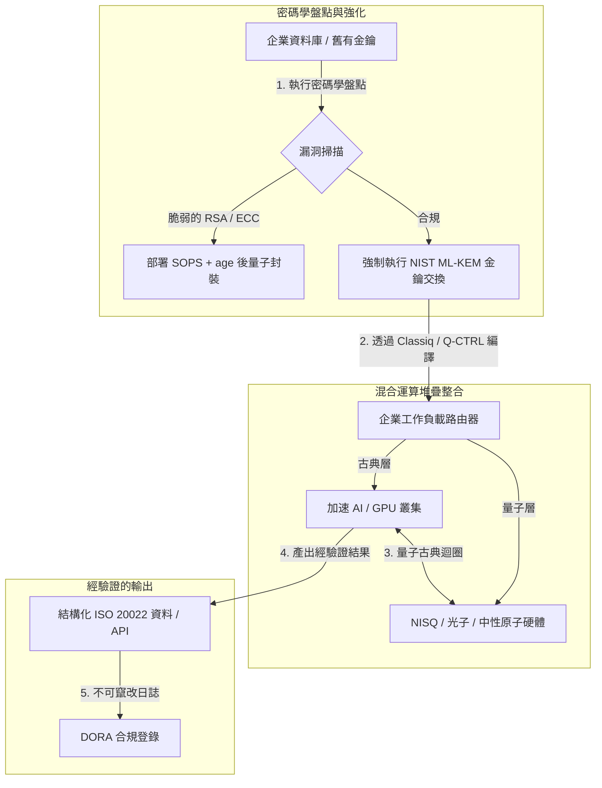

---

# Front Matter (YAML)

author: "contact@sebastienrousseau.com (Sebastien Rousseau)"
banner_alt: "倫敦 Economist Impact 第五屆 Commercialising Quantum Global 2026 高峰會現場——象徵量子科技從物理研究跨入企業級工作流"
banner_height: "1597"
banner_width: "2584"
banner: "https://cloudcdn.pro/stocks/images/sebastien-rousseau-20260617-5th-commercialising-quantum-2.webp"
cdn: "https://cloudcdn.pro"
charset: "UTF-8"
cname: "sebastienrousseau.com"
copyright: "© Copyright 2025 - 2026 - Sebastien Rousseau. All rights reserved."
date: "June 17, 2026"
description: "Economist Impact 第五屆 Commercialising Quantum Global 2026 高峰會的董事會層級洞察——13 億美元資金浪潮、無悔型混合運算堆疊、後量子密碼學遷移的迫切性、量子感測商業化,以及 HSBC 的直言:等待即是非受迫性失誤。"
format-detection: "telephone=no"
hreflang: "zh-hant"
icon: "https://cloudcdn.pro/clients/sebastienrousseau/v1/logos/sebastienrousseau.svg"
id: "https://sebastienrousseau.com/2026-06-17-economist-commercialising-quantum-summit-2026"
image_alt: "Sebastien Rousseau 的黑白肖像"
image_height: "162"
image_width: "162"
image: "https://cloudcdn.pro/stocks/images/sebastienrousseau.webp"
keywords: "Commercialising Quantum Global 2026, Economist Impact 高峰會, 後量子密碼學, NIST ML-KEM, harvest-now decrypt-later, SNDL, HSBC 量子, Philip Intallura, 量子感測, GPS 獨立導航, NQCC, 歐盟量子法, Quantcore, qBIG 獎, Lord Vallance, 混合量子古典, DORA 第 6 條"
language: "zh-Hant"
last_reviewed: "2026-06-17"
layout: "report"
locale: "zh_TW"
logo_alt: "Sebastien Rousseau 的識別標誌"
logo_height: "44"
logo_width: "44"
logo: "https://cloudcdn.pro/clients/sebastienrousseau/v1/logos/sebastienrousseau.svg"
menu: ""
measurementID: "G-169G4ET5HQ"
name: "Sebastien Rousseau"
permalink: "https://sebastienrousseau.com/2026-06-17-economist-commercialising-quantum-summit-2026"
rating: "general"
referrer: "no-referrer"
robots: "index, follow"
schema: "FAQPage, Article"
seo_title: "Commercialising Quantum 2026:董事會洞察"
short_name: "sebastienrousseau"
subtitle: "量子已從投機性實驗室科學跨入混合企業工作流;董事會必須回應 2026 年的 13 億美元資金、後量子遷移的即刻性,以及 HSBC「停止等待」的明確指令。"
tags: "量子, 後量子密碼學, NIST ML-KEM, harvest-now decrypt-later, 量子感測, HSBC, Economist Impact, 混合運算, DORA, 歐盟量子法, NQCC, 高峰會洞察"
theme-color: "0, 83, 191"
title: "從量子位元到獲利:Economist 第五屆 Commercialising Quantum Global 2026 高峰會的策略洞察"
url: "https://sebastienrousseau.com/2026-06-17-economist-commercialising-quantum-summit-2026"
viewport: "width=device-width, initial-scale=1, shrink-to-fit=no"

# RSS - The RSS feed front matter (YAML).
atom_link: "https://sebastienrousseau.com/2026-06-17-economist-commercialising-quantum-summit-2026/rss.xml"
category: "Technology"
docs: https://validator.w3.org/feed/docs/rss2.html
generator: "Static Site Generator (SSG) (version 0.0.26)"
item_description: "Economist Impact 第五屆 Commercialising Quantum Global 2026 高峰會的董事會層級洞察——13 億美元資金浪潮、無悔型混合運算堆疊、後量子密碼學遷移的迫切性、量子感測商業化,以及 HSBC 的直言:等待即是非受迫性失誤。"
item_guid: "https://sebastienrousseau.com/2026-06-17-economist-commercialising-quantum-summit-2026/rss.xml"
item_link: "https://sebastienrousseau.com/2026-06-17-economist-commercialising-quantum-summit-2026/rss.xml"
item_pub_date: "Wed, 17 Jun 2026 06:06:06 +0000"
item_title: "從量子位元到獲利:Economist 第五屆 Commercialising Quantum Global 2026 高峰會的策略洞察"
last_build_date: "Wed, 17 Jun 2026 06:06:06 +0000"
managing_editor: "contact@sebastienrousseau.com (Sebastien Rousseau)"
pub_date: "Wed, 17 Jun 2026 06:06:06 +0000"
ttl: "60"
type: "article"
webmaster: "contact@sebastienrousseau.com"

# Apple - The Apple front matter (YAML).
apple_mobile_web_app_orientations: "portrait"
apple_touch_icon_sizes: "192x192"
apple-mobile-web-app-capable: "yes"
apple-mobile-web-app-status-bar-inset: "black"
apple-mobile-web-app-status-bar-style: "black-translucent"
apple-mobile-web-app-title: "Commercialising Quantum 2026:董事會洞察"
apple-touch-fullscreen: "yes"

# MS Application - The MS Application front matter (YAML).

msapplication-navbutton-color: "0, 83, 191"

# Twitter Card - The Twitter Card front matter (YAML).

twitter_card: "summary_large_image"
twitter_creator: "@wwdseb"
twitter_description: "Economist Impact 第五屆 Commercialising Quantum Global 2026 高峰會的董事會層級洞察——13 億美元資金浪潮、無悔型混合運算堆疊、後量子密碼學遷移的迫切性、量子感測商業化,以及 HSBC 的直言:等待即是非受迫性失誤。"
twitter_image: "https://cloudcdn.pro/clients/sebastienrousseau/v1/logos/sebastienrousseau.svg"
twitter_image_alt: "Sebastien Rousseau 的識別標誌"
twitter_site: "@wwdseb"
twitter_title: "Commercialising Quantum 2026:董事會洞察"
twitter_url: "https://sebastienrousseau.com/2026-06-17-economist-commercialising-quantum-summit-2026"

excerpt: "Economist Impact 第五屆 Commercialising Quantum Global 2026 高峰會,確認了量子轉向企業工作流的軸線:五個月內募得 13 億美元、後量子密碼學在 SNDL 收割下已成董事會層級的受託議題、量子感測已可投入 GPS 獨立導航,而 HSBC 的 Philip Intallura 直言:坐等容錯硬體就是非受迫性失誤。"

# Humans.txt - The Humans.txt front matter (YAML).
author_website: "https://sebastienrousseau.com"
author_twitter: "@wwdseb"
author_location: "London, UK"
thanks: "感謝您的閱讀!"
site_last_updated: "2026-06-17"
site_standards: "HTML5, CSS3, RSS, Atom, JSON, XML, YAML, Markdown, TOML"
site_components: "Kaishi, Kaishi Builder, Kaishi CLI, Kaishi Templates, Kaishi Themes"
site_software: "Static Site Generator, Rust"

---

# 從量子位元到獲利:Economist 第五屆 Commercialising Quantum Global 2026 高峰會的策略洞察

企業就緒度、後量子密碼學遷移、混合運算堆疊,以及量子感測與量子網路新興的商業地景。

**重點速覽。**第五屆 Commercialising Quantum Global 2026 大會由 Economist Impact 主辦,2026 年 6 月 16 至 17 日於倫敦 Business Design Centre 舉行,集結逾 1,100 位橫跨企業、金融、政策與研究領域的全球領袖。大會的核心主軸標誌一項清晰的結構性軸線轉移:量子技術已從投機性實驗室科學,進入務實、混合的企業工作流。在 2026 年前五個月即募得 13 億美元創投資金的支撐下,董事會的討論已不再聚焦於計算物理量子位元的數量,而是建立「無悔型」混合運算堆疊、在「先收割、後解密」(SNDL)密碼學威脅下保全數位資產,並部署可短期落地的量子感測系統以實現 GPS 獨立導航。

## 關鍵要點

- **企業轉向務實工作流。**業界領袖(HorizonX 的 [Steve Suarez](https://www.linkedin.com/in/stevesuarez)、HSBC 的 [Phil Intallura](https://www.linkedin.com/in/intallura))強調,量子整合已不再是物理問題,而是營運問題。銀行與企業正部署混合量子古典試點,以培養人才、優化現行工作負載。
- **後量子密碼學(PQC)已是董事會優先事項。**資安與法律專家(CMS UK、Microsoft 的 [Joanne Miller](https://www.linkedin.com/in/joanne-miller-nso)、EY 的 [Craig Farrell](https://www.linkedin.com/in/craig-farrell))警告,組織不能等到容錯硬體出現才部署 PQC。「先收割、後解密」式收割正在發生,使遷移至 NIST ML-KEM 標準成為即刻的受託責任。
- **量子感測領銜近期商業獲利。**容錯運算仍有數年路要走,但量子感測(Infleqtion 的 [Matthew Kinsella](https://www.linkedin.com/in/matthewkinsella))正快速擴展。量子時鐘與慣性感測器已陸續部署於 GPS 獨立導航、國家安全與超穩定電網。
- **主權、群聚與政策的迫切性。**英國科學部長 [Lord Vallance](https://www.linkedin.com/in/patrick-vallance) 與 [Lord William Hague](https://www.linkedin.com/in/williamhague) 揭示了將研究轉化為工業級「超群聚」的國家任務,並與 National Quantum Computing Centre(NQCC)協作。即將推出的歐盟量子法進一步凸顯主權運算能量的地緣政治競賽。
- **Quantcore 奪得 qBIG 大獎。**University of Glasgow 衍生新創 Quantcore 憑藉其鈮基超導元件技術獲頒 IOP qBIG 獎;該元件於高於傳統材料的溫度下運作,大幅降低低溫基礎建設的開銷。

**延伸閱讀:**[KyberLib 與 2026 年的後量子銀行遷移:從標準到程式碼](https://sebastienrousseau.com/2026-06-12-kyberlib-post-quantum-banking-migration-standards-code-2026/)、[2026 年銀行業韌性指數:AI、雲端、量子、支付與第三方集中風險](https://sebastienrousseau.com/2026-06-08-banking-resilience-index-ai-cloud-quantum-payments-third-party-risk-2026/)、[2026 年雲原生銀行指數:DORA、平台工程、主權雲與營運韌性](https://sebastienrousseau.com/2026-06-05-cloud-native-banking-index-dora-resilience-platform-engineering-2026/)。

## 01. 為何 2026 高峰會對董事會至關重要

2026 年的 Economist Commercialising Quantum Global 高峰會,標誌企業界評估深科技方式的永久性轉變。

過去,量子運算被歸入研發部門,視為跨數十年的科學長征。在 2026 年 6 月,這一視角已然過時。組織必須從「物理為本」的好奇心,轉向「業務為本」的落地實作。原因有二:

1. **量子與 AI 的匯流。**高效能運算(HPC)堆疊正將古典運算、加速 AI 與 NISQ(雜訊中等規模量子)節點整合為單一、統一的運算層。延遲打造量子就緒應用的組織,將會發現掌握策略優勢的時間視窗,比預期關閉得更快。
2. **地緣政治與受託責任的迫切性。**隨著英國以任務為導向的量子方案與即將推出的歐盟量子法,量子能量已成國家主權與企業營運延續的議題。

此外,後量子網路安全已非未來的法遵要求。敵對方「先儲存、後解密」(SNDL)攻擊的威脅,意味著今日被攔截的企業資料,將在商用量子系統規模化時被解密,並依《數位營運韌性法》(DORA)等全球營運韌性規範,構成即刻的法律責任。

## 02. Commercialising Quantum 2026 策略視角

企業技術主管必須將量子成熟度映射至五個明確的營運層次,評估時間視窗與資產負債表風險。

### 表 1:Commercialising Quantum 2026 策略視角

| 層次 | 企業聚焦 | 時間 / 視窗 | 關鍵企業風險 |
| ---- | ---- | ---- | ---- |
| **硬體與編譯器** | 在競爭路徑之間抉擇(超導、囚禁離子、中性原子、光子) | 3 – 5 年(容錯) | 鎖入死胡同架構,或過早押注單一平台。 |
| **密碼學強化** | 盤點密碼學依賴項;遷移至 NIST ML-KEM | 即刻(主動遷移) | 系統性資料外洩、違反 DORA 與 NIST CSF 2.0。 |
| **量子感測** | 部署 GPS 獨立導航、超穩定時鐘與重力儀 | 1 – 2 年(即刻商用) | 物流、航運與電網因 GPS 干擾而陷入營運中斷。 |
| **系統整合** | 將量子硬體接入既有古典 HPC 與超級電腦資料中心 | 1 – 3 年(混合階段) | 高延遲、資料傳輸瓶頸、運算孤島碎裂。 |
| **企業軟體** | 透過高階抽象層與 API(Classiq、Q-CTRL)曝露量子演算法 | 即刻(技能養成) | 人才與工作流脫離實際工程執行。 |

## 03. 關鍵量子訊號與董事會觸發點

技術主管必須監測具體、可量化的市場與法規指標,以引導其量子投資決策。

### 表 2:關鍵量子訊號與董事會觸發點

| 訊號 | 量化指標 | 法規 / 政策參照 | 可執行的平台優先事項 |
| ---- | ---- | ---- | ---- |
| **量子資金浪潮** | 2026 年前五個月全球募得 13 億美元 | 韌性回報(RoR) | 將預算自投機性試點,轉向「無悔型」混合量子古典工作負載。 |
| **資料解密曝險** | 透過公開通道傳輸的加密資料,100% 暴露於 SNDL 收割 | DORA 第 6 條(ICT 安全) | 部署密碼學盤點工具,辨識企業內所有脆弱的 RSA / ECC 金鑰。 |
| **主權基礎建設** | 英國國家量子戰略 25 億英鎊撥款 | 英國量子任務 / Lord Vallance | 與 NQCC 等國家級超群聚建立在地合作。 |
| **法遵期限** | 2026 年 11 月 14 日 SWIFT 結構化地址切換 | SWIFT SR 2026 指令 | 整理並格式化銀行間資料庫,以符合結構化 XML 規格。 |

## 04. 深入高峰會核心主題

### 量子抵達投資臨界點

創投資金已大幅加速,2026 年前五個月即募得 **13 億美元**。與過去年度的投機性炒作週期不同,本輪資金潮由真實、可短期落地的工作負載所支撐。來自 Classiq 與 IBM Quantum Platform 的講者展示:軟體抽象層與自動化編譯器,如何讓非專精的開發團隊得以在當今的古典基礎建設上執行混合量子古典演算法。此一「無悔型」策略,讓組織得以即刻打造量子就緒的人才與工作流。

### 法律與監理對「先收割、後解密」的警告

法律合夥人與資安主管在資料風險的即刻性上引發了高度討論。贊助律所 CMS UK 與 Microsoft 資安長 [Joanne Miller](https://www.linkedin.com/in/joanne-miller-nso) 的代表對高階管理階層發出明確警告:*等到容錯硬體出現才部署後量子密碼學,是嚴重的受託失職。*

在「先儲存、後解密」(SNDL)範式下,敵對方正積極收割今日的加密企業資料,意圖在密碼學意義上夠強的量子電腦現身時加以解密。組織必須立即部署後量子防護(如 NIST ML-KEM),以保護長壽命的敏感資料集、智慧財產與歷史客戶紀錄。

### 「量子感測」的炒作再校準

容錯量子運算雖仍需數年,但本次高峰會凸顯量子感測為首波真正具獲利潛力的實際部署。Infleqtion 執行長 [Matthew Kinsella](https://www.linkedin.com/in/matthewkinsella) 詳述量子時鐘、慣性感測器與射頻系統如何在多項產業快速擴展。

由於這些技術以亞原子精度量測物理常數,得以實現 **GPS 獨立導航**、超穩定電網與深空通訊。對於面臨 GPS 干擾威脅日益升高的航空、海運與國防系統而言,這些應用具高度相關性。

### 生態系與群聚協作

英國量子生態系藉倫敦高峰會展示其在地創新超群聚。National Quantum Computing Centre(NQCC)與 Digital Catapult 的即時更新詳述,早期深科技衍生新創如何藉由將量子硬體直接整合入古典超級電腦資料中心,以彌合「技術鴻溝」。

蘇格蘭量子新創 Quantcore 共同創辦人 [Wridhdhisom Karar](https://www.linkedin.com/in/wridhdhisomkarar) 代表公司領取 Institute of Physics(IOP)Quantum Business Innovation and Growth(qBIG)獎項,表彰其鈮基超導元件。該元件可於高於傳統材料的溫度下運作,大幅降低擴展量子處理器所需的低溫基礎建設開銷。

### HSBC 案例:為何坐等量子是「非受迫性失誤」

[**Philip Intallura, Ph.D.**](https://www.linkedin.com/in/intallura)(HSBC 全球量子技術主管、英國政府顧問、董事顧問)於 Economist 第五屆 Commercialising Quantum 大會(2026)的洞見,對董事會發出強而有力的指令:*「等到容錯量子才開始,就是非受迫性失誤。」*

Intallura 博士主張,金融機構常見的「觀望」做法,實為建立於三個錯誤假設之上的烏龍球:

- **近期投資回報是真實的。**在實證測試中,HSBC 已超越目前正式環境中的模型表現、將量子工作串接至業務其他環節、運用量子深化與部分大型客戶的關係,並為 **HSBC Innovation Banking** 引入可觀的新業務。
- **量子是陡峭的採用曲線。**在高度受監理的組織內建立能力、訂定策略、爭取資金與執行實驗循環,並非短期任務。流程須系統化地測試,並針對該技術調整適配。
- **量子是一個生態系。**沒有任何單一玩家能獨自抵達。HSBC 執行過的每一篇研究、每一項 POC 與試點,皆與量子供應商密切協作——某些情境下,協作更延伸至學界、監理機關與政府。

**收尾的董事會指令:***「容錯到來的那一天你會需要的能力,正是你現在要建立的能力。」*

## 05. 企業量子整合與密碼學流程

要在打造量子就緒度的同時保全數位資產,企業必須建立明確的整合流程。

## 06. 董事會手冊:可執行的當務之急

要將 Commercialising Quantum Global 2026 高峰會的洞見轉化為即時的商業價值,高階管理層應執行以下四步驟董事會手冊:

1. **下達密碼學盤點命令。**指示資訊安全長(CISO)盤點所有密碼學資產,逐一映射企業內每一把舊有 RSA 與 ECC 金鑰,為後量子遷移預做準備。
2. **部署「無悔型」混合策略。**勿等待完美硬體。投資量子啟發式軟體與混合古典量子試點,以培養內部人才,並於今日優化複雜的物流或風險組合。
3. **評估量子感測於物流的應用。**若貴組織倚賴全球供應鏈、航運或關鍵基礎建設,應積極評估量子感測系統(如 GPS 獨立導航),以緩解地緣政治擾動的風險。
4. **報名 6 月 30 日 Insight Hour。**確保貴組織的技術主管報名 2026 年 6 月 30 日下午 3:00 BST 舉行的線上 **Commercialising Quantum Global Insight Hour**(由 IonQ 贊助),以持續追蹤企業風險管理與人才配置策略。

## 07. 常見問答

**什麼是「先收割、後解密」(SNDL)?為何今日就重要?**
SNDL 是指今日攔截並儲存加密資料,意圖在具備密碼學意義的量子電腦問世時加以解密的做法。長壽命的敏感資料集——智慧財產、客戶紀錄、政府通訊——已成為攻擊目標。遷移至 NIST ML-KEM 是董事會無法再延遲的受託決策。

**為何量子感測是首波商用,而非運算?**
量子感測器以亞原子精度量測物理常數,無需量子運算所要求的容錯硬體。量子時鐘、重力儀與慣性感測器,已試點部署於 GPS 獨立導航、超穩定電網與深空通訊。

**HSBC 的量子工作只是研發,還是已產生可量測的回報?**
依 Philip Intallura 於高峰會所述,HSBC 已超越目前正式環境中的模型表現、運用量子深化與其最大客戶的關係,並為 HSBC Innovation Banking 引入可觀新業務。該項工作已從研究進入營運整合。

## 08. 參考資料

- **Economist Impact, (2026).** *5th Annual Commercialising Quantum Global 2026.* 即時會議紀錄,2026 年 6 月 16 至 17 日。倫敦:Business Design Centre。線上版本:[Economist Impact](https://events.economist.com/commercialising-quantum/)。
- **National Institute of Standards and Technology (NIST), (2024).** *First Three Finalized Post-Quantum Encryption Standards (FIPS 203, 204, and 205).* Gaithersburg:美國商務部。線上版本:[NIST Standards](https://www.nist.gov/news-events/news/2024/08/nist-releases-first-3-finalized-post-quantum-encryption-standards)。
- **European Parliament and Council of the European Union, (2022).** *Regulation (EU) 2022/2554 on digital operational resilience for the financial sector (DORA).* 布魯塞爾:歐盟官方公報。線上版本:[DORA Regulation](https://eur-lex.europa.eu/legal-content/EN/TXT/?uri=CELEX%3A32022R2554)。
- **SWIFT, (2024).** *ISO 20022 November 2026 Structured Address Milestone.* La Hulpe:SWIFT。線上版本:[SWIFT ISO 20022 milestone](https://www.swift.com/standards/iso-20022/iso-20022-bytes/call-action-november-2026)。
