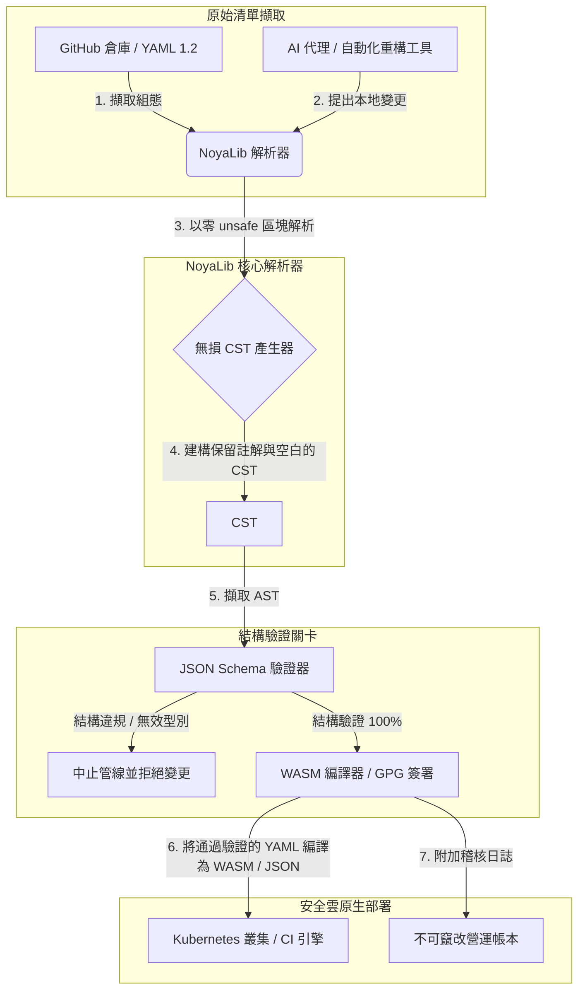

---

# Front Matter (YAML)

author: "contact@sebastienrousseau.com (Sebastien Rousseau)"
banner_alt: "戲劇性光影下的建築幾何——象徵 NoyaLib 作為支撐 CI、Kubernetes、MCP 與金融服務組態的安全 Rust YAML 解析器之承重角色"
banner_height: "1597"
banner_width: "2584"
banner: "https://cloudcdn.pro/stocks/images/ken-cheung-KonWFWUaAuk.webp"
cdn: "https://cloudcdn.pro"
charset: "UTF-8"
cname: "sebastienrousseau.com"
copyright: "© Copyright 2025 - 2026 - Sebastien Rousseau. All rights reserved."
date: "June 18, 2026"
description: "NoyaLib——零 unsafe 的 Rust YAML 1.2 解析器,406/406 規格相容、JSON Schema 驗證、無損 CST 與 MCP/WASM 綁定,專為金融基礎建設打造。"
format-detection: "telephone=no"
hreflang: "zh-hant"
icon: "https://cloudcdn.pro/clients/sebastienrousseau/v1/logos/sebastienrousseau.svg"
id: "https://sebastienrousseau.com/2026-06-18-noyalib-safe-yaml-rust-ai-mcp-financial-infrastructure-2026"
image_alt: "Sebastien Rousseau 的黑白肖像"
image_height: "162"
image_width: "162"
image: "https://cloudcdn.pro/stocks/images/sebastienrousseau.webp"
keywords: "更安全的 Rust YAML 解析器, NoyaLib, YAML 1.2 規格相容, 零 unsafe Rust, JSON Schema 驗證, 無損 CST, MCP, Model Context Protocol, WebAssembly, Kubernetes 清單, CI/CD 組態, DORA 第 5 條, BCBS 239, Basel III 營運風險, 金融基礎建設, 組態安全, 軟體供應鏈"
language: "zh-Hant"
last_reviewed: "2026-06-18"
layout: "report"
locale: "zh_TW"
logo_alt: "Sebastien Rousseau 的識別標誌"
logo_height: "44"
logo_width: "44"
logo: "https://cloudcdn.pro/clients/sebastienrousseau/v1/logos/sebastienrousseau.svg"
menu: ""
measurementID: "G-169G4ET5HQ"
name: "Sebastien Rousseau"
permalink: "https://sebastienrousseau.com/2026-06-18-noyalib-safe-yaml-rust-ai-mcp-financial-infrastructure-2026"
rating: "general"
referrer: "no-referrer"
robots: "index, follow"
schema: "FAQPage, Article"
seo_title: "更安全的 Rust YAML 解析器:AI、MCP 與金融"
short_name: "sebastienrousseau"
subtitle: "更安全的 Rust YAML 堆疊——NoyaLib——將 YAML 1.2 從便利的標記語言,轉化為服務 AI 代理、MCP、Kubernetes 與金融服務基礎建設的密碼學安全、規格相容組態控制平面。"
tags: "更安全的 Rust YAML 解析器, NoyaLib, YAML 1.2, 零 unsafe Rust, JSON Schema, MCP, WebAssembly, Kubernetes, DORA, BCBS 239, Basel III, 金融基礎建設, 供應鏈安全"
theme-color: "0, 83, 191"
title: "為何 2026 年的 AI、MCP 與金融基礎建設需要更安全的 Rust YAML 堆疊"
url: "https://sebastienrousseau.com/2026-06-18-noyalib-safe-yaml-rust-ai-mcp-financial-infrastructure-2026"
viewport: "width=device-width, initial-scale=1, shrink-to-fit=no"

# RSS - The RSS feed front matter (YAML).
atom_link: "https://sebastienrousseau.com/2026-06-18-noyalib-safe-yaml-rust-ai-mcp-financial-infrastructure-2026/rss.xml"
category: "Technology"
docs: https://validator.w3.org/feed/docs/rss2.html
generator: "Static Site Generator (SSG) (version 0.0.26)"
item_description: "NoyaLib——零 unsafe 的 Rust YAML 1.2 解析器,406/406 規格相容、JSON Schema 驗證、無損 CST 與 MCP/WASM 綁定,專為金融基礎建設打造。"
item_guid: "https://sebastienrousseau.com/2026-06-18-noyalib-safe-yaml-rust-ai-mcp-financial-infrastructure-2026/rss.xml"
item_link: "https://sebastienrousseau.com/2026-06-18-noyalib-safe-yaml-rust-ai-mcp-financial-infrastructure-2026/rss.xml"
item_pub_date: "Thu, 18 Jun 2026 06:06:06 +0000"
item_title: "為何 2026 年的 AI、MCP 與金融基礎建設需要更安全的 Rust YAML 堆疊"
last_build_date: "Thu, 18 Jun 2026 06:06:06 +0000"
managing_editor: "contact@sebastienrousseau.com (Sebastien Rousseau)"
pub_date: "Thu, 18 Jun 2026 06:06:06 +0000"
ttl: "60"
type: "article"
webmaster: "contact@sebastienrousseau.com"

# Apple - The Apple front matter (YAML).
apple_mobile_web_app_orientations: "portrait"
apple_touch_icon_sizes: "192x192"
apple-mobile-web-app-capable: "yes"
apple-mobile-web-app-status-bar-inset: "black"
apple-mobile-web-app-status-bar-style: "black-translucent"
apple-mobile-web-app-title: "更安全的 Rust YAML 解析器:AI、MCP 與金融"
apple-touch-fullscreen: "yes"

# MS Application - The MS Application front matter (YAML).

msapplication-navbutton-color: "0, 83, 191"

# Twitter Card - The Twitter Card front matter (YAML).

twitter_card: "summary_large_image"
twitter_creator: "@wwdseb"
twitter_description: "NoyaLib——零 unsafe 的 Rust YAML 1.2 解析器,406/406 規格相容、JSON Schema 驗證、無損 CST 與 MCP/WASM 綁定,專為金融基礎建設打造。"
twitter_image: "https://cloudcdn.pro/clients/sebastienrousseau/v1/logos/sebastienrousseau.svg"
twitter_image_alt: "Sebastien Rousseau 的識別標誌"
twitter_site: "@wwdseb"
twitter_title: "更安全的 Rust YAML 解析器:AI、MCP 與金融"
twitter_url: "https://sebastienrousseau.com/2026-06-18-noyalib-safe-yaml-rust-ai-mcp-financial-infrastructure-2026"

excerpt: "NoyaLib 是更安全的 Rust YAML 堆疊——零 unsafe 區塊、406/406 YAML 1.2 規格相容、無損 CST、JSON Schema(Draft 2020-12)驗證,以及 MCP/WASM 綁定——專為 AI 代理、Kubernetes、CI/CD 以及金融基礎建設背後的組態控制平面所打造。"

# Humans.txt - The Humans.txt front matter (YAML).
author_website: "https://sebastienrousseau.com"
author_twitter: "@wwdseb"
author_location: "London, UK"
thanks: "感謝您的閱讀!"
site_last_updated: "2026-06-18"
site_standards: "HTML5, CSS3, RSS, Atom, JSON, XML, YAML, Markdown, TOML"
site_components: "Kaishi, Kaishi Builder, Kaishi CLI, Kaishi Templates, Kaishi Themes"
site_software: "Static Site Generator, Rust"

---

# 為何 2026 年的 AI、MCP 與金融基礎建設需要更安全的 Rust YAML 堆疊

更安全的 Rust YAML 堆疊之所以關鍵,在於 YAML 如今承載著 CI/CD 管線、Kubernetes 清單、[Open Policy Agent](https://www.openpolicyagent.org/) 規則,以及 Model Context Protocol(MCP)工具登錄表——而任何一次模稜兩可的解析,都可能拖垮一套清算系統、誤設安全群組,或讓本地 AI 代理取得錯誤的權限。[NoyaLib](https://github.com/sebastienrousseau/noyalib) 是純 Rust、零 unsafe 的 [YAML 1.2](https://yaml.org/spec/1.2.2/) 解析與驗證生態系,專為讓這類基礎建設預設即安全而打造。

## 速答

**用一句話說明 NoyaLib 是什麼?**NoyaLib 是開源、純 Rust 的 YAML 1.2 解析與驗證生態系,擁有零 `unsafe` 程式碼、跨 406 項官方測試 100% 規格相容、無損 CST,以及即時 [JSON Schema](https://json-schema.org/) 驗證——專為讓 AI 代理、MCP、Kubernetes 與金融基礎建設的組態預設即安全而打造。

## 行政摘要

YAML 看似平凡,直到一次模稜兩可的解析或結構違規拖垮數十億美元等級的正式清算系統。2026 年,YAML 已是 [CI/CD](https://docs.github.com/en/actions/learn-github-actions/workflow-syntax-for-github-actions) 管線、[Kubernetes](https://kubernetes.io/docs/concepts/configuration/overview/) 清單、[Open Policy Agent](https://www.openpolicyagent.org/) 規則,以及 Model Context Protocol(MCP)工具登錄表事實上的標準。具有記憶體漏洞與破壞性解析行為的不透明舊式解析器,是無法接受的資安風險。NoyaLib 是純 Rust、零 unsafe 的 YAML 1.2 生態系:跨全部 406 項官方測試 100% 規格相容、保留註解與空白的無損 CST,並內建 JSON Schema 驗證。其成果,是將 YAML 重新定位為可稽核、安全、且代理可存取的組態控制平面。

## 關鍵要點

- **組態即正式環境的程式碼。**單一格式錯誤的 YAML 檔案,即可誤設雲原生安全群組或 AI 代理權限。NoyaLib 將 YAML 視為關鍵基礎建設。
- **零 unsafe 設計。**NoyaLib 完全以安全 Rust 打造,零 `unsafe` 區塊,從核心解析層消除記憶體安全漏洞——緩衝區溢位、遠端程式碼執行。
- **絕對的 406/406 規格相容。**以數學方式驗證組態結構,消弭預備與正式環境間的解析差異與結構漂移。
- **無損 CST。**有別於丟棄註解與格式的舊式解析器,NoyaLib 保留空白與註記,讓 AI 代理得以執行安全、可往返的自動化重構。
- **董事會層級的受託價值。**將組態完整性連結至 [DORA 第 5 條](https://eur-lex.europa.eu/legal-content/EN/TXT/?uri=CELEX%3A32022R2554)與 [Basel III](https://www.bis.org/bcbs/publ/d424.htm) 營運風險資本指標,直接屏蔽高階管理層的個人法律責任。

**延伸閱讀:**[KyberLib 與 2026 年的後量子銀行遷移:從標準到程式碼](https://sebastienrousseau.com/2026-06-12-kyberlib-post-quantum-banking-migration-standards-code-2026/)、[2026 年雲原生銀行指數:DORA、平台工程、主權雲與營運韌性](https://sebastienrousseau.com/2026-06-05-cloud-native-banking-index-dora-resilience-platform-engineering-2026/)、[2026 年 AI 感知 dotfiles:為 MCP、SLSA 與多 shell 一致性打造安全、可重現的開發者工作站](https://sebastienrousseau.com/2026-06-16-ai-aware-dotfiles-secure-reproducible-workstation-2026/)。

## 01. 為何 2026 年需要更安全的 Rust YAML 堆疊

2026 年 6 月,企業 IT 基礎建設高度分散,且自動化程度持續攀升。

YAML 已悄然成為整個軟體工程堆疊的承重組態語言。它承載著編譯正式環境產物的持續整合(CI)工作流、編排全球雲原生叢集的 [Kubernetes](https://kubernetes.io/docs/concepts/overview/) 清單,以及授權本地 AI 代理執行在地作業的 [Model Context Protocol](https://modelcontextprotocol.io/)(MCP)伺服器結構。

舊式 YAML 解析器——[PyYAML](https://pyyaml.org/)、[yaml-cpp](https://github.com/jbeder/yaml-cpp)、[libyaml](https://github.com/yaml/libyaml)——帶來兩項結構性風險:

1. **型別強制轉換漏洞(「Norway 問題」)。**舊式解析器經常將未加引號的字串強制轉型(國碼 `NO` 被轉成布林 `false`,`yes`/`no` 亦同)——詳見 [YAML 1.1 與 1.2 布林標籤](https://yaml.org/type/bool.html)——造成關鍵系統故障或默默發生的安全誤設。
2. **記憶體安全的可被利用漏洞。**以 C/C++ 撰寫的不透明解析器,常受記憶體洩漏與緩衝區溢位漏洞影響,進而可能在核心建置伺服器上導致遠端程式碼執行(RCE)。

[NoyaLib](https://github.com/sebastienrousseau/noyalib) 解決了上述難題。它是純 Rust、零 unsafe 的 YAML 1.2 解析與驗證生態系。藉由達成絕對的 406/406 規格相容,並於解析期間直接強制執行嚴格的 JSON Schema 驗證,NoyaLib 帶來高度的**韌性回報(RoR)**——預防組態引發的服務中斷,並守護金融級的軟體供應鏈。

## 02. NoyaLib 2026 架構視角

NoyaLib 生態系扮演安全、無損的組態解析器角色。每一份本地與雲端清單,皆於最低層的執行層接受結構驗證與保護。

### 表 1:NoyaLib 架構分層與風險緩解

| 分層 | 設計決策 | 為何重要 | 處理不當的風險 |
| ---- | ---- | ---- | ---- |
| **解析器層** | YAML 1.2 相容、純 Rust、零 `unsafe` 區塊的解析器 | 於最低層的執行層消除記憶體安全漏洞與緩衝區溢位。 | 核心建置伺服器上的遠端程式碼執行(RCE)。 |
| **相容性層** | 跨 406/406 項官方 YAML 1.2 測試達 100% 相容 | 消弭預備與正式環境間的解析差異與型別強制轉換漂移。 | 「Norway 問題」型別強制轉換錯誤,導致安全群組失效。 |
| **語法樹層** | 無損 CST | 於往返解析與程式化重構中,保留註解、空白與順序。 | 自動化 AI 重構摧毀開發者註記。 |
| **驗證層** | 解析期間進行 [JSON Schema(Draft 2020-12)](https://json-schema.org/draft/2020-12/release-notes)驗證 | 在組態檔抵達正式叢集前,強制其符合嚴格資料模型。 | 格式錯誤的組態檔觸發雲原生叢集崩潰。 |
| **介面層** | WebAssembly(WASM)與 MCP 綁定 | 讓組態驗證得以在瀏覽器、邊緣節點與本地代理工具鏈中直接執行。 | 工具鏈孤島化,驗證無法在邊緣裝置上執行。 |

## 03. 關鍵工作站與組態安全訊號

要在開發與營運版圖中維持絕對安全,資訊安全長(CISO)必須監測具體、可量化的指標。

### 表 2:工作站與組態安全訊號

| 訊號 | 指標 / 營運基準 | NIST CSF / DORA 參照 | 技術平台實作 |
| ---- | ---- | ---- | ---- |
| **解析器相容性** | 跨官方 YAML 1.2 測試套件 100% 通過(406/406 項)。 | [DORA 第 6 條](https://eur-lex.europa.eu/legal-content/EN/TXT/?uri=CELEX%3A32022R2554)(ICT 安全) | NoyaLib 解析器核心於 CI 執行前驗證所有清單。 |
| **記憶體安全輪廓** | 解析器與序列化相依套件內零 `unsafe` Rust 區塊。 | DORA 第 30 條(供應鏈) | cargo 建置中的自動化編譯檢查([`forbid(unsafe_code)`](https://doc.rust-lang.org/reference/attributes/diagnostics.html#the-forbid-attribute))。 |
| **結構驗證** | 100% 已解析的組態檔皆已對應有效的 [JSON Schema](https://json-schema.org/) 模型完成驗證。 | [NIST CSF 2.0](https://www.nist.gov/cyberframework)(PR.DS-01) | 即時驗證關卡於發現結構違規時中止建置管線。 |
| **組態漂移** | 即時偵測本地組態檔,並還原至 git 版本化狀態。 | 韌性回報(RoR) | 持續遙測,記錄所有本地檔案異動。 |
| **代理存取控制** | 對透過 MCP 組態運作的本地 AI 工具,給予有界、唯讀的權限。 | 模型風險管理([SR 11-7](https://www.federalreserve.gov/supervisionreg/srletters/sr1107.htm)) | MCP 伺服器邊界限制代理作業僅能於核准目錄內執行。 |

## 04. 不透明組態解析的謬誤

雲原生營運的一項主要漏洞,即*不透明解析*——使用會丟棄結構性中繼資料(註解、空白、文件順序)或在編譯期默默轉型的解析器。此行為帶來兩項嚴重的資安風險:

1. **破壞性重構。**當 AI 編碼助理或自動化重構工具更新部署清單時,傳統解析器會丟棄開發者註解與格式,摧毀人工審查與事後鑑識所需的脈絡。
2. **解析差異。**若預備環境使用 Python 解析器、正式環境執行 C 解析器,YAML 1.2 規格相容上的細微差異,可能使一份有效的預備清單於正式環境中失敗或行為改變,進而埋下隱性資安漏洞。

NoyaLib 的**無損 CST** 解決此問題。它於解析—序列化迴圈中保留每一個空白、註解與文件行。自動化 AI 助理得以在保留 100% 人工註記的前提下編輯、重構並提交組態檔——這是絕對的稽核軌跡。

## 05. 設計有界的 AI 組態管線

為防止惡意組態變更抵達正式環境,組織必須實作嚴格有界、結構驗證的組態管線。

下方營運流程展示 NoyaLib 如何解析原始 YAML、建構無損 CST、針對 JSON Schema 模型驗證 AST,並為瀏覽器或邊緣環境編譯 WebAssembly 綁定。

## 06. 董事會手冊與受託責任

組態安全與軟體供應鏈完整性是關鍵的董事會優先事項。高階管理層必須以受託職責與營運韌性的視角看待組態管理。

- **DORA 第 5 條(董事會問責)。**規定董事會對機構的 ICT 風險管理負最終、不可委派的責任。由於組態檔控管關鍵雲原生安全群組與支付路由路徑,董事會必須確認解析這些清單的系統具備記憶體安全與完整規格相容,方能通過監理稽核。([Regulation (EU) 2022/2554](https://eur-lex.europa.eu/legal-content/EN/TXT/?uri=CELEX%3A32022R2554))
- **BCBS 239(風險資料彙整與報告)。**要求風險報告與基礎建設指標必須精準、完整,並於嚴格的資料品質管控下產出。NoyaLib 於源頭以嚴格結構驗證並解析組態檔,預防默默發生的資料外洩或誤設導致的中斷,以支持 BCBS 239。([BCBS 239 標準](https://www.bis.org/publ/bcbs239.htm))
- **緩解營運風險資本附加費(Basel III)。**組態引發的中斷會直接膨脹 Basel III 下的營運風險資本附加費,綁住資產負債表的資本。將企業組態堆疊標準化於 NoyaLib 這類安全的純 Rust 解析器,可將此風險降至最低,既保全資本,亦守護客戶信任。([Basel III 標準](https://www.bis.org/bcbs/publ/d424.htm))

## 07. 對各類銀行的意涵

### 全球系統性重要銀行(G-SIBs)

G-SIBs 跨多個司法管轄區管理數千個微服務與部署管線。其首要挑戰,在於跨龐大雲原生版圖維持組態一致性並預防安全漂移。將整體標準化於 NoyaLib 這類更安全的 Rust YAML 堆疊,可確保所有 Kubernetes 清單、CI/CD 管線與安全政策皆於統一、記憶體安全的框架下解析驗證——消弭未經稽核的「雪花」組態風險。

### 交易型與企業金融銀行

交易型銀行營運敏感的支付閘道與批發清算基礎建設。證明部署至這類正式環境的程式碼與組態具備絕對安全,是不可妥協的監理要求。導入 NoyaLib 可確保軟體供應鏈經完整稽核、無損且免於解析漏洞——此一控管能乾淨對應至 DORA 第 6 條與 [PCI DSS v4.0](https://www.pcisecuritystandards.org/document_library/) 第 6 章。

### 區域型與中小型銀行

區域型銀行必須在沒有 G-SIB 等級科技預算的前提下,維持高度資安水準。開源的 NoyaLib 框架提供輕量、具成本效益且高度安全的 Rust 友善解決方案,使中小型機構得以在不支付專有授權費的前提下,實作企業級的組態安全與供應鏈防護。

## 08. 結論:組態安全路線圖

開發者工作站與雲原生基礎建設組態,是軟體供應鏈中關鍵的控制平面。容許未經稽核、模稜兩可或不安全的組態檔抵達企業資產,是無法接受的營運與監理風險。

要守護軟體供應鏈、防範端點上的組態漏洞,資深科技與資安主管應即刻執行明確的開發路線圖:

1. **強制宣告式組態。**逐步淘汰手動、未經稽核的組態調整,並強制要求所有清單以版本控管的宣告式系統作為唯一紀錄來源管理。
2. **強制執行結構驗證。**強制嚴格的 pre-commit 鉤子與掃描工具,確保所有組態檔於部署前皆已對應有效的 JSON Schema 模型完成驗證。
3. **實作無損往返。**確保所有自動化 AI 編碼助理與重構工具皆採用無損解析,以保留註解、空白與開發者脈絡。
4. **守護供應鏈。**確保所有組態設定與解析工具於執行前,皆透過 NoyaLib 這類純 Rust、零 unsafe 函式庫進行密碼學驗證。([SLSA 框架](https://slsa.dev/))

## 09. 常見問答

**什麼是 NoyaLib?為何用它來解析 YAML?**
NoyaLib 是開源、純 Rust、零 unsafe 的 YAML 1.2 解析器。它跨 406 項官方測試達 100% 規格相容、於解析期間強制執行嚴格的 [JSON Schema](https://json-schema.org/) 驗證,並提供 WASM 與 [MCP](https://modelcontextprotocol.io/) 綁定——成為 AI 代理、Kubernetes 與金融基礎建設更安全的 Rust YAML 堆疊。

**為何零 unsafe 設計對組態解析至關重要?**
以 C/C++ 撰寫的舊式解析器內的記憶體安全漏洞——緩衝區溢位、釋放後使用——可能在核心建置伺服器上導致遠端程式碼執行。NoyaLib 的純 Rust 設計搭配 [`#![forbid(unsafe_code)]`](https://doc.rust-lang.org/reference/attributes/diagnostics.html#the-forbid-attribute),於編譯期以數學方式消除此類漏洞。

**什麼是無損 CST?為何重要?**
傳統解析器丟棄註解與格式,使 AI 代理的自動化編輯成為破壞性行為。NoyaLib 的無損 CST 保留每一個註解、空白與文件行——讓 AI 助理得以安全編輯與重構組態檔,同時完整保留開發者脈絡、事後鑑識所需的資訊與稽核軌跡。

**NoyaLib 如何對應 DORA、BCBS 239 與 Basel III?**
DORA 第 5 條將 ICT 風險問責放在董事會;BCBS 239 要求風險報告須有資料品質管控;Basel III 對營運風險資本課稅。NoyaLib 提供這些法規對「組態即程式碼」所要求的結構驗證、記憶體安全解析層——讓監理對應一目了然,營運風險資本附加費也隨之縮小。

## 10. 參考資料

- **YAML, (2026).** *YAML 1.2 specification*. 線上版本:[YAML 1.2 spec](https://yaml.org/spec/1.2.2/)。
- **JSON Schema, (2026).** *JSON Schema Draft 2020-12 release notes*. 線上版本:[JSON Schema Draft 2020-12](https://json-schema.org/draft/2020-12/release-notes)。
- **European Parliament and Council of the European Union, (2022).** *Regulation (EU) 2022/2554 on digital operational resilience for the financial sector (DORA)*. 布魯塞爾:歐盟官方公報。線上版本:[DORA regulation](https://eur-lex.europa.eu/legal-content/EN/TXT/?uri=CELEX%3A32022R2554)。
- **Basel Committee on Banking Supervision, (2013).** *Principles for effective risk data aggregation and risk reporting (BCBS 239)*. 巴塞爾:國際清算銀行。線上版本:[BCBS 239 standard](https://www.bis.org/publ/bcbs239.htm)。
- **Basel Committee on Banking Supervision, (2017).** *Basel III: finalising post-crisis reforms*. 巴塞爾:國際清算銀行。線上版本:[Basel III standards](https://www.bis.org/bcbs/publ/d424.htm)。
- **Anthropic, (2025).** *Model Context Protocol (MCP) specification*. 線上版本:[Model Context Protocol](https://modelcontextprotocol.io/)。
- **GitHub, (2026).** *noyalib open-source repository*. 線上版本:[NoyaLib repository](https://github.com/sebastienrousseau/noyalib)。
