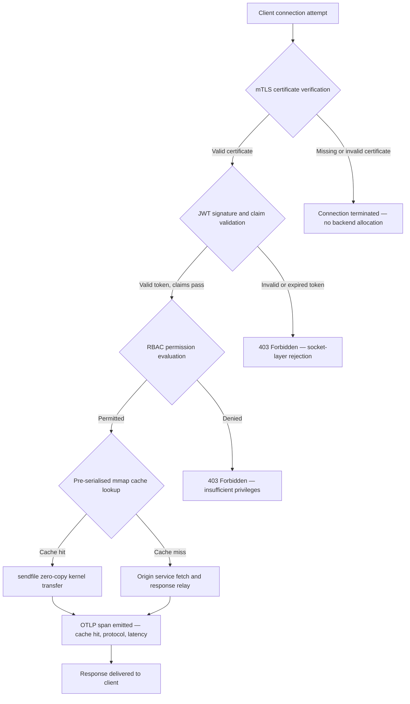

---

# Front Matter (YAML)

author: "contact@sebastienrousseau.com (Sebastien Rousseau)"
banner_alt: "夜間抽象電路板城市景觀——呈現銀行業邊緣網路中核心層級零複製傳輸、mTLS 握手與 JWT 驗證在單一靜態連結二進位檔案中匯聚的場景"
banner_height: "1597"
banner_width: "2584"
banner: "https://cloudcdn.pro/stocks/images/bit-cloud-GlqbGLCPnQ4.webp"
cdn: "https://cloudcdn.pro"
charset: "UTF-8"
cname: "sebastienrousseau.com"
copyright: "© Copyright 2025 - 2026 - Sebastien Rousseau. All rights reserved."
date: "June 20, 2026"
description: "http-handle 是一個靜態連結的 Rust 二進位檔案，在銀行業邊緣以零執行時期依賴項實現每秒 180,000 次請求，整合 mTLS 與 JWT 驗證、ALPN 協商的 HTTP/2 和 HTTP/3，以及 OTLP 可觀察性——填補了 Nginx 和 Envoy 留下的安全與彈性缺口。"
format-detection: "telephone=no"
hreflang: "zh-Hant"
icon: "https://cloudcdn.pro/clients/sebastienrousseau/v1/logos/sebastienrousseau.svg"
id: "https://sebastienrousseau.com/2026-06-20-http-handle-zero-dependency-edge-ingress-banking-rust-2026"
image_alt: "Sebastien Rousseau 黑白肖像"
image_height: "162"
image_width: "162"
image: "https://cloudcdn.pro/stocks/images/sebastien-rousseau.png"
keywords: "http-handle, Rust 邊緣入口, 零依賴代理, 銀行基礎設施, mTLS JWT, sendfile 零複製, ALPN HTTP3, DORA 合規, 巴塞爾III, OTLP 可觀察性, 靜態二進位, ARM64 銀行, 零信任銀行, 輕量級入口, Rust 銀行安全"
language: "zh-Hant-TW"
last_reviewed: "2026-06-20"
layout: "report"
locale: "zh_Hant_TW"
logo_alt: "Sebastien Rousseau 的標誌"
logo_height: "44"
logo_width: "44"
logo: "https://cloudcdn.pro/clients/sebastienrousseau/v1/logos/sebastienrousseau.svg"
menu: ""
measurementID: "G-169G4ET5HQ"
name: "Sebastien Rousseau"
permalink: "https://sebastienrousseau.com/2026-06-20-http-handle-zero-dependency-edge-ingress-banking-rust-2026"
rating: "general"
referrer: "no-referrer"
robots: "index, follow"
schema: "FAQPage, Article"
seo_title: "http-handle：銀行業零依賴 Rust 入口，每秒 18 萬次請求"
short_name: "sebastienrousseau"
subtitle: "單一靜態連結 Rust 二進位檔案如何在銀行業邊緣以每秒 180,000 次請求實現 mTLS、JWT 和 ALPN——以及這對 DORA 和巴塞爾III 合規意味著什麼。"
tags: "http-handle, Rust, banking, edge-ingress, mTLS, JWT, ALPN, HTTP3, DORA, Basel-III, zero-copy, sendfile, ARM64, zero-trust, OTLP, observability, open-source, infrastructure"
theme-color: "0, 83, 191"
title: "http-handle：2026 年銀行業高效能零依賴邊緣入口"
url: "https://sebastienrousseau.com/2026-06-20-http-handle-zero-dependency-edge-ingress-banking-rust-2026"
viewport: "width=device-width, initial-scale=1, shrink-to-fit=no"

# RSS - The RSS feed front matter (YAML).
atom_link: "https://sebastienrousseau.com/2026-06-20-http-handle-zero-dependency-edge-ingress-banking-rust-2026/rss.xml"
category: "Technology"
docs: https://validator.w3.org/feed/docs/rss2.html
generator: "Static Site Generator (SSG) (version 0.0.40)"
item_description: "http-handle 是一個靜態連結的 Rust 二進位檔案，在銀行業邊緣以零執行時期依賴項實現每秒 180,000 次請求，整合 mTLS 與 JWT 驗證、ALPN 協商的 HTTP/2 和 HTTP/3，以及 OTLP 可觀察性——填補了 Nginx 和 Envoy 留下的安全與彈性缺口。"
item_guid: "https://sebastienrousseau.com/2026-06-20-http-handle-zero-dependency-edge-ingress-banking-rust-2026/rss.xml"
item_link: "https://sebastienrousseau.com/2026-06-20-http-handle-zero-dependency-edge-ingress-banking-rust-2026/rss.xml"
item_pub_date: "Sat, 20 Jun 2026 07:07:07 +0000"
item_title: "http-handle：2026 年銀行業高效能零依賴邊緣入口"
last_build_date: "Sat, 20 Jun 2026 07:07:07 +0000"
managing_editor: "contact@sebastienrousseau.com (Sebastien Rousseau)"
pub_date: "Sat, 20 Jun 2026 07:07:07 +0000"
ttl: "60"
type: "article"
webmaster: "contact@sebastienrousseau.com"

# Apple - The Apple front matter (YAML).
apple_mobile_web_app_orientations: "portrait"
apple_touch_icon_sizes: "192x192"
apple-mobile-web-app-capable: "yes"
apple-mobile-web-app-status-bar-inset: "black"
apple-mobile-web-app-status-bar-style: "black-translucent"
apple-mobile-web-app-title: "零依賴銀行邊緣"
apple-touch-fullscreen: "yes"

# MS Application - The MS Application front matter (YAML).

msapplication-navbutton-color: "0, 83, 191"

# Twitter Card - The Twitter Card front matter (YAML).

twitter_card: "summary_large_image"
twitter_creator: "@wwdseb"
twitter_description: "http-handle 是一個靜態連結的 Rust 二進位檔案，在銀行業邊緣以零執行時期依賴項實現每秒 180,000 次請求，整合 mTLS、JWT 和 OTLP 可觀察性。"
twitter_image: "https://cloudcdn.pro/clients/sebastienrousseau/v1/logos/sebastienrousseau.svg"
twitter_image_alt: "Logo of Sebastien Rousseau"
twitter_site: "@wwdseb"
twitter_title: "http-handle：銀行業零依賴 Rust 入口，每秒 18 萬次請求"
twitter_url: "https://sebastienrousseau.com/2026-06-20-http-handle-zero-dependency-edge-ingress-banking-rust-2026"

# Humans.txt - The Humans.txt front matter (YAML).
author_website: "https://sebastienrousseau.com"
author_twitter: "@wwdseb"
author_location: "London, UK"
thanks: "Thanks for reading!"
site_last_updated: "2026-06-20"
site_standards: "HTML5, CSS3, RSS, Atom, JSON, XML, YAML, Markdown, TOML"
site_components: "Kaishi, Kaishi Builder, Kaishi CLI, Kaishi Templates, Kaishi Themes"
site_software: "Static Site Generator, Rust"

excerpt: "銀行業邊緣存在依賴項問題。每個在客戶端和核心銀行服務之間路由流量的 Nginx 或 Envoy 實例都攜帶著一棵依賴樹：OpenSSL 建置、Lua 模組……"
---

# http-handle：2026 年銀行業高效能零依賴邊緣入口

<!-- lead-start -->
<aside class="post-lead" aria-label="文章摘要">

<strong>TL;DR。</strong> http-handle 是一個靜態連結的 Rust 二進位檔案，在銀行業邊緣以零執行時期依賴項實現每秒 180,000 次請求，整合 mTLS 與 JWT 驗證、ALPN 協商的 HTTP/2 和 HTTP/3，以及 OTLP 可觀察性——填補了 Nginx 和 Envoy 留下的安全與彈性缺口。

<strong>核心要點</strong>

<ul class="post-lead-takeaways">
  <li><strong>簡明回答。</strong> http-handle 一句話是什麼？</li>
  <li><strong>執行摘要。</strong> 銀行業在其邊緣執行 Nginx 和 Envoy 已有十年。</li>
  <li><strong>01. 銀行業的重型代理問題。</strong> Nginx 和 Envoy 建構了現代網際網路的邊緣。</li>
  <li><strong>02. http-handle 2026 架構視角。</strong> 該二進位檔案由五個相互依存的層構成，每層旨在消除傳統代理架構積累的特定風險類別。</li>
</ul>

<strong>相關閱讀：</strong> <a href="https://sebastienrousseau.com/2023-11-19-crystals-kyber-the-safeguarding-algorithm-in-a-quantum-age/index.html">CRYSTALS-Kyber：量子時代的保護演算法</a>，<a href="https://sebastienrousseau.com/2026-06-20-html-generator-accessible-seo-structured-markdown-rust-2026">2026 年用 Rust 將 Markdown 轉化為無障礙、SEO 就緒的結構化 HTML</a>，<a href="https://sebastienrousseau.com/2026-06-12-kyberlib-post-quantum-banking-migration-standards-code-2026">KyberLib 與 2026 年銀行業後量子遷移：從標準到程式碼</a>。

</aside>
<!-- lead-end -->

銀行業邊緣存在依賴項問題。每個在客戶端和核心銀行服務之間路由流量的 Nginx 或 Envoy 實例都攜帶著一棵依賴樹：OpenSSL 建置、Lua 模組、gRPC 函式庫和容器層——每一個都是潛在的 CVE，每一個都需要專門的修補週期，每一個都增加了使 SLA 量測複雜化的延遲變異數。根據[《數位運營韌性法案》（DORA）](https://eur-lex.europa.eu/eli/reg/2022/2554/oj)，這種複雜性現在與運營風險同樣是監管責任。

[http-handle](https://github.com/sebastienrousseau/http-handle) 採取了不同的方法。它是一個單一的靜態連結 Rust 二進位檔案，除 `libc` 外無任何執行時期依賴項。它在 ARM64 節點上每秒處理 180,000 次請求，在網路套接字層強制執行雙向 TLS 和 JWT 身份驗證，並自動協商 HTTP/2 和 HTTP/3——所有這些都在 20 MB RAM 以內的部署佔用中完成。

## 簡明回答

**http-handle 一句話是什麼？** http-handle 是一個開源的靜態連結 Rust 二進位檔案，它取代了銀行業邊緣的重型代理容器，透過 Linux `sendfile(2)` 零複製核心傳輸在 ARM64 上實現每秒 180,000 次請求，在套接字層強制執行 mTLS、JWT 和 RBAC，在任何後端資源被觸及之前完成驗證，並發出原生 [OpenTelemetry](https://opentelemetry.io/) 指標——除 `libc` 外零執行時期函式庫依賴項。

## 執行摘要

銀行業在其邊緣執行 Nginx 和 Envoy 已有十年。兩者都有能力，但都不是為 2026 年的監管環境設計的。依賴繁多的容器映像產生了合規團隊無法及時清除的 CVE 佇列，每次函式庫版本升級都帶來迴歸風險。DORA 第 5 條和第 6 條要求透過設計來管理 ICT 風險，而不是在發現後打補丁。巴塞爾III 運營風險框架對系統複雜性隨失敗點增加的架構進行懲罰。

http-handle 從源頭消除了依賴項問題。該二進位檔案一次性靜態編譯，執行時期無需外部函式庫。攻擊面縮小到 Rust 標準函式庫加 `libc`。安全執行——mTLS 憑證驗證、JWT 聲明驗證和基於角色的存取控制——在任何後端分配之前在網路套接字執行，將零信任邊界壓縮到最小可能的表達。效能源於架構：預序列化的記憶體對映快取區塊與 `sendfile(2)` 核心傳輸相結合，完全將資料從 CPU 到記憶體的複製路徑中移除，在 ARM64 硬體上維持每秒 180,000 次請求。結果是一個滿足 DORA 韌性要求、支援巴塞爾III 運營風險降低論據，並為 SM&CR 下的高階 IT 領導者提供可驗證、單元件問責鏈的入口層。

## 核心要點

- **更小的二進位檔案，更小的 CVE 佇列。** 靜態連結的單一二進位檔案只有一個套件需要修補、一個版本需要驗證、一個構件需要稽核。帶有標準模組集的 Nginx 附帶超過 30 個共用函式庫依賴項；每個都有其自己的漏洞生命週期。
- **零複製不是最佳化——而是設計約束。** 在每秒 180,000 次請求時，任何使用者空間資料複製都會引入可量測的延遲變異數。`sendfile(2)` 完全在核心空間將檔案描述符內容傳輸到網路套接字。與 mmap 固定的回應快取區塊結合，CPU 從不接觸快取回應的資料路徑。
- **安全邊界屬於套接字層。** 在應用程式中介軟體中驗證 JWT 和 mTLS 憑證意味著後端在請求被拒絕之前已經分配了執行緒和記憶體。套接字層驗證確保未經身份驗證的請求不消耗任何後端資源。
- **OTLP 消除了可觀察性缺口。** 原生 OpenTelemetry 整合意味著每個請求、每個身份驗證決定和每個協定協商都會產生結構化遙測資料，無需 sidecar 代理。現有銀行儀表板直接擷取 OTLP 追蹤。

**相關閱讀：** [2026 年為什麼 YAML 需要更安全的 Rust 堆疊用於 AI、MCP 和金融基礎設施](https://sebastienrousseau.com/2026-06-18-noyalib-safe-yaml-rust-ai-mcp-financial-infrastructure-2026/)，[CloudCDN：2026 年 AI 原生邊緣的開源藍圖](https://sebastienrousseau.com/2026-06-11-cloudcdn-open-source-blueprint-ai-native-edge-2026/)，[2026 年銀行和金融機構的最佳雲端基礎設施架構](https://sebastienrousseau.com/2026-05-16-best-cloud-infrastructure-architecture-2026/)。

## 01. 銀行業的重型代理問題

Nginx 和 Envoy 建構了現代網際網路的邊緣。它們可配置、經過實戰檢驗，並得到大型社群的支援。它們也是在 DORA 出現之前、在巴塞爾III 運營風險框架要求可量化的複雜性降低之前、在 ARM64 雲端節點改變高吞吐量運算經濟學之前做出的架構選擇。

實際後果是銀行業需求與重型代理容器所提供之間的差距。

**依賴面。** 標準 Envoy 部署引入 OpenSSL、Abseil、Protobuf、gRPC、Lua 和數十個次要函式庫。每個都有獨立的 CVE 生命週期。當國家漏洞資料庫發布關鍵 OpenSSL 公告時，整個環境中的每個 Envoy 實例都成為合規時鐘：評估、修補、測試、重新部署，並在二進位檔案執行的每個環境中重新認證。根據 DORA 第 6 條，銀行必須證明 ICT 風險管理流程是成比例的、有記錄的和可驗證的。多函式庫依賴樹使這種證明維護起來代價高昂。

**記憶體開銷。** 在適度負載下，最低配置的 Nginx 工作程序消耗 40–80 MB 的常駐記憶體。在規模化環境中——交易系統、支付 API 和面向客戶的入口網站中的數百個入口節點——這種開銷積累成可量測的基礎設施成本，而相比於精心設計的單二進位替代方案沒有對應的效能優勢。

**修補速度。** 容器映像供應鏈在 CVE 發布和經驗證的修補程式到達生產之間引入多天延遲。必須重建基礎映像、重新分層應用程式層、重新執行完整測試矩陣，並重新執行部署管線。對於在 DORA 事件報告視窗內運營的關鍵銀行系統，這個週期是結構性風險。

http-handle 解決了所有三個問題。一個二進位檔案。一個 CVE 面。一個需要修補的構件。生產入口節點不超過 20 MB RAM。

## 02. http-handle 2026 架構視角

該二進位檔案由五個相互依存的層構成，每層旨在消除傳統代理架構積累的特定風險類別。

### 表 1：http-handle 架構層與風險緩解

| 層 | 設計決策 | 為何重要 | 處理不當的風險 |
| ---- | ---- | ---- | ---- |
| **伺服器核心** | 單一 Rust 二進位檔案，靜態連結，除 `libc` 外零依賴項 | 一個需要修補的構件；消除整個環境中的函式庫 CVE 傳播 | 依賴項混淆攻擊；函式庫漏洞積累 |
| **加速引擎** | 預序列化 mmap 快取區塊和 `sendfile(2)` 零複製核心傳輸 | ARM64 上每秒 180,000 次請求，子毫秒代理開銷；快取回應不進入使用者空間 | 記憶體對映洩漏；快取失效下的核心空間瓶頸 |
| **加密安全** | 支援熱重載憑證的原生 mTLS 和 ALPN 協商 | 保證資料完整性和協定相容性；憑證輪換不中斷連線 | 憑證過期導致服務中斷；弱密碼套件預設值 |
| **存取策略平面** | 套接字層 JWT 驗證和 RBAC 聲明評估 | 未經身份驗證的請求不消耗後端資源；在核心邊界強制執行零信任 | JWT 演算法混淆攻擊；RBAC 配置錯誤授予過度特權存取 |
| **可觀察性** | 原生 [OpenTelemetry (OTLP)](https://opentelemetry.io/docs/specs/otlp/) 整合 | 無需 sidecar 代理的結構化遙測；直接擷取到現有銀行監控環境 | 中斷期間的盲點；DORA 事件報告的不完整稽核追蹤 |

## 03. 關鍵效能和安全訊號

在邊緣執行 http-handle 的銀行必須對五個可量化訊號進行檢測，以滿足 DORA 運營報告要求和內部 SLA 治理。

### 表 2：運營基準與監管參考

| 訊號 | 基準 | 監管參考 | 技術實作 |
| ---- | ---- | ---- | ---- |
| **吞吐量** | ARM64 節點上 P99 ≤ 1 ms 代理開銷，≥ 180,000 次請求/秒 | 巴塞爾III 運營風險——系統複雜性降低 | `sendfile(2)` + mmap 預序列化快取區塊；快取命中無使用者空間資料複製 |
| **攻擊面** | 零執行時期函式庫依賴項；每次發布一個二進位構件 | [DORA 第 6 條](https://eur-lex.europa.eu/eli/reg/2022/2554/oj)——透過設計管理 ICT 風險 | 使用 `cargo build --release --target aarch64-unknown-linux-musl` 靜態編譯 |
| **身份驗證延遲** | mTLS 握手 + JWT 驗證在後端回應第一個位元組之前完成 | [DORA 第 5 條](https://eur-lex.europa.eu/eli/reg/2022/2554/oj)——ICT 安全保護 | 套接字層攔截；後端路由之前在核心相鄰 Rust 中進行 JWT 聲明評估 |
| **憑證可用性** | mTLS 憑證熱重載，輪換期間零連線遺失 | SM&CR 高階管理層對邊緣可用性的問責 | inotify 驅動的憑證監視器；重載期間原子檔案描述符交換 |
| **可觀察性覆蓋** | 100% 的請求產生包含身份驗證結果、協定版本和快取狀態的 OTLP 跨度 | DORA 第 17 條——事件偵測和報告 | 原生 OTLP 匯出器；無需 sidecar；可配置 gRPC 或 HTTP/Protobuf 傳輸 |

## 04. 零複製引擎：mmap 與 sendfile(2)

高頻銀行業——即時支付、市場資料 API、身份驗證權杖服務——的網路效能受一個約束的限制超過其他任何因素：將位元組從儲存移動到網路套接字的成本。

傳統 HTTP 伺服器將檔案內容讀入使用者空間緩衝區，然後將該緩衝區寫入套接字。該序列對每個回應需要兩次記憶體複製和使用者空間與核心空間之間的兩次上下文切換。在每秒 180,000 次請求時，累積的開銷是巨大的。

http-handle 消除了兩次複製。

**記憶體對映快取區塊。** 服務啟動時，它使用 `mmap(2)` 將靜態回應內容序列化到記憶體對映區域。這些區域固定在核心的頁面快取中。當快取資源的請求到達時，回應已經對映到核心記憶體中——無需磁碟讀取，無需緩衝區分配。

**`sendfile(2)` 核心傳輸。** Linux `sendfile(2)` 系統呼叫完全在核心內將資料從檔案描述符——或記憶體對映區域——直接傳輸到網路套接字檔案描述符。沒有位元組進入使用者空間。CPU 的作用減少到發出系統呼叫和處理完成事件。在使用此架構的 ARM64 節點上，http-handle 在持續負載下以子毫秒代理開銷維持每秒 180,000 次請求。

對於執行月末批次對帳、日內流動性報告或即時詐騙評分 API 流量的銀行，工程後果是直接的：每個流量層所需的 ARM64 節點更少，基礎設施成本更低，以及來自容量短缺的 DORA 韌性風險更小。

## 05. mTLS 與 JWT 存取策略平面

在銀行業，邊緣身份驗證不是一項功能——而是監管要求。DORA 要求 ICT 安全控制是成比例的、有記錄的和可驗證的。SM&CR 將基礎設施安全決策的個人問責置於指定的高階管理者身上。問題不是是否在邊緣進行身份驗證，而是在哪個層進行。

http-handle 在分配任何後端資源之前強制執行三階段零信任策略。

**階段 1：mTLS 用戶端憑證驗證。** 在 TLS 握手期間，http-handle 針對可配置的信任存放區請求並驗證用戶端憑證。沒有有效憑證的連線在握手時終止。不產生應用程式執行緒，不分配記憶體集區。後端從不看到該請求。

**階段 2：JWT 聲明驗證。** 對於通過 mTLS 的連線，http-handle 在套接字層從 `Authorization` 標頭中提取並驗證 JSON Web Token。簽章驗證、過期檢查和簽發者驗證在請求到達路由層之前發生。演算法混淆攻擊——伺服器在預期非對稱金鑰時接受對稱演算法——透過配置中的明確演算法允許清單來阻止。

**階段 3：RBAC 聲明評估。** 經驗證的 JWT 聲明對映到記憶體中的角色表。在存取策略平面攜帶權限不足的請求收到 403 回應。對於未授權流量，從不呼叫後端服務。

這種排序在運營上很重要。在傳統模型下——身份驗證在應用程式中介軟體中執行——攻擊者可以在發出單個拒絕之前用未經身份驗證的請求耗盡後端執行緒集區。套接字層身份驗證完全消除了該攻擊向量。

## 06. ALPN 路由與 HTTP/3 回退鏈

銀行流量在不同網路條件下到達：交易台的企業光纖、行動銀行客戶的 5G、遠端操作的衛星連線，以及監管環境中的 TLS 檢查代理。單協定入口建立了最低公分母約束。

http-handle 使用[應用層協定協商（ALPN）](https://www.rfc-editor.org/rfc/rfc7301)自動為每個連線選擇最優協定。

**HTTP/2** 是透過 TCP 的瀏覽器和 API 流量的預設協定。單個連線上的多路復用串流消除了 HTTP/1.1 在並行請求模式下引入的隊頭阻塞。

**HTTP/3 (QUIC)** 在網路支援 UDP 且用戶端在其 ALPN 延伸中通告 `h3` 時啟用。QUIC 的獨立串流多路復用和連線遷移使其對 TCP 連線頻繁斷開和重新連線的擁塞蜂窩網路上的行動銀行客戶實質上更好。

**優雅回退。** 如果 ALPN 協商失敗——因為中間代理剝離了延伸或舊版用戶端省略了它——http-handle 回退到 HTTP/1.1，同時保持所有安全標頭、mTLS 強制執行和 JWT 驗證。協定回退期間沒有安全屬性降級。

## 07. 零複製請求生命週期

以下圖表顯示了從用戶端連線到回應傳遞的完整請求路徑，包括身份驗證閘控和可觀察性發射點。

快取命中回應的關鍵路徑經過三個安全閘控和一個系統呼叫。回應體不分配使用者空間緩衝區。OTLP 跨度在單個結構化記錄中擷取身份驗證結果、ALPN 協商的協定版本、快取狀態和端到端延遲。

## 08. 監管對齊：DORA、巴塞爾III 與 SM&CR

### DORA 第 5 條和第 6 條——ICT 風險管理與保護

[DORA 第 5 條](https://eur-lex.europa.eu/eli/reg/2022/2554/oj)要求金融實體維護 ICT 風險管理框架。第 6 條要求它們實作與其 ICT 系統風險狀況成比例的保護和預防措施。

靜態連結的單一二進位檔案比多函式庫容器堆疊更有效地滿足這兩個要求。攻擊面是可量化的——一個構件，一個依賴項（`libc`），一個 CVE 面——保護措施是結構性的而不是程序性的：mTLS 和 JWT 強制執行無法透過配置錯誤繞過，因為它們在任何可配置的應用程式邏輯執行之前在套接字層執行。

### 巴塞爾III——運營風險資本要求

[巴塞爾III 運營風險框架](https://www.bis.org/bcbs/basel3.htm)將監管資本要求與可證明的風險降低聯繫起來。能夠記錄系統複雜性和 ICT 故障點數量可量測減少的銀行有一個可量化的論據來減少運營風險資本分配。用單二進位入口節點替換多容器代理環境正是支援這一論據的複雜性降低——前提是工程團隊能夠提供證明文件。

http-handle 的可稽核發布構件——可重現的建置、SBOM 相容的依賴項清單和基於 OTLP 的運營日誌——支援巴塞爾III 資本討論所需的文件鏈。

### SM&CR——高階管理者問責制

[高階管理者和認證制度（SM&CR）](https://www.fca.org.uk/firms/senior-managers-certification-regime)將指定高階管理者對其問責範圍內系統的 ICT 安全態勢的個人責任置於其身上。一個在不中斷服務的情況下熱重載憑證、透過 OTLP 產生結構化稽核日誌、每次部署有一個版本固定構件的單二進位入口，為指定高階管理者提供了可驗證、可記錄的安全鏈。多函式庫容器堆疊則不然。

## 09. 按角色意義

### 董事會和執行長

巴塞爾III 運營風險框架下的監管資本最佳化取決於可證明的複雜性降低。用單一靜態連結二進位檔案替換 Nginx 或 Envoy 以可稽核且可向審慎監管機構呈現的方式減少了 ICT 故障點數量。減少的 CVE 面也支援網路保險費重新談判——保險公司按可證明的攻擊面指標定價，單依賴項入口二進位檔案是一個具體的資料點。

### 首席資訊安全官和首席風險官

DORA 合規要求 ICT 保護措施是成比例的和可驗證的。套接字層 mTLS 和 JWT 強制執行在邊緣提供了可驗證的、不可繞過的身份驗證閘控。熱重載憑證輪換消除了傳統憑證更新所攜帶的服務視窗風險。零依賴項編譯模型意味著，當發布關鍵 `libc` 公告時，整個環境可以在數小時而不是數天內從單個 Rust 源構件重建、測試和重新部署。

### 工程和 IT 管理

標準 ARM64 節點上每秒 180,000 次請求改變了支付 API 和身份驗證服務的基礎設施規模討論。原生 OTLP 整合消除了對 Prometheus 匯出器、sidecar 代理或自訂日誌傳送器的需求。Kubernetes 部署模型是標準 pod——不超過 20 MB RAM，無特權容器權限，無主機網路存取。憑證熱重載在沒有 Kubernetes 滾動重啟開銷的情況下執行。

## 常見問題

**http-handle 如何在負載下處理憑證輪換？**
二進位檔案使用 inotify 監視器監視憑證檔案路徑。當偵測到新的憑證和金鑰檔案時，它執行活躍 TLS 上下文的原子交換——現有連線使用之前的憑證完成，而新連線立即使用輪換後的憑證。沒有連線被丟棄。不需要服務視窗。

**http-handle 可以在 Kubernetes 叢集內作為入口控制器執行嗎？**
可以。該二進位檔案作為獨立 pod 執行，帶有標準入口服務注釋。資源需求在滿吞吐量時不超過 20 MB RAM，沒有特權容器權限，也沒有主機網路存取要求。它也可以在服務網格中作為 sidecar 執行，在那裡偏好在 sidecar 層而不是集中式閘道身份驗證處強制執行 mTLS。

**代理本身的可量測延遲貢獻是多少？**
對於快取命中回應，代理開銷——從套接字接受到 `sendfile(2)` 完成——在 ARM64 硬體上是子毫秒級。對於需要上游擷取的快取未命中回應，開銷是相同的子毫秒數字加上來源回應時間。代理本身不增加佇列延遲，因為身份驗證在憑證驗證完成之前沒有執行緒集區分配的情況下在套接字層同步發生。

**http-handle 如何與現有 API 閘道一起融入零信任架構？**
http-handle 在 OSI 第 4/7 層邊界運行：它在路由到上游服務之前強制執行傳輸層 mTLS 並驗證應用層 JWT。它可以放在完整 API 閘道前面——在未經身份驗證的流量到達閘道更昂貴的處理層之前吸收它——或者完全替換閘道，用於存取策略完全可以用 JWT 聲明表達的服務。

**二進位輸出對供應鏈稽核是否可重現？**
可以。使用固定的 Rust 工具鏈版本和鎖定的 `Cargo.lock` 建置是可重現的。透過 `cargo cyclonedx` 生成 SBOM 為每次發布產生符合 CycloneDX 的物料清單。兩個構件都可以發布到銀行的內部軟體成分分析工具鏈，並滿足 DORA 供應鏈風險文件要求。

## 結論

銀行業邊緣不需要更多功能——它需要更少的元件，每個元件做的更少，做的可驗證。http-handle 將入口層減少到其不可簡化的最小值：一個在套接字處強制執行身份驗證、無需複製即可傳輸資料，並在結構化遙測中報告其所做一切的單一 Rust 二進位檔案。對於在 DORA 合規時間表、巴塞爾III 資本最佳化審查和 SM&CR 問責要求之間導航的銀行，這種簡單性不是工程偏好——而是監管論據。

[http-handle 原始碼](https://github.com/sebastienrousseau/http-handle) 在 MIT 和 Apache 2.0 雙重授權下提供。

---

*參考文獻*

Basel Committee on Banking Supervision (2011). *Basel III: A global regulatory framework for more resilient banks and banking systems*. Bank for International Settlements. Available at: [https://www.bis.org/publ/bcbs189.pdf](https://www.bis.org/publ/bcbs189.pdf)

European Parliament and Council (2022). Regulation (EU) 2022/2554 on digital operational resilience for the financial sector (DORA). Available at: [https://eur-lex.europa.eu/legal-content/EN/TXT/?uri=CELEX:32022R2554](https://eur-lex.europa.eu/legal-content/EN/TXT/?uri=CELEX:32022R2554)

Financial Conduct Authority (2015). *Senior Managers and Certification Regime (SM&CR)*. Available at: [https://www.fca.org.uk/firms/senior-managers-certification-regime](https://www.fca.org.uk/firms/senior-managers-certification-regime)

Internet Engineering Task Force (2014). *RFC 7301: Transport Layer Security (TLS) Application-Layer Protocol Negotiation Extension*. Available at: [https://www.rfc-editor.org/rfc/rfc7301](https://www.rfc-editor.org/rfc/rfc7301)

OpenTelemetry Authors (2024). *OpenTelemetry Protocol Specification (OTLP)*. Available at: [https://opentelemetry.io/docs/specs/otlp/](https://opentelemetry.io/docs/specs/otlp/)

<!-- enrich-start -->
<aside class="author-card" aria-label="關於作者"><strong class="author-card-name"><a href="/about/index.html">Sebastien Rousseau</a></strong>高階銀行業技術專家，專注於應用 AI、ISO 20022 遷移、金融服務的後量子密碼學以及批發支付的結構性變革。20 餘年經驗，跨越滙豐商業與投資銀行、PayPal、巴克萊、Shazam、AKQA、維珍集團。 <a href="/about/index.html">完整簡介</a> &middot; <a href="https://www.linkedin.com/in/sebastienrousseau/" rel="external noopener">LinkedIn</a> &middot; <a href="https://github.com/sebastienrousseau" rel="external noopener">GitHub</a></aside>

最後審閱 <time datetime="2026-06-20">2026-06-20</time>。

<aside class="related-posts" aria-labelledby="related-heading">
<h2 id="related-heading" class="related-heading">相關閱讀</h2>

<article class="related-card"><footer class="related-body"><h3><a href="https://sebastienrousseau.com/2023-11-19-crystals-kyber-the-safeguarding-algorithm-in-a-quantum-age/index.html">CRYSTALS-Kyber：量子時代的保護演算法</a></h3>
<time datetime="2023-11-19">2023-11-19</time>
</footer></article>
<article class="related-card"><footer class="related-body"><h3><a href="https://sebastienrousseau.com/2026-06-20-html-generator-accessible-seo-structured-markdown-rust-2026">2026 年用 Rust 將 Markdown 轉化為無障礙、SEO 就緒的結構化 HTML</a></h3>
<time datetime="2026-06-20">2026-06-20</time>
</footer></article>
<article class="related-card"><footer class="related-body"><h3><a href="https://sebastienrousseau.com/2026-06-12-kyberlib-post-quantum-banking-migration-standards-code-2026">KyberLib 與 2026 年銀行業後量子遷移：從標準到程式碼</a></h3>
<time datetime="2026-06-12">2026-06-12</time>
</footer></article>

</aside>
<!-- enrich-end -->
