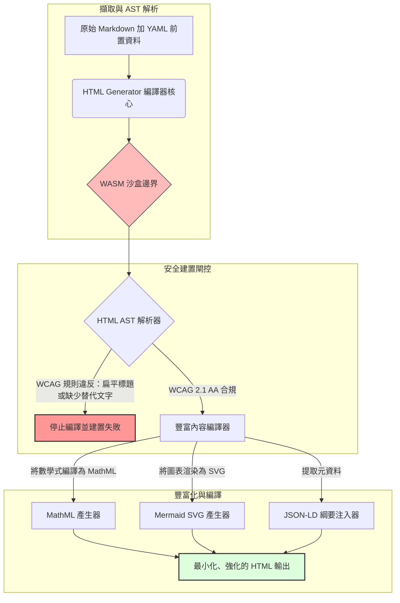

---

# Front Matter (YAML)

author: "contact@sebastienrousseau.com (Sebastien Rousseau)"
banner_alt: "結構化光線下的建築幾何圖形——象徵 HTML Generator 作為編譯閘控式 Markdown 轉 HTML 管線，為無障礙、SEO 就緒的沙盒化發布基礎設施所扮演的角色"
banner_height: "1597"
banner_width: "2584"
banner: "https://cloudcdn.pro/stocks/images/markus-winkler-IrRbSND5EUc-unsplash-1200.webp"
cdn: "https://cloudcdn.pro"
charset: "UTF-8"
cname: "sebastienrousseau.com"
copyright: "© Copyright 2025 - 2026 - Sebastien Rousseau. All rights reserved."
date: "June 20, 2026"
description: "HTML Generator 是一個 Rust 函式庫，可將 Markdown 轉換為符合 WCAG 規範、SEO 就緒、注入 JSON-LD 的 HTML——以程式碼實現無障礙，支援 MathML 與 Mermaid，並在 WebAssembly 沙盒中安全執行企業發布。"
format-detection: "telephone=no"
hreflang: "zh-hant"
icon: "https://cloudcdn.pro/clients/sebastienrousseau/v1/logos/sebastienrousseau.svg"
id: "https://sebastienrousseau.com/2026-06-20-html-generator-accessible-seo-structured-markdown-rust-2026"
image_alt: "Sebastien Rousseau 的黑白肖像"
image_height: "162"
image_width: "162"
image: "https://cloudcdn.pro/stocks/images/sebastienrousseau.webp"
keywords: "html-generator, Rust Markdown 轉 HTML, 程式碼即無障礙, WCAG 2.1 AA, SEO 就緒 HTML, JSON-LD, MathML, Mermaid, WebAssembly, EAA, DORA, ADA Title III, 無障礙發布, 沙盒解析, 開放原始碼"
language: "zh-Hant"
last_reviewed: "2026-06-20"
layout: "report"
locale: "zh_TW"
logo_alt: "Sebastien Rousseau 的標誌"
logo_height: "44"
logo_width: "44"
logo: "https://cloudcdn.pro/clients/sebastienrousseau/v1/logos/sebastienrousseau.svg"
menu: ""
measurementID: "G-169G4ET5HQ"
name: "Sebastien Rousseau"
permalink: "https://sebastienrousseau.com/2026-06-20-html-generator-accessible-seo-structured-markdown-rust-2026"
rating: "general"
referrer: "no-referrer"
robots: "index, follow"
schema: "FAQPage, Article"
seo_title: "程式碼即無障礙：用 Rust 將 Markdown 轉為 AAA HTML（2026）"
short_name: "sebastienrousseau"
subtitle: "將企業網路發布、產品文件與客戶入口網站，從無障礙的文字檔轉型為高度結構化、合規且沙盒化的數位資產。"
tags: "html-generator, Rust, Markdown, 無障礙, WCAG, SEO, JSON-LD, MathML, Mermaid, WebAssembly, EAA, DORA, ADA, AI探索, RAG, 開放原始碼, 銀行基礎設施"
theme-color: "0, 83, 191"
title: "2026 年以 Rust 將 Markdown 轉換為無障礙、SEO 就緒的結構化 HTML"
url: "https://sebastienrousseau.com/2026-06-20-html-generator-accessible-seo-structured-markdown-rust-2026"
viewport: "width=device-width, initial-scale=1, shrink-to-fit=no"

# RSS - The RSS feed front matter (YAML).
atom_link: "https://sebastienrousseau.com/2026-06-20-html-generator-accessible-seo-structured-markdown-rust-2026/rss.xml"
category: "Technology"
docs: https://validator.w3.org/feed/docs/rss2.html
generator: "Static Site Generator (SSG) (version 0.0.40)"
item_description: "HTML Generator 是一個 Rust 函式庫，可將 Markdown 轉換為符合 WCAG 規範、SEO 就緒、注入 JSON-LD 的 HTML——以程式碼實現無障礙，支援 MathML 與 Mermaid，並在 WebAssembly 沙盒中安全執行企業發布。"
item_guid: "https://sebastienrousseau.com/2026-06-20-html-generator-accessible-seo-structured-markdown-rust-2026/rss.xml"
item_link: "https://sebastienrousseau.com/2026-06-20-html-generator-accessible-seo-structured-markdown-rust-2026/rss.xml"
item_pub_date: "Sat, 20 Jun 2026 06:06:06 +0000"
item_title: "2026 年以 Rust 將 Markdown 轉換為無障礙、SEO 就緒的結構化 HTML"
last_build_date: "Sat, 20 Jun 2026 06:06:06 +0000"
managing_editor: "contact@sebastienrousseau.com (Sebastien Rousseau)"
pub_date: "Sat, 20 Jun 2026 06:06:06 +0000"
ttl: "60"
type: "article"
webmaster: "contact@sebastienrousseau.com"

# Apple - The Apple front matter (YAML).
apple_mobile_web_app_orientations: "portrait"
apple_touch_icon_sizes: "192x192"
apple-mobile-web-app-capable: "yes"
apple-mobile-web-app-status-bar-inset: "black"
apple-mobile-web-app-status-bar-style: "black-translucent"
apple-mobile-web-app-title: "用 Rust 將 Markdown 轉為 AAA HTML"
apple-touch-fullscreen: "yes"

# MS Application - The MS Application front matter (YAML).

msapplication-navbutton-color: "0, 83, 191"

# Twitter Card - The Twitter Card front matter (YAML).

twitter_card: "summary_large_image"
twitter_creator: "@wwdseb"
twitter_description: "HTML Generator 是一個 Rust 函式庫，可將 Markdown 轉換為符合 WCAG 規範、SEO 就緒、注入 JSON-LD 的 HTML——以程式碼實現無障礙，支援 MathML 與 Mermaid，並在 WebAssembly 沙盒中安全執行企業發布。"
twitter_image: "https://cloudcdn.pro/clients/sebastienrousseau/v1/logos/sebastienrousseau.svg"
twitter_image_alt: "Sebastien Rousseau 的標誌"
twitter_site: "@wwdseb"
twitter_title: "程式碼即無障礙：用 Rust 將 Markdown 轉為 AAA HTML"
twitter_url: "https://sebastienrousseau.com/2026-06-20-html-generator-accessible-seo-structured-markdown-rust-2026"

# Humans.txt - The Humans.txt front matter (YAML).
author_website: "https://sebastienrousseau.com"
author_twitter: "@wwdseb"
author_location: "London, UK"
thanks: "感謝您的閱讀！"
site_last_updated: "2026-06-20"
site_standards: "HTML5, CSS3, RSS, Atom, JSON, XML, YAML, Markdown, TOML"
site_components: "Kaishi, Kaishi Builder, Kaishi CLI, Kaishi Templates, Kaishi Themes"
site_software: "Static Site Generator, Rust"

---

# 2026 年以 Rust 將 Markdown 轉換為無障礙、SEO 就緒的結構化 HTML

<!-- lead-start -->
<aside class="post-lead" aria-label="文章摘要">

<strong>TL;DR。</strong> HTML Generator 是一個純 Rust 的 Markdown 轉 HTML 編譯器，在建置時強制執行 WCAG 2.1 AA，自動注入符合 Schema.org 規範的 JSON-LD，原生渲染 MathML 與 Mermaid SVG，並在 WebAssembly 沙盒中隔離解析——將發布流程轉變為兼顧無障礙、SEO 與資訊安全的編譯閘控平台。

<strong>重點摘要</strong>

<ul class="post-lead-takeaways">
  <li><strong>快速解答。</strong> 一句話說明 HTML Generator 是什麼？</li>
  <li><strong>執行摘要。</strong> Markdown 渲染看似簡單；達到發布級 HTML 的品質實為合規問題。</li>
  <li><strong>01. 無障礙優先的 HTML 編譯器為何在 2026 年舉足輕重。</strong> EAA 與 ADA Title III 已將無障礙從工程衛生提升為受信託責任約束的法律義務。</li>
  <li><strong>02. HTML Generator 2026 架構視角。</strong> 從原始 Markdown 到強化 HTML 輸出的多階段編譯閘控管線。</li>
</ul>

<strong>延伸閱讀：</strong> <a href="https://sebastienrousseau.com/2026-06-18-noyalib-safe-yaml-rust-ai-mcp-financial-infrastructure-2026">2026 年 AI、MCP 與金融基礎設施為何需要更安全的 Rust YAML 堆疊</a>，2026 年 AI 時代發布的預設安全靜態網站產生器，<a href="https://sebastienrousseau.com/2026-06-11-cloudcdn-open-source-blueprint-ai-native-edge-2026">CloudCDN：2026 年 AI 原生邊緣的開放原始碼藍圖</a>。

</aside>
<!-- lead-end -->

2026 年，網路內容被 AI 搜尋爬蟲、LLM 驅動的搜尋引擎與檢索增強生成（RAG）管線消費的比例，已與人類讀者相當。扁平或格式錯誤的 HTML 會干擾機器探索，而未能遵守[歐洲無障礙法（EAA）](https://www.accessibility-act.eu/)與[美國 ADA Title III](https://www.ada.gov/topics/title-iii/)等嚴格全球法規，現在是明確的民事責任。[HTML Generator](https://github.com/sebastienrousseau/html-generator) 是一個高效能 Rust 函式庫，專為在編譯器層面彌補這些缺口而設計——而非靠部署後的補丁。

## 快速解答

**一句話說明 HTML Generator 是什麼？** HTML Generator 是一個開放原始碼的純 Rust Markdown 轉 HTML 編譯器，在建置時強制執行 [WCAG 2.1 AA](https://www.w3.org/TR/WCAG21/)，自動生成語意地標與 ARIA 屬性，從 YAML 前置資料注入符合 Schema.org 規範的 [JSON-LD](https://json-ld.org/) 元資料，將 Mermaid 圖表與數學式渲染為無障礙的 SVG 與 MathML，並在 [WebAssembly](https://webassembly.org/) 沙盒中執行——將企業發布轉變為編譯閘控、受信託責任保障的控制平台。

## 執行摘要

Markdown 渲染看似簡單。達到發布級 HTML 的品質實為合規問題。2026 年 6 月，每個企業數位接觸點——投資人關係入口、法規申報、客戶文件、API 參考、行銷平台——都由人類與機器共同解析。每個頁面都承受兩股壓力：[EAA](https://www.accessibility-act.eu/) 與 [ADA Title III](https://www.ada.gov/topics/title-iii/) 使無障礙成為董事會層級的法律風險，而 AI 擷取與 RAG 管線則獎勵結構化、機器可讀的輸出。標準 Markdown 函式庫產生的扁平 HTML 同時在這兩道關卡落敗。HTML Generator 將文件生成視為編譯閘控管線：WCAG 驗證是建置錯誤，JSON-LD 從 YAML 前置資料自動生成無需手動標記，MathML 與 Mermaid 以無障礙方式渲染，整個引擎支援 WebAssembly 目標，確保不受信任文件的解析與宿主隔離。

## 重點摘要

- **程式碼即無障礙是新基準。** EAA 要求消費者數位服務具備無障礙性。HTML Generator 在編譯時評估文件樹，自動生成語意地標與 ARIA 屬性——減少部署後修正、降低補救預算，不讓缺少替代文字的內容進入生產環境。
- **結構化資料支援 AI 探索。** 現代搜尋與 RAG 依賴機器可讀的元資料。編譯器解析 YAML 前置資料並直接將 [符合 Schema.org 規範的 JSON-LD](https://schema.org/) 注入文件標頭，使內容對 [Google Rich Results](https://developers.google.com/search/docs/appearance/structured-data/intro-structured-data)、[Bing Webmaster](https://www.bing.com/webmasters) 及 LLM 驅動的爬蟲完全可解讀。
- **技術內容卓越性。** 技術發布不是純文字。HTML Generator 將 Markdown 數學擴充語法編譯為無障礙的 [MathML](https://www.w3.org/Math/)，並將 [Mermaid.js](https://mermaid.js.org/) 圖表渲染為響應式 SVG——兩者均保留 WCAG 合規結構，而非降格為不透明圖片。
- **WebAssembly 沙盒化。** 解析不受信任的 Markdown 是安全風險。透過以 [WASM](https://webassembly.org/) 為目標，HTML Generator 在隔離沙盒中執行，防止任意程式碼執行並保護宿主系統——直接滿足 [DORA Article 6](https://eur-lex.europa.eu/legal-content/EN/TXT/?uri=CELEX%3A32022R2554) 的資訊安全義務。
- **保護董事會的受信義務。** 技術不合規已進入董事會議程。採用編譯閘控 HTML 引擎作為標準，可保護董事與高級管理層免於 DORA、EAA 及 ADA Title III 下的個人民事與法規責任。

**延伸閱讀：** [2026 年 AI、MCP 與金融基礎設施為何需要更安全的 Rust YAML 堆疊](https://sebastienrousseau.com/2026-06-18-noyalib-safe-yaml-rust-ai-mcp-financial-infrastructure-2026/)，2026 年 AI 時代發布的預設安全靜態網站產生器，[CloudCDN：2026 年 AI 原生邊緣的開放原始碼藍圖](https://sebastienrousseau.com/2026-06-11-cloudcdn-open-source-blueprint-ai-native-edge-2026/)。

## 01. 無障礙優先的 HTML 編譯器為何在 2026 年舉足輕重

企業網路資產、文件庫與產品說明中心是關鍵的數位接觸點。它們現在面臨兩股強烈且相互交疊的壓力。

第一股是 **AI 擷取與可探索性**。內容越來越多地被大型語言模型與檢索增強生成管線處理。扁平或格式錯誤的 HTML 會干擾爬蟲解析，使企業研究與文件在現代搜尋典範中不可見——包括 [Google 搜尋生成式體驗](https://blog.google/products/search/generative-ai-search/)、[ChatGPT](https://chat.openai.com/) 瀏覽以及企業 RAG 智能體。

第二股是 **嚴格的全球無障礙法律**。依據[歐洲無障礙法](https://www.accessibility-act.eu/)（自 2025 年 6 月起全面適用）及[美國 ADA Title III](https://www.ada.gov/topics/title-iii/)，企業發布平台必須保證完整的數位無障礙性。未達 [WCAG 2.1 AA](https://www.w3.org/TR/WCAG21/) 不再是工程疏失；這是已導致數百萬美元和解金的民事與法規責任。

[HTML Generator](https://github.com/sebastienrousseau/html-generator) 直接應對這兩股壓力。它是一個執行緒安全的 Rust 函式庫，設計用於將 Markdown 轉換為無障礙、SEO 就緒的結構化 HTML。透過將文件生成視為編譯閘控管線，該引擎提供高度的**韌性回報（RoR）**——在保護資產負債表免受無障礙訴訟的同時，最大化 AI 探索的機器可讀性。

## 02. HTML Generator 2026 架構視角

該框架設計為安全的多階段編譯管線，將原始 Markdown 文字轉換為經過加密驗證、高度無障礙的靜態資產。

### 表 1：HTML Generator 架構層與風險緩解

| 層次 | 設計決策 | 重要性 | 處理不當的風險 |
| ---- | ---- | ---- | ---- |
| **輸入層** | Markdown 加 YAML 前置資料解析器 | 以作者熟悉的方式工作；將內文與結構元資料分離。 | 元資料不一致、Sitemap 損壞、索引缺漏。 |
| **結構層** | 自動生成目錄與帶 ARIA 標籤的語意地標 | 透過建構產生可導航、無障礙的文件樹。 | 扁平 HTML 破壞螢幕閱讀器並違反 WCAG。 |
| **豐富內容層** | 原生 MathML 與 Mermaid.js SVG 渲染 | 將公式與圖表編譯為無障礙的 SVG 與 MathML。 | 客戶端 JS 渲染延遲及輔助技術輸出中斷。 |
| **SEO 與資料層** | 整合 JSON-LD 與結構化元資料生成 | 直接將 [Schema.org](https://schema.org/) 合規的 JSON-LD 注入標頭。 | 搜尋引擎與 AI 爬蟲誤讀作者、情境與授權。 |
| **執行層** | 原生 Rust 編譯器搭配 WebAssembly 目標 | 在伺服器、邊緣節點與瀏覽器上實現安全的沙盒執行。 | 解析不受信任的 Markdown 時發生任意程式碼執行。 |

## 03. 關鍵網路安全與無障礙指標

為確認公開發布的資產滿足現代法規與安全稽核，資深技術主管必須監控具體且可量化的指標。

### 表 2：網路安全與無障礙指標

| 指標 | 衡量標準 / 運營基準 | EAA / DORA / W3C 參考 | 技術實作 |
| ---- | ---- | ---- | ---- |
| **無障礙合規性** | 100% 的編譯頁面通過 WCAG 2.1 AA 規則驗證。 | [EAA](https://www.accessibility-act.eu/) 與 [ADA Title III](https://www.ada.gov/topics/title-iii/) | 建置時 HTML 解析器評估圖片替代文字與語意地標。 |
| **WASM 執行沙盒** | 100% 的不受信任 Markdown 輸入在隔離的 WebAssembly 執行環境中編譯。 | [DORA Article 6](https://eur-lex.europa.eu/legal-content/EN/TXT/?uri=CELEX%3A32022R2554)（資訊安全） | 將解析環境與宿主伺服器隔離。 |
| **結構化元資料覆蓋率** | 100% 的發布文章注入有效且符合 Schema.org 規範的 JSON-LD 標頭。 | [Schema.org](https://schema.org/) 規範 | 自動解析前置資料並轉換為 JSON-LD 物件。 |
| **編譯吞吐量** | 在一般硬體上每秒頁面數目標超過 10,000。 | 韌性回報（RoR） | 高度並行化的 Rust AST 編譯器。 |
| **豐富摘要驗證** | 在 [Google Rich Results](https://search.google.com/test/rich-results) 與 [Schema validator](https://validator.schema.org/) 執行中零解析錯誤。 | Google 搜尋指南 | 在建置管線中對生成的 JSON-LD 進行結構驗證。 |

## 04. 簡單 Markdown 渲染的迷思

技術管理人員中有一個常見的誤解：將 Markdown 轉換為 HTML 是簡單的文字替換工作。許多標準函式庫將 Markdown 格式轉換為扁平、無結構的 HTML。輸出在瀏覽器中對視力正常的讀者來說可正常顯示，但這代表一個合規陷阱。

扁平 HTML 通常缺少三件事。

1. **正確的標題層次結構。** 標準 Markdown 不強制標題順序。從 `<h1>` 跳到 `<h4>` 違反 WCAG 2.1 AA，並破壞螢幕閱讀器的文件導航。
2. **明確的表格語意。** 標準 Markdown 表格很少以無障礙解析所需的正確 `<th>` 範圍與 `<tbody>` 屬性渲染。
3. **機器可讀的元資料。** 標準 HTML 缺乏現代 AI 搜尋平台與 RAG 擷取系統所依賴的 JSON-LD 鉤子。

HTML Generator 透過將 Markdown 解析為**抽象語法樹（AST）**來解決這個問題。引擎在產生 HTML 之前評估文件結構，驗證標題巢狀層級、注入適當的 ARIA 屬性，並確認每個媒體資產都有替代文字——將無障礙從手動稽核轉變為編譯時的保證不變量。

## 05. 設計程式碼即無障礙的建置管線

為防止無障礙不合規或未被索引的資產進入公開部署，無障礙必須是嚴格的編譯閘控。以下管線展示 HTML Generator 如何評估 Markdown、執行 WebAssembly 隔離驗證，並輸出強化的結構化 HTML。

## 06. 董事會行動手冊與受信義務

現代無障礙與網路安全合規是不可迴避的董事會議題。高級管理層必須從法律風險、財務保全與法規風險的視角審視發布基礎設施。

- **歐洲無障礙法（EAA）。** 對公共與私人數位入口網站施加直接且具法律約束力的合規義務。不合規可能產生嚴重財務罰款、民事訴訟，並導致資產立即被強制退出歐盟市場。透過整合程式碼即無障礙，董事會可認證不合規程式碼無法出貨——將被動補救轉變為結構性法律防護。
- **DORA Article 6（安全資訊環境）。** 建立資訊環境安全的嚴格規則。透過在 WebAssembly 沙盒中隔離 Markdown 編譯，組織確保解析客戶上傳的文件或合作夥伴資料無法將宿主伺服器暴露於任意程式碼執行，保護關鍵銀行入口。
- **降低合規稽核成本。** 傳統無障礙合規依賴昂貴的、回溯性的部署後稽核——每個網站每年數萬美元。將 WCAG 驗證實作為編譯時阻斷，可消除這些回溯成本，將合規預算從防禦轉移到創新。

## 07. 各銀行與企業類型的意義

### 全球系統重要性銀行（G-SIBs）

G-SIBs 管理龐大的多語言公開資產，在多個司法管轄區發布數千份研究報告、法規披露與投資人關係文件。其挑戰在於規模與多語言一致性。HTML Generator 的 WebAssembly 目標與高吞吐量 Rust 引擎，使大規模本地化研究庫能在數秒內全球更新、編譯與部署——不存在渲染延遲或無障礙回退。

### 交易與企業銀行

對交易銀行而言，客戶入口、文件中心與開發者 API 指南是關鍵的數位接觸點。透過 HTML Generator 編譯這些資產，意味著面向客戶的渠道不存在 XSS 暴露、依賴項挾持載體或無障礙缺陷——維護機構信任並降低訴訟風險。

### 區域銀行與金融科技公司

區域銀行與敏捷金融科技公司在沒有 G-SIB 工程預算的情況下競爭數位體驗。HTML Generator 為這些團隊提供開箱即用的企業級發布管線，讓較小的機構能夠交付無障礙、SEO 就緒、沙盒化的資產，既能承受監管機構的審查，也能滿足潛在企業客戶的要求。

## 08. 發布基礎設施路線圖

企業公開網路資產是運營韌性的核心組成部分。依賴緩慢、動態脆弱、資料庫驅動的網路引擎——或未簽署的靜態資產——是不可接受的業務風險。

為保護公開數位接觸點並防止資產負債表受無障礙訴訟衝擊，資深技術與安全主管應執行明確的路線圖。

1. **轉向靜態架構。** 逐步淘汰研究、行銷與文件資產的舊式動態 CMS 平台。將內容遷移至 HTML Generator 等編譯閘控管線。
2. **在建置時強制無障礙。** 實作程式碼即無障礙。在任何 WCAG 2.1 AA 違規時自動使編譯管線失敗。
3. **在 WebAssembly 中隔離解析。** 將所有文件與內容解析沙盒化在 WASM 執行環境中，使不受信任的輸入永不觸及宿主系統。
4. **注入豐富的 JSON-LD 元資料。** 確保每個發布的資產都帶有符合 Schema.org 規範的 JSON-LD 標頭，以最大化 AI 可探索性。

## 09. 常見問題

**HTML Generator 如何強制執行無障礙？**

它在建置時解析生成的 HTML 抽象語法樹（AST），根據 [WCAG 2.1 AA](https://www.w3.org/TR/WCAG21/) 規則評估文件。若規則被違反——缺少 alt 屬性、跳過標題層級、未標記的表單控制項——編譯器停止建置，將無障礙視為編譯時不變量，而非部署後稽核任務。

**WebAssembly 隔離為何重要？**

[WebAssembly](https://webassembly.org/) 允許 Markdown 解析引擎在隔離沙盒中執行，與宿主伺服器分隔。即使惡意行為者上傳針對解析器漏洞精心製作的 Markdown 文件，執行也被攔截——保護宿主系統並滿足 DORA Article 6 的資訊安全義務。

**JSON-LD 如何在 2026 年提升搜尋可探索性？**

[JSON-LD](https://json-ld.org/) 在文件標頭提供結構化、機器可讀的元資料。[Google Rich Results](https://developers.google.com/search/docs/appearance/structured-data/intro-structured-data)、Bing 爬蟲與 LLM 驅動的搜尋智能體可立即識別作者、授權、發布日期與語意情境——繞過標準 HTML 的歧義性，在 AI 驅動的探索中擴大觸及面。

**HTML Generator 的目標受眾是誰？**

靜態網站建設者、文件團隊、技術寫作者、Rust 開發人員，以及交付無障礙關鍵或面向監管機構資產的平台工程師。它也是大型安全發布管線（如 [Static Site Generator (SSG)](https://github.com/sebastienrousseau/static-site-generator)）中可行的內容處理層。

## 10. 參考資料

- 全球資訊網協會（W3C），2024年。[網路內容無障礙指引（WCAG）2.1 ⧉](https://www.w3.org/TR/WCAG21/ "Web Content Accessibility Guidelines 2.1")。
- Schema.org，2026年。[Schema.org 結構化資料規範 ⧉](https://schema.org/ "Schema.org structured-data specifications")。
- 歐洲議會與歐盟理事會，2022年。[歐盟法規 2022/2554——金融部門數位運營韌性（DORA）⧉](https://eur-lex.europa.eu/legal-content/EN/TXT/?uri=CELEX%3A32022R2554 "DORA Regulation")。
- 歐盟委員會，2025年。[歐洲無障礙法 ⧉](https://www.accessibility-act.eu/ "European Accessibility Act")。
- 美國司法部，2024年。[ADA Title III ⧉](https://www.ada.gov/topics/title-iii/ "ADA Title III")。
- WebAssembly 社群工作組，2026年。[WebAssembly 規範 ⧉](https://webassembly.org/ "WebAssembly")。
- GitHub，2026年。[HTML Generator 儲存庫 ⧉](https://github.com/sebastienrousseau/html-generator "HTML Generator open-source repository")。

<!-- enrich-start -->
<aside class="author-card" aria-label="關於作者"><strong class="author-card-name"><a href="/about/index.html">Sebastien Rousseau</a></strong>資深銀行科技作家，專注於應用 AI、支付基礎設施、代幣化貨幣、ISO 20022、後量子安全、雲端原生金融服務、開放原始碼基礎設施與受監管數位市場。20 餘年橫跨滙豐商業及投資銀行、PayPal、巴克萊、Shazam、AKQA、維珍集團。<a href="/about/index.html">完整簡介</a> &middot; <a href="https://www.linkedin.com/in/sebastienrousseau/" rel="external noopener">LinkedIn</a> &middot; <a href="https://github.com/sebastienrousseau" rel="external noopener">GitHub</a></aside>

最後審閱日期 <time datetime="2026-06-20">2026-06-20</time>。

<!-- enrich-end -->
