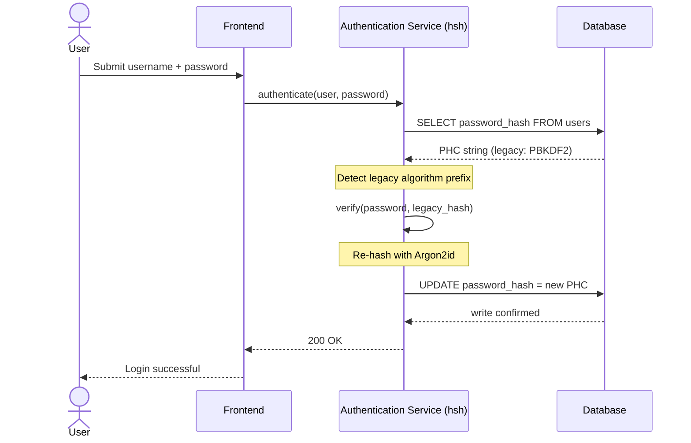
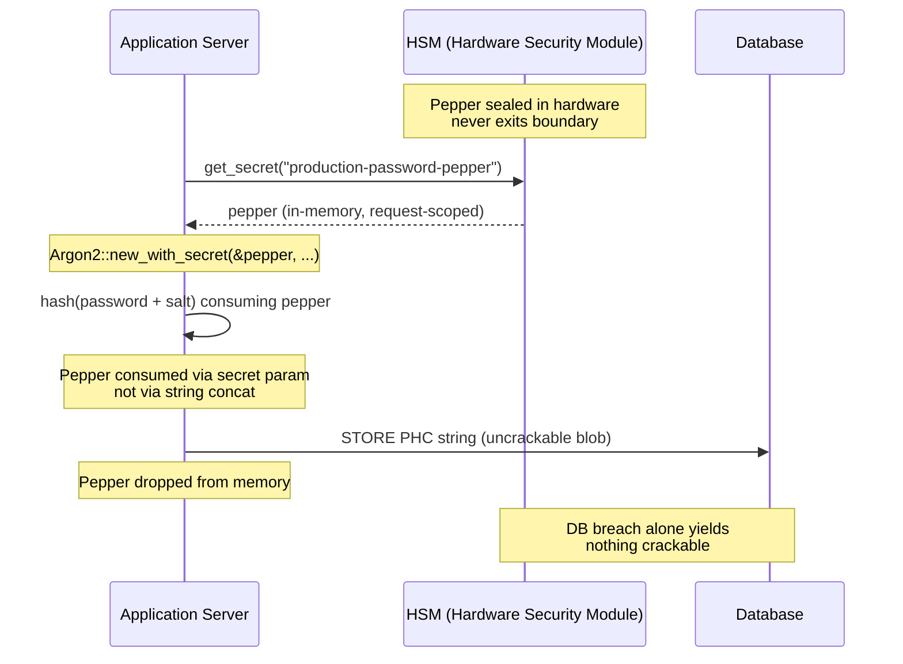

---
# Front Matter (YAML)
author: "contact@sebastienrousseau.com (Sebastien Rousseau)"
banner_alt: "開發者終端機特寫,捲動顯示 Rust 編譯器輸出——可見的紀律,構成企業銀行身分驗證資產底層的記憶體安全、可稽核密碼學基底"
banner_height: "1597"
banner_width: "2584"
banner: "https://cloudcdn.pro/stocks/images/rustlogs.webp"
cdn: "https://cloudcdn.pro"
charset: "UTF-8"
cname: "sebastienrousseau.com"
copyright: "© Copyright 2025 - 2026 - Sebastien Rousseau. All rights reserved."
date: "June 22, 2026"
description: "hsh 是純 Rust 的密碼學框架,讓一線銀行能以零停機將舊式密碼雜湊遷移至 Argon2id,整合 HSM peppering 並消除 C 語言 FFI 的記憶體漏洞,以符合 DORA 韌性要求。"
format-detection: "telephone=no"
hreflang: "zh-hant"
icon: "https://cloudcdn.pro/clients/sebastienrousseau/v1/logos/sebastienrousseau.svg"
id: "https://sebastienrousseau.com/2026-06-22-hsh-zero-downtime-cryptographic-stewardship-rust-banking-2026"
image_alt: "Sebastien Rousseau 的黑白肖像"
image_height: "162"
image_width: "162"
image: "https://cloudcdn.pro/stocks/images/sebastienrousseau.webp"
keywords: "hsh, Rust 密碼學, 密碼雜湊, Argon2id, 銀行資安, HSM 互鎖, DORA 法遵, Basel III, 零停機遷移, 記憶體安全, PBKDF2, scrypt, 網路復原"
language: "zh-Hant"
last_reviewed: "2026-06-22"
layout: "report"
locale: "zh_TW"
logo_alt: "Sebastien Rousseau 的識別標誌"
logo_height: "44"
logo_width: "44"
logo: "https://cloudcdn.pro/clients/sebastienrousseau/v1/logos/sebastienrousseau.svg"
measurementID: "G-169G4ET5HQ"
name: "Sebastien Rousseau"
permalink: "https://sebastienrousseau.com/2026-06-22-hsh-zero-downtime-cryptographic-stewardship-rust-banking-2026"
rating: "general"
referrer: "no-referrer"
robots: "index, follow"
schema: "FAQPage, Article"
seo_title: "hsh:Rust 打造的零停機銀行密碼學受託機制"
short_name: "sebastienrousseau"
subtitle: "純 Rust 密碼學框架如何讓銀行以 HSM 互鎖無縫升級舊式密碼至 Argon2id——以及對 DORA 與 Basel III 法遵的意義。"
tags: "hsh, Rust, 銀行, 密碼學, Argon2id, HSM, DORA, Basel-III, 資安, 開源, 營運韌性"
theme-color: "0, 83, 191"
title: "企業銀行密碼管理的守護:以 hsh 進行多演算法雜湊與升級"
url: "https://sebastienrousseau.com/2026-06-22-hsh-zero-downtime-cryptographic-stewardship-rust-banking-2026"
viewport: "width=device-width, initial-scale=1, shrink-to-fit=no"

# RSS
atom_link: "https://sebastienrousseau.com/2026-06-22-hsh-zero-downtime-cryptographic-stewardship-rust-banking-2026/rss.xml"
category: "Technology"
generator: "Static Site Generator (SSG) (version 0.0.40)"
item_description: "hsh 是純 Rust 的密碼學框架,讓一線銀行能以零停機將舊式密碼雜湊遷移至 Argon2id,整合 HSM peppering 並消除 C 語言 FFI 的記憶體漏洞,以符合 DORA 韌性要求。"
item_pub_date: "Mon, 22 Jun 2026 07:07:07 +0000"
item_title: "企業銀行密碼管理的守護:以 hsh 進行多演算法雜湊與升級"
pub_date: "Mon, 22 Jun 2026 07:07:07 +0000"
type: "article"

# Twitter Card
twitter_card: "summary_large_image"
twitter_creator: "@wwdseb"
twitter_description: "hsh 讓一線銀行以零停機、HSM 互鎖與記憶體安全的 Rust,將舊式密碼雜湊遷移至 Argon2id。"
twitter_image: "https://cloudcdn.pro/clients/sebastienrousseau/v1/logos/sebastienrousseau.svg"
twitter_title: "hsh:Rust 打造的零停機密碼學受託機制"
twitter_url: "https://sebastienrousseau.com/2026-06-22-hsh-zero-downtime-cryptographic-stewardship-rust-banking-2026"

excerpt: "在 GPU 加速破解與 DORA 要求的時代,密碼學腐化是系統性風險。每一筆躺在銀行資料庫中的舊式 PBKDF2 或 scrypt 雜湊,都是邁向資安失守的倒數計時器。hsh 以零停機、記憶體安全的升級扭轉局面……"

# Added by fix_hsh_frontmatter.py (template completeness)
apple_mobile_web_app_orientations: "portrait"
apple_touch_icon_sizes: "192x192"
apple-mobile-web-app-capable: "yes"
apple-mobile-web-app-status-bar-inset: "black"
apple-mobile-web-app-status-bar-style: "black-translucent"
apple-touch-fullscreen: "yes"
author_location: "London, United Kingdom"
author_twitter: "@wwdseb"
author_website: "https://sebastienrousseau.com"
docs: https://validator.w3.org/feed/docs/rss2.html
item_guid: "https://sebastienrousseau.com/2026-06-22-hsh-zero-downtime-cryptographic-stewardship-rust-banking-2026/rss.xml"
item_link: "https://sebastienrousseau.com/2026-06-22-hsh-zero-downtime-cryptographic-stewardship-rust-banking-2026/rss.xml"
last_build_date: "Mon, 22 Jun 2026 06:06:06 +0000"
managing_editor: "contact@sebastienrousseau.com (Sebastien Rousseau)"
menu: "active"
msapplication-navbutton-color: "0, 83, 191"
site_components: "Kaishi, Kaishi Builder, Kaishi CLI, Kaishi Templates, Kaishi Themes"
site_last_updated: "2023-07-05"
site_software: "Static Site Generator, Rust"
site_standards: "HTML5, CSS3, RSS, Atom, JSON, XML, YAML, Markdown, TOML"
ttl: "60"
twitter_site: "@wwdseb"
webmaster: "contact@sebastienrousseau.com"
apple-mobile-web-app-title: "hsh: Rust password hashing"
thanks: "感謝閱讀！"
twitter_image_alt: "Sebastien Rousseau 的黑白肖像"
---

# 企業銀行密碼管理的守護:以 hsh 進行多演算法雜湊與升級

<!-- lead-start: manual -->
<aside class="post-lead" aria-label="文章摘要">
<p class="post-lead-tldr"><strong>速答。</strong><a href="https://github.com/sebastienrousseau/hsh">hsh</a> 是開源、純 Rust 的密碼學框架,讓一線銀行能在服務零中斷的前提下,將舊式密碼雜湊遷移至 Argon2id 等現代標準。透過整合 HSM 後盾的 peppering 並嚴格執行記憶體安全、不依賴 C 語言 FFI 包裝,它封堵了直接威脅 DORA 與 Basel III 法遵的密碼學腐化漏洞。</p>
<p class="post-lead-heading"><strong>關鍵要點</strong></p>
<ul class="post-lead-takeaways">
  <li><strong>密碼學腐化問題。</strong>PBKDF2 等舊式演算法隨硬體加速而呈指數級弱化,擴大了憑證填充與離線暴力破解攻擊的受攻擊面。</li>
  <li><strong>零停機遷移。</strong><code>verify_and_upgrade</code> 模式於標準登入事件中以透明方式重新雜湊使用者憑證,免去大規模資料庫遷移的營運風險。</li>
  <li><strong>硬體互鎖與 peppering。</strong>雜湊以硬體安全模組(HSM)或雲端 KMS 架構包裝,確保僅資料庫外洩無法產生任何可破解的候選密碼。</li>
  <li><strong>記憶體安全作為監理基準。</strong>hsh 完全以安全 Rust 重寫,並透過嚴格的相依套件衛生強化,消弭舊式 C 語言密碼學函式庫固有的緩衝區溢位與供應鏈風險。</li>
</ul>
<p class="post-lead-related"><strong>延伸閱讀:</strong><a href="https://sebastienrousseau.com/2026-06-20-http-handle-zero-dependency-edge-ingress-banking-rust-2026">http-handle:2026 年銀行業的高效能、零相依邊緣入口</a>、<a href="https://sebastienrousseau.com/2026-06-07-autonomous-treasury-index-programmable-liquidity-tokenised-deposits-2026/index.html">2026 年自主財資指數</a>。</p>
</aside>
<!-- lead-end -->

> **執行摘要。** 以 2018 年威脅模型打造的銀行身分驗證,已無法因應 2026 年的監理體制。GPU 加速破解、ASIC 密度提升,以及逼近的後量子地平線,已使 PBKDF2 與早期參數 scrypt 的安全餘裕坍塌;DORA 第 5 條更將這項衰敗轉為董事會須負責的監理責任。hsh 作為開源純 Rust 框架,從三個層次平行對應問題:`verify_and_upgrade` 分派器,在每次成功登入時即時將既有憑證重新雜湊為當前 Argon2id 參數,無需維護時間窗;HSM 或 KMS 互鎖的 peppering 層,使僅憑資料庫外洩無從產生可破解資料;以及記憶體安全的供應鏈,消除 C 語言密碼學函式庫固有的外部函式介面(FFI)受攻擊面。最終成果,是一套可同時滿足 DORA、Basel III 營運風險紀律、SM&CR 高階主管問責,以及 NIST IR 8547 後量子遷移地平線的基底——無需歷來升級身分驗證資產所需的大規模重設行動。

大多數企業銀行的身分驗證,至今仍仰賴一層僅針對 2018 年威脅模型強化的密碼。破解它的硬體早已換代。隨著 GPU 農場規模化、密碼學相關量子電腦(CRQCs)逼近,舊式雜湊——PBKDF2、早期 scrypt——在攻擊者花於離線破解佇列上的每一小時運算中持續衰敗。這種衰敗悄無聲息:正式資料庫中沒有任何訊號告訴你,昨日仍堅固的雜湊今日已不再可靠。

依據[數位營運韌性法(DORA)](https://eur-lex.europa.eu/eli/reg/2022/2554/oj "Regulation (EU) 2022/2554 — 數位營運韌性法"),將未經輪替的舊式密碼學資產留在正式環境,已不再是技術債,而是被明文點名的監理責任。

[hsh](https://github.com/sebastienrousseau/hsh "hsh — 純 Rust 密碼雜湊框架") 縫合此一缺口。作為純 Rust 框架,它並行管理多種雜湊格式,並於使用中登入流程內即時升級弱憑證。身分驗證基礎建設可對齊 2026 年的韌性要求,無需維護時間窗、無需強制重設、無需任何一秒停機。

## 01. 銀行業的密碼學腐化問題

要理解 hsh 這類框架的必要性,必先理解密碼雜湊的生命週期。演算法並不會優雅地老化;它們會相對於可用以破解的硬體而衰敗。

**ASIC/GPU 加速落差。**PBKDF2 等演算法的設計,是讓 CPU 在運算上昂貴。如今,攻擊者改用高度平行化的 GPU 執行離線字典攻擊。2018 年產生的舊式雜湊,面對 2026 年對手已大幅弱化。

**大爆炸遷移風險。**當資訊安全長(CISO)決定從 PBKDF2 升級至 Argon2id 這類記憶體高耗演算法時,雜湊無法逆向以便重新加密。傳統解法——強制數百萬使用者重設密碼——會造成大量客戶摩擦與營運風險。

**C 語言函式庫供應鏈。**過去,銀行中介軟體常依賴 `argonautica` 等函式庫或原生 C 綁定來處理雜湊。這些函式庫帶有隱性的供應鏈風險:身分驗證模組中單一的記憶體緩衝區溢位,即可在銀行堆疊最高權限層導致遠端程式碼執行(RCE)。

### 演算法比較——硬體抗性與調校面

銀行在遷移作業中實際遇到的三種演算法,差異不在於密碼學基元的選擇,而在於它們承受硬體壓力時的老化方式。下表彙整實務態勢。

| Algorithm | 記憶體高耗 | GPU / ASIC 抗性 | 調校面 | 2026 狀態 |
| ---- | ---- | ---- | ---- | ---- |
| **PBKDF2** | 否 | 低——可於 GPU 上向量化;在通用硬體上每次猜測耗時不到一毫秒。 | 僅迭代次數。 | 已成舊式。僅可作為遷移期間驗證端的後備。 |
| **scrypt** | 是(中等) | 中等——記憶體成本可擊退簡單的 GPU 農場;具規模時可被 ASIC 攤銷。 | `N`(CPU/記憶體)、`r`(區塊大小)、`p`(平行度)。 | 對於新建系統已不建議。仍活躍於遷移語料中。 |
| **Argon2id** | 是(高) | 高——同時為記憶體高耗與時間高耗;可抵抗側通道與 TMTO 攻擊。 | 記憶體成本(`m`)、時間成本(`t`)、平行度(`p`)、秘密值(pepper)。 | 建議的預設值。OWASP、NIST SP 800-63B-4 草案、FedRAMP。 |

遷移計畫的結論很窄:PBKDF2 是*驗證端*狀態,而非*寫入端*目的地。每一筆 PBKDF2 紀錄上的成功登入,離開時都應產出一筆 Argon2id 紀錄。

## 02. hsh 2026 架構視角

此框架由五個核心分層構成,每一層皆為緩解某一類營運風險而設計。

### 表 1:hsh 架構分層與風險緩解

| 分層 | 設計決策 | 為何重要 | 處理不當的風險 |
| ---- | ---- | ---- | ---- |
| **密碼學基元** | 統一的 PHC 字串格式,支援 Argon2id、scrypt 與 PBKDF2 | 提供業界領先的 GPU 攻擊抵抗力,同時維持向後相容。 | 資料孤島;弱演算法容許離線每秒 1,000 億次以上的猜測。 |
| **政策引擎** | `verify_and_upgrade` 分派 | 於登入時動態自動完成由舊政策過渡至新政策。 | 資安腐化;活躍使用者仍停留於易破解的舊式雜湊型別。 |
| **硬體互鎖** | HSM 與雲端 KMS「peppering」能力 | 確保僅資料庫外洩無法曝露候選密碼。 | SQL 注入外洩後,離線暴力破解攻擊得逞。 |
| **資安衛生** | `deny.toml` 強制執行與純 Rust | 全面封鎖不安全的 FFI 與不可信的外部 C 相依套件。 | 災難性供應鏈攻擊與記憶體破壞 CVE。 |

## 03. 零停機重新雜湊路徑

`verify_and_upgrade` 模式透過具狀態感知的智慧分派系統解決資料遷移,過程中所需的資料庫停機為零。

當使用者提交憑證時,hsh 讀取已儲存的密碼雜湊競賽(PHC)字串。若其中包含舊式雜湊(例如已過時的 PBKDF2 設定),系統即執行下列流程:

1. **辨識:**剖析舊式演算法及其特定參數。
2. **驗證:**以候選密碼驗證舊式雜湊。
3. **即時升級:**比對成功後,於記憶體中取得候選密碼的明文,並立即以高度安全的 Argon2id 政策計算新的雜湊。
4. **持久化:**將新的 PHC 字串回傳予銀行應用程式,後者於資料庫中覆寫舊紀錄。

此流程對終端使用者完全透明。它有效地讓最活躍的帳號於首日即遷移至最高資安等級,在時間推進中有機地大幅削減銀行的受攻擊面。

下方序列圖呈現當已儲存紀錄仍處於舊式演算法時,單次登入事件中所發生的流程。使用者看不到任何變化,而銀行的身分驗證資產則多了一筆強化紀錄。



### 實作模式——`verify_and_upgrade` 分派

於身分驗證服務內的整合面積很小。舊路徑保留為後備,新路徑就是分派器。

```rust
use hsh::{Hasher, UpgradeResult};

struct UserRecord {
    username: String,
    password_hash: String, // PHC string
}

async fn authenticate(user: UserRecord, password_attempt: &str) -> Result<bool, AuthError> {
    let hasher = Hasher::new();
    match hasher.verify_and_upgrade(password_attempt, &user.password_hash) {
        Ok(UpgradeResult::Verified(is_valid)) => Ok(is_valid),
        Ok(UpgradeResult::Upgraded(new_hash)) => {
            db::update_user_hash(&user.username, new_hash).await?;
            Ok(true)
        }
        Err(_) => Err(AuthError::InvalidCredentials),
    }
}
```

有三項屬性至關重要:

- **狀態感知。**`verify_and_upgrade` 檢視 PHC 字串前綴。若演算法標記為舊式,框架便會依據設定的 Argon2id 政策自動觸發重新雜湊。呼叫端程式碼無需任何分支判斷。
- **原子性。**重新雜湊只在舊式驗證成功之後、於同一身分驗證事件內進行。沒有獨立的批次任務、沒有排定的遷移時間窗、也沒有需要復原的破壞性大規模遷移。
- **持久化。**`UpgradeResult::Upgraded` 變體攜帶新的 PHC 字串。應用程式透過原本就存在於舊紀錄的同一條資料路徑加以持久化——無需平行寫入面、無需兩階段寫入協定。

**失敗模式。**若資料庫寫入失敗,或 KMS 在升級寫入期間短暫無法連線,該登入仍會以舊式雜湊驗證成功,紀錄則繼續維持於舊演算法。下一次成功登入會重試升級。系統不會出現半遷移狀態,使用者也看不到任何失敗——遷移在多次登入事件間具備單調性,每一筆紀錄一次升級失敗的代價,正好就是下次登入時多一次重試。

## 04. 經由 HSM / KMS 互鎖的 peppered 雜湊

標準的密碼雜湊可防範直接的資料庫外洩,但若攻擊者同時取得資料庫(雜湊與 salt),便可執行離線破解。

hsh 引入穩健的「peppered」資安層。透過與硬體安全模組(HSM)或雲端原生金鑰管理服務(KMS)整合,最終的 Argon2id 輸出會以一把絕不離開安全硬體邊界的高熵金鑰進行密碼學包裝。若使用者資料庫被外洩,攻擊者僅持有加密後的 blob。除非同時攻破銀行物理隔離的 HSM 基礎建設,否則他們無法著手破解密碼。

下方架構圖追蹤秘密的流向。pepper 永遠不會落地於資料庫,資料庫本身也不持有任何可單獨定址的內容。兩個儲存體可彼此獨立失效——唯有兩者同時失效,系統才會喪失機密性。



### 實作模式——HSM 後盾的 peppered Argon2id

pepper 於請求時自 HSM 取得,而非來自設定檔。`Argon2::new_with_secret` 透過演算法的秘密參數消費它,而非以字串串接方式注入。

```rust
use argon2::{
    Argon2, Algorithm, Version, Params,
    PasswordHasher, PasswordVerifier,
    password_hash::{PasswordHash, SaltString, rand_core::OsRng},
};

async fn authenticate_with_hsm(
    user: UserRecord,
    password_attempt: &str,
) -> Result<bool, AuthError> {
    let pepper = hsm::client::get_secret("production-password-pepper").await?;
    let hasher = Argon2::new_with_secret(
        &pepper,
        Algorithm::Argon2id,
        Version::V0x13,
        Params::default(),
    )
    .map_err(|_| AuthError::Internal)?;

    let parsed = PasswordHash::new(&user.password_hash)
        .map_err(|_| AuthError::InvalidCredentials)?;
    if hasher.verify_password(password_attempt.as_bytes(), &parsed).is_ok() {
        if is_legacy_hash(&user.password_hash) {
            let new_hash = hasher
                .hash_password(
                    password_attempt.as_bytes(),
                    &SaltString::generate(&mut OsRng),
                )
                .map_err(|_| AuthError::Internal)?
                .to_string();
            db::update_user_hash(&user.username, new_hash).await?;
        }
        return Ok(true);
    }
    Err(AuthError::InvalidCredentials)
}
```

由此架構衍生出三項與 DORA 對齊的後果:

- **金鑰輪替成為金鑰管理問題。**pepper 駐留於 HSM/KMS 邊界之後,而非資料庫之中。輪替成為金鑰管理變更,而非橫掃使用者群的重新雜湊行動。新雜湊綁定當前 pepper 版本;舊雜湊則於其綁定版本下完成驗證,直到它們自然升級。
- **職責分離。**讀取 pepper 的服務身分必須可稽核且具最小權限。完整資料庫外洩若未同時取得對應的 HSM 授權,即無任何可破解內容;HSM 授權若被攻破而未取得資料庫,則無任何可定址對象。任一單點失效的爆炸半徑都受到約束。
- **避免長度延伸與串接 bug。**採用 Argon2 的秘密參數而非字串串接,將一整類密碼學陷阱——長度延伸、UTF-8 串接型別錯誤、salt/pepper 排序 bug——自實作面排除。

## 05. 監理對應:DORA、Basel III 與 SM&CR

- **DORA 第 5 與第 6 條:**要求金融機構維持 ICT 風險管理框架。仰賴未經輪替、長達十年的舊式密碼雜湊之策略,違反這些原則。hsh 提供有文件、可自動化的機制,持續提升密碼學防護等級。
- **Basel III:**將監理資本與損失事件的機率與嚴重性連動。透過 Argon2id 搭配 HSM 互鎖,資料庫外洩的嚴重性大幅下降,可支持降低營運風險資本分配的可量化論點。
- **SM&CR 問責:**核准一套主動修補密碼學腐化的架構,為被指名的高階主管提供可驗證、可文件化的風險縮減證據鏈。

## 常見問題

**hsh 是否已可用於一線銀行的身分驗證路徑?**
此函式庫為開源、具備文件,並透過支撐 RustCrypto 密碼雜湊生態系的同一個 `argon2` crate 運作 Argon2id。一線銀行的採用,須依循銀行自身的盡職調查流程:獨立程式碼審查、可重現建置之憑證、相依樹版本鎖定、HSM 廠商整合測試,以及營運風險核可。hsh 提供基底;銀行為部署背書。

**`verify_and_upgrade` 如何規避大規模遷移風險?**
驗證器在剖析階段檢視 PHC 字串、執行舊式演算法以驗證密碼,並——當所儲存的演算法或參數集低於當前下限時——以綁定 HSM pepper 的 Argon2id 重新雜湊明文,並原子地寫回新的 PHC 字串。使用者體驗到的是一次正常登入。資產則隨每一次成功的身分驗證,以一筆紀錄的增量強化。沒有重設行動、沒有維護時間窗、沒有營運風險事件。

**從未登入的休眠帳號該如何處理?**
從未驗證的紀錄就從未重新雜湊。銀行以兩項互補政策處理:一是有明文規範的休眠門檻(通常為 18–24 個月),逾此門檻則由受控重設行動行政性輪替帳號;二是針對特定族群(高金額、高權限、受監理)於排定維護期間進行的合成式重新雜湊批次。兩者皆為政策層面的決定,而非函式庫行為;hsh 會將分派決策記錄於稽核遙測中,讓營運負責人得以舉證涵蓋範圍。

**HSM pepper 是否會在身分驗證路徑上引入單一故障點?**
為支付訊息簽章、輪替 KMS 後盾金鑰所使用的同一座 HSM,本就在路徑上。風險與銀行既有態勢一致;hsh 是繼承它,而非引入它。緩解措施屬於業界標準:HA HSM 配對、熱備援 KMS 區域、以斷路器後備至唯讀模式的請求範圍 pepper 取得,以及針對 HSM 不可用情境的明文營運手冊。pepper 為 `argon2` 的秘密參數,於程序內消費後即從記憶體中釋出。

**hsh 在後量子遷移中的定位為何?**
hsh 是密碼與秘密雜湊框架,並非金鑰封裝或簽章基元。[NIST IR 8547](https://csrc.nist.gov/pubs/ir/8547/ipd "Transition to Post-Quantum Cryptography Standards") 所記載的 PQC 過渡,聚焦於金鑰建立(ML-KEM,FIPS 203)與簽章(ML-DSA,FIPS 204;SLH-DSA,FIPS 205)。hsh 涵蓋的雜湊層,大致與該遷移正交。兩者於基底層次匯流——皆需要記憶體安全、可稽核、可重現建置的密碼學供應鏈——而這正是 hsh 今日所成就的態勢。

## 結論

部署即遺忘的密碼雜湊時代已結束。DORA 已將密碼學被動性由技術債推進為被點名的監理責任,而硬體曲線一年比一年陡。hsh 的貢獻並非更強的演算法——Argon2id 已存在多年。它的貢獻在於具備可操作機制,得以在不安排停機、不強迫使用者重設、且不託付 C 語言 FFI 墊片掌管銀行身分驗證路徑的前提下完成遷移。

[hsh 原始碼](https://github.com/sebastienrousseau/hsh "hsh — 純 Rust 密碼雜湊框架,以 MIT 與 Apache 2.0 雙重授權釋出")以 MIT 與 Apache 2.0 雙重授權提供。

## 參考文獻

巴塞爾銀行監理委員會(2011)。《Basel III:更具韌性的銀行與銀行體系全球監理框架》。國際清算銀行。取自:[https://www.bis.org/publ/bcbs189.pdf](https://www.bis.org/publ/bcbs189.pdf "Basel III: A global regulatory framework for more resilient banks and banking systems")

Biryukov, A.、Dinu, D.、Khovratovich, D. 與 Josefsson, S.(2021)。《RFC 9106:用於密碼雜湊與工作量證明應用的 Argon2 記憶體高耗函式》。網際網路工程任務組。取自:[https://datatracker.ietf.org/doc/html/rfc9106](https://datatracker.ietf.org/doc/html/rfc9106 "RFC 9106 — Argon2 Memory-Hard Function for Password Hashing")

歐洲議會與理事會(2022)。《歐盟法規 2022/2554 號——金融部門數位營運韌性(DORA)》。取自:[https://eur-lex.europa.eu/eli/reg/2022/2554/oj](https://eur-lex.europa.eu/eli/reg/2022/2554/oj "Regulation (EU) 2022/2554 — DORA")

金融行為監理局(2015)。《高階主管與認證制度(SM&CR)》。取自:[https://www.fca.org.uk/firms/senior-managers-certification-regime](https://www.fca.org.uk/firms/senior-managers-certification-regime "Senior Managers and Certification Regime")

美國國家標準與技術研究院(2024)。《初版公開草案——後量子密碼學標準過渡(NIST IR 8547)》。取自:[https://csrc.nist.gov/pubs/ir/8547/ipd](https://csrc.nist.gov/pubs/ir/8547/ipd "NIST IR 8547 — Transition to Post-Quantum Cryptography Standards")

OWASP 基金會(2024)。《密碼儲存秘笈》。取自:[https://cheatsheetseries.owasp.org/cheatsheets/Password_Storage_Cheat_Sheet.html](https://cheatsheetseries.owasp.org/cheatsheets/Password_Storage_Cheat_Sheet.html "OWASP Password Storage Cheat Sheet")

<!-- enrich-start -->
<aside class="author-card" aria-label="關於作者"><span class="author-card-body"><strong class="author-card-name"><a href="/about/index.html">Sebastien Rousseau</a></strong><span class="author-card-bio">資深銀行科技人,撰寫應用 AI、ISO 20022 遷移、金融服務後量子密碼學,以及躉售支付結構性轉型相關主題。</span><span class="author-credentials">於匯豐商業與投資銀行、PayPal、Barclays、Shazam、AKQA、Virgin Group 等機構累計逾 20 年經驗。<a href="/about/index.html">完整檔案</a> &middot; <a href="https://www.linkedin.com/in/sebastienrousseau/" rel="external noopener">LinkedIn</a> &middot; <a href="https://github.com/sebastienrousseau" rel="external noopener">GitHub</a></span></span></aside>
<p class="post-reviewed">最後審閱於 <time datetime="2026-06-22">2026-06-22</time>。</p>
<!-- enrich-end -->
