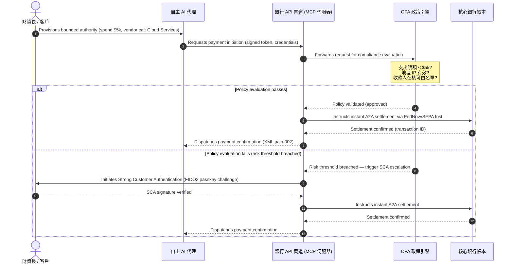

# 2026 年全球支付展望:智能體驅動、隱形、即時世界中的營運模式、風險與營收

2026 年全球支付週期由三股匯流力量定義——智能體商務、隱形嵌入式支付與即時執行——立基於 Project Agorá 下的通證化統一帳本,以及 2026 年 11 月 SWIFT 結構化地址硬性切換之上。

<!-- lead-start -->
<aside class="post-lead" aria-label="Article summary">

<strong>重點摘要。</strong>2026 年支付格局已從訊息遷移走向多維度營運模式,風險與營收皆由即時執行決定。本文將 J.P. Morgan、Global Payments、HSBC 與 Payments Association 2026 展望綜合為四支柱 G-SIB 營運計畫,涵蓋模型發起的智能體商務、永不中斷的財資 API、BIS Project Agorá 下的通證化統一帳本,以及 2026 年 11 月 14/15 日 SWIFT 結構化地址期限。Swift CBPR+ 自 2026 年 11 月 14 日起移除非結構化 `<AdrLine>` 區塊;EPC SEPA 規則手冊僅允許非結構化地址至 2026 年 11 月 15 日。

<strong>關鍵啟示</strong>

<ul class="post-lead-takeaways">
  <li><strong>智能體商務開啟受託責任新前沿。</strong>自主 AI 代理預計於 2030 年前年度中介 3 至 5 兆美元商務。銀行須界定 MCP 守門機制、PSD3/PSR 下的 SCA 委派,以及多代理支付鏈中 KYC/AML 的歸屬。</li>
  <li><strong>永不中斷的流動性已成為營運與監理基線。</strong>24/7 財資 API 與虛擬帳戶可最小化滯留資金,並抬高韌性門檻。對於具系統重要性的即時財資 API,五個九（99.999 %）可用性正在成為銀行為向監管機關展現 DORA 等級韌性而自設的內部工程目標。DORA 本身並未規定統一的五個九門檻;它涵蓋 ICT 風險管理、事件通報、韌性測試、第三方風險以及關鍵 ICT 供應商的監督。</li>
  <li><strong>通證化已晉升至受監理的統一帳本。</strong>Project Agorá 是針對通證化商業銀行存款與央行準備金最大規模的公私協作框架。銀行需要五步驟通證化路徑,並有明確的審慎處理方式。</li>
  <li><strong>2026 年 11 月 14/15 日結構化地址切換有硬性期限。</strong>Swift CBPR+ 自 2026 年 11 月 14 日起移除非結構化 `<AdrLine>` 區塊;EPC SEPA 規則手冊僅允許非結構化地址至 2026 年 11 月 15 日。切換後 CBPR+ 與 SEPA 訊息中未結構化的郵政地址欄位將立即觸發退件。產品、技術與合規團隊需建立乾淨的資料治理。</li>
</ul>

<strong>延伸閱讀:</strong><a href="https://sebastienrousseau.com/2026-06-23-iso-20022-pain001-programmable-liquidity-autonomic-treasury-2026">從 Pain.001 到可程式化流動性:ISO 20022 作為 2026 年財資自主神經系統</a>、<a href="https://sebastienrousseau.com/2026-06-24-cross-border-iso-20022-open-finance-tokenised-deposits-treasury-2026">跨境 2026:企業財資中的 ISO 20022、開放金融與通證化存款</a>、<a href="https://sebastienrousseau.com/2026-06-25-quantum-dawn-cib-kyberlib-quantum-resilient-payments-stack-2026">CIB 的量子曙光:從 KyberLib 到量子韌性支付堆疊</a>。

</aside>
<!-- lead-end -->

對全球交易銀行而言,2026 至 2028 週期是一扇結構性窗口。現代支付基礎設施已不再是行政事務工具——它是銀行級技術策略的核心。在 G-SIB 與主要區域機構內部,技術、監理與客戶期望已匯流至同一個營運平面。

三股力量定義此一週期,各自直接對應一個高階管理層關切。

- **智能體商務**——通路分銷、產品設計、責任分配,以及監理檢視下的模型風險管理。
- **隱形支付**——客戶體驗,銀行若未將其帳本嵌入企業與商戶前端,即面臨去中介化風險。
- **即時執行**——資本周轉速度,進而牽動流動性管理、信用風險、營運韌性與詐欺防禦的變革。

財務利害關係重大。詐欺在速度與精細度上同步擴張;監理期限是硬性的;主動現代化核心系統的銀行可解鎖可觀的手續費營收機會。不作為的代價恰好相反:立即遭遇交易退件、營運瓶頸、監理罰則,以及市佔率快速流失。

## 確定性階梯 — 哪些已定期、哪些已監管、哪些仍是預測

並非本報告中每一項條目都具相同程度的確定性。董事會層級的問題是:哪些差異屬於期限、哪些屬於監理期望、哪些仍只是市場推估——因為答案直接決定預算對話的方向。

| 類別 | 範例 |
| --- | --- |
| **硬性期限** | Swift CBPR+ 結構化地址切換（2026 年 11 月 14 日）;EPC SEPA 規則手冊（2026 年 11 月 15 日） |
| **監理義務** | DORA ICT 風險 + 韌性測試 + 第三方監督（歐盟）;PSD3/PSR 下的 SCA 委派;SR 11-7 + PRA SS1/23 下的 MRM |
| **高機率市場轉變** | 即時財資 API、AI 主導的詐欺防禦、API 化流動性、深度偽造驅動的生物辨識詐欺 |
| **策略選項** | 通證化存款、Project Agorá 下的統一帳本、智能體商務通道、連續外匯（Wire 365） |
| **預測** | 2030 年前智能體商務年度流量達 `$3-$5 trillion`（McKinsey 基線） |

前兩列應視為合規事實,無論銀行是否能捕捉任何上行空間,皆驅動一條預算支出線。後兩列則應視為策略選項——方向上具高度信心,但執行時點是董事會的選擇,而非監理機關行事曆上的條目。

## 全球支付權威機構的匯流

本報告綜合來自四個權威產業聲音的 2026 年支付與商務展望——[J.P. Morgan Payments](https://www.jpmorgan.com/payments/newsroom/payments-outlook-2026-trends-report-released "J.P. Morgan Payments — Outlook 2026")、[Global Payments](https://investors.globalpayments.com/news-events/press-releases/detail/497/global-payments-releases-its-2026-commerce-and-payment "Global Payments — 2026 Commerce and Payment Trends Report")、HSBC 與 The Payments Association——並與 [G20 強化跨境支付路徑圖](https://www.fsb.org/2026/03/fsb-kicks-off-new-implementation-phase-to-enhance-cross-border-payments-through-public-private-partnership/ "FSB — cross-border payments implementation phase, March 2026") 進行三角驗證。

各組織從不同市場角度切入生態系,但其發現匯流至三項不變條件。

1. **即時、API 驅動的通道是基線。**傳統批次處理模式於跨境與大額流動中已被邊緣化;該分部的交易速度由永不中斷的即時訊息決定。
2. **AI 同時是威脅與防禦。**生成式工具與深度偽造擴大了交易詐欺規模,迫使即時、多層次的機器學習反制防禦勢在必行。
3. **通證化是生產級基礎設施。**帳本正在統一,以承載通證化商業負債與批發央行數位貨幣。

| 報告 | 主要受眾 | 焦點 | 關鍵支柱 | 對銀行的意涵 |
| --- | --- | --- | --- | --- |
| **J.P. Morgan Payments** | 企業財資長、G-SIB | 即時流動性、詐欺 | API、AI 生物辨識 | 重建流動性、外匯與風險系統以支援全年無休 365 天結算。 |
| **Global Payments** | 商戶、電子商務 | POS 演進、全通路 | 智能體商務、無摩擦結帳 | 為自主 AI 代理建構安全、API 閘道化的商戶支付通道。 |
| **HSBC Insights** | 跨國企業 | ERP 整合(SAP/Oracle)、即時現金 | Treasury-as-a-Service、現金可視性 | 將交易型 API 套件商業化,並於來源端嵌入即時現金帳本回報。 |
| **The Payments Association** | 金融科技、支付機構 | 穩定幣、通證化、全球監理 | 受監理數位資產、政策合規 | 為通證化存款備妥資產負債表,並游走於 PSD3/PSR 責任結構。 |

四份展望實質定義了運行在公部門 G20 政策基礎設施之上的私部門營運堆疊,將政策意圖轉譯為銀行內部關於流動性、通證化、資料與詐欺管控的具體決策。

## 支柱一——智能體商務與隱形支付

智能體商務是從人工驅動、點擊購買的結帳,過渡至自主、模型驅動的交易發起。產業預測匯流至 2030 年自主代理中介 3 至 5 兆美元年度商務——全球支付量中個位數百分比、在無人按下「購買」之下執行。

零售與商業生態系存在對應落差。明確多數消費者現已預期近乎無摩擦的支付,但不及一半的商戶優先建置一鍵結帳或可由 API 存取的商品目錄。AI 代理無法瀏覽為人眼設計的傳統多頁結帳畫面;它們需要結構化、機器對機器的 API 握手。

### 銀行優先事項與營運影響

- **KYC 與 AML 歸屬。**銀行必須界定智能體交易鏈中誰持有合規義務。若消費者的個人 AI 代理透過商戶的智能體結帳發起交易,銀行必須驗證發起的受託授權以密碼學方式與主要帳戶持有人綁定。
- **責任與拒付重新設計。**卡組織與 A2A 通道是圍繞人工授權設計的。當 AI 代理因資料解析錯誤而錯誤採購工業庫存等發生錯誤購買時,銀行必須在消費者、代理供應商與商戶之間明確配置責任。
- **智能體流的風險評等。**支付路由引擎必須動態地對智能體支付進行風險評等,在穩定的結算紀錄建立前,對非人工發起的交易適用較高的準備金要求或交換手續費率。
- **受限行動與受限授權**

### 受限行動與受限授權

為緩解「無界行動」——例如企業採購代理因軟體故障而執行無限遞迴採購迴圈——銀行必須部署 **受限授權 API 閘道**。閘道於三個維度執行政策層級的限制。

1. **分層財務限制**——依交易規模、單日累積金額與商戶類別限制代理支出。
2. **情境感知防護**——在帳本撥款前評估次要訊號(時段、IP 地理位置、交易頻率)。
3. **人工介入升級**——當交易超出風險門檻時,透過 PSD3 / PSR 下的強客戶驗證(SCA)觸發強制性人工授權。

以下 Mermaid 序列展示了多數銀行可辨識為受限授權智能體支付流程的目標架構。

### Model Context Protocol(MCP)

為將在地化 AI 模型連接至銀行治理的執行層,產業正以 [Model Context Protocol(MCP)](https://modelcontextprotocol.io "Model Context Protocol — open standard for LLM tool integration") 為基準進行標準化——這是一項開放協定,讓 LLM 得以呼叫範圍清晰、可審計的工具與 API,而無需對核心系統有原始存取權。

將銀行 API(支付發起、餘額查詢、當事人驗證)包裝於 MCP 伺服器內,可讓 LLM 遠離資料庫表與系統根層級控制。模型僅透過結構化、受審計且限速的端點與帳本互動——安全性是在智能體工具執行的邊界強制執行,而非埋藏於模型內部。

## 支柱二——財資轉型與重新想像的流動性

2026 年交易銀行的速度由從日終批次處理轉向永不中斷、即時財資營運的轉變所設定。跨國企業不再容忍滯留資金——因結算系統關閉而於週末或假日閒置於當地帳戶的流動性。

### 即時流動性的經濟論據

J.P. Morgan 與 HSBC 同步指出,擁有先進即時現金與資料能力的企業在營收成長與資本效率上明顯較同業更有可能勝出,主要透過降低滯留流動性與優化營運資金循環。

為取得該價值,銀行推出 **Treasury-as-a-Service(TaaS)API 產品**,讓企業 ERP(SAP、Oracle)直接接入銀行帳本。

- **即時餘額 API**,採用 `camt.052` 結構描述——以即時、事件驅動的現金部位回報取代檔案傳輸協定。
- **批次支付發起 API**,採用 `pain.001`——從 ERP 帳本直接、直通執行供應商付款批次。
- **連續外匯 API**——財資引擎為跨境結算鎖定即時、演算法化的外匯匯率,消除隔夜市場跳空風險。
- **虛擬帳戶 API**——企業動態建立與關閉數千個子帳戶,以進行自動化應收帳款比對與帳本分離。

### 營運韌性與 DORA

提供永不中斷的流動性會改變銀行的風險樣態。對於具系統重要性的即時財資 API,五個九（99.999 %）可用性正在成為銀行為向監管機關展現 DORA 等級韌性而自設的內部工程目標。DORA 本身並未規定統一的五個九門檻;它涵蓋 ICT 風險管理、事件通報、韌性測試、第三方風險以及關鍵 ICT 供應商的監督。

依據 [數位營運韌性法(DORA)](https://eur-lex.europa.eu/legal-content/EN/TXT/?uri=CELEX%3A32022R2554 "Regulation (EU) 2022/2554 — Digital Operational Resilience Act"),這並非 IT 的 KPI——而是嚴格的監理要求。監理機關期望銀行證明即時財資 API 介面與帳本資料庫,在不中斷關鍵支付或損害系統流動性的前提下,能吸收嚴重但合理的網路攻擊、網路中斷與超大規模雲端業者中斷。這需要地理冗餘、active-active 多雲資料庫架構、即時威脅偵測層,以及自動化故障切換——這些會反映在變更成本科目,而不只是在稽核檔案上。

### 連續外匯與跨境創新

即時財資無法存在於單一貨幣邊界之內。G-SIB 正在部署連續外匯基礎設施——J.P. Morgan 的 [Wire 365](https://www.jpmorgan.com/insights/payments/fx-cross-border/wire-365-global-clearing "J.P. Morgan — Wire 365 global clearing reinvented") 平台一年內任何一天皆可處理跨境支付與外匯轉換,超越傳統央行 RTGS 時段。該層直接與支柱三討論的通證化存款與統一帳本系統互鎖。

## 支柱三——通證化存款與統一帳本

通證化已從孤立的概念驗證試點晉升為規模化、銀行級的貨幣基礎設施。焦點已從私人穩定幣與投機性加密資產轉向運行於可程式化統一帳本上的 **通證化商業銀行存款** 與 **批發央行數位貨幣(wCBDC)**。

參考框架為 [Project Agorá](https://www.bis.org/about/bisih/topics/fmis/agora.htm "BIS Project Agorá — tokenisation of wholesale cross-border payments")——由 BIS 與 IIF 召集的重要公私協作,涵蓋**八家中央銀行**與逾 40 家民營金融機構（依據 BIS Agorá 頁面,2026 年 5 月 27 日更新）。本計畫探索通證化商業銀行存款如何於共享可程式化帳本上與通證化批發 CBDC 整合,以消除跨境結算摩擦、協調合規檢核,並達成 24/7 原子終局性。

### 五步驟通證化路徑

對 G-SIB 與主要區域銀行而言,通證化是一段從內部優化到開放市場互通的逐步路徑。

1. **內部財資流動性**——通證化內部企業現金餘額(例如 JPM Coin 或等價的私有銀行帳本),以實現銀行自有分行間即時、24/7 跨境轉帳與淨額結算。
2. **受限多銀行通道**——封閉、受監理的聯盟(Project Agorá 沙盒),測試不同機構間的銀行間結算與共享帳本狀態。
3. **連續可程式化外匯**——統一帳本上的智能合約執行即時付款對付款(PvP)外匯,跨時區消除結算風險。
4. **通證化實體資產(RWA)**——通證化現金端與通證化證券、債務或貿易帳本整合,以實現即時券款對付(DvP)終局性,將資本鎖定從數天縮短至毫秒。
5. **受監理公開/混合互通**——安全閘道包裝層讓機構流動性得以安全與開放公開網絡互動。

### 審慎監理與資產負債表意涵

通證化現金必須謹慎地穿越審慎監理框架。監理機關強調,通證化存款於經濟上必須等同於傳統商業銀行存款——意指銀行資產負債表上的無擔保負債,並享有相同的存款保險覆蓋。

在營運上,通證化存款引入了傳統流動性壓力模型未設計來模擬的風險。智能合約以傳統假設未捕捉到的速度與量能執行可程式化提款。在 Basel III 下,銀行必須確保風險引擎能對可程式化現金外流建模,並確保通證化帳本在日常流動性循環中與既有 RTGS 系統乾淨互通。

### 穩定幣 vs 通證化存款——細緻立場

私人全額準備穩定幣(USDC 等)於零售跨境匯款與去中心化商務持續取得市佔,但缺乏商業銀行系統的信用創造能力與結算終局性。

交易銀行並未在零售通道上競爭,而是建立託管、發行自家受監理的通證化負債工具,並建構安全的上鏈/離鏈閘道。企業客戶取得可程式化彈性,同時將資本保留於受監理範圍之內。

### 董事會應就通證化貨幣提出的問題

- **統一帳本參與。**我們參與如 Project Agorá 等批發公私統一帳本倡議的具體策略路徑圖為何?
- **資產負債表與風險建模。**我們的風險引擎與資本適足框架是否已更新壓力測試,以納入智能合約觸發的代幣外流速度?
- **首動者客群。**我們企業財資與商業銀行客群中,哪些可從可程式化、通證化的 DvP/PvP 結算立即受益?

## 支柱四——結構化資料與詐欺防禦

2026 年的基礎設施合規由 [SWIFT Standards Release(SR)2026](https://www.swift.com/standards/iso-20022/removal-unstructured-address "SWIFT — Removal of unstructured address, November 2026") 所建立的 **2026 年 11 月 14/15 日結構化地址切換** 主導。Swift CBPR+ 自 2026 年 11 月 14 日起移除非結構化 `<AdrLine>` 區塊;EPC SEPA 規則手冊僅允許非結構化地址至 2026 年 11 月 15 日。自該日起,CBPR+ 與 SEPA 支付網絡停止接受支付訊息中完全未結構化、自由文字的郵政地址區塊(`<AdrLine>`)。任何於應出現結構化元素之處仍夾帶未結構化地址的跨境或國內訊息,將被網絡延遲或退件。

多數機構知曉此一日期。許多機構將其視為介面層的表面對應作業。實情是更深層的資料品質與資料治理挑戰。為避免災難性退件率,支付營運需要清楚的跨職能治理框架。

- **產品與營運。**從來源端進行資料擷取。面向客戶的數位入口、開戶介面與企業 ERP 輸入欄位必須於支付發起時點強制要求結構化地址欄位(`<StrtNm>`、`<PstCd>`、`<TwnNm>`、`<Ctry>`)。
- **技術。**解析、對應、結構描述驗證。驗證引擎於既有檔案抵達 SWIFT 介面前即予阻擋。本地部署的機器學習模型將既有未結構化地址區塊解析為 `<PstlAdr>` 下符合 XML 規範的標籤。
- **合規與風險。**制裁名單篩查、交易監控與 AML 邏輯須更新以攝入結構化 XML 欄位——降低偽陽性比率與人工調查。

### 結構化資料的商業論據

若視為合規成本,結構化資料計畫代價高昂。若視為營收賦能,它能自我回本。

1. **進階信用決策。**結構化的發票、匯款與最終債務人資料讓銀行可為企業客戶建立自動化、精準的營運資金融資與供應鏈發票保理計畫。
2. **自動化應收帳款比對。**暴露結構化的當事人與發票識別碼,可支援高階現金對帳與虛擬帳戶歸集產品,產生新的交易手續費營收。
3. **可商業化交易分析。**銀行包裝並販售細緻的即時流動性與採購樣態分析儀表板予企業 CFO 與財資長。

### 分層 AI 詐欺防禦

隨交易速度加速至即時,詐欺手法亦同步擴張。[Entrust 2026 身分詐欺報告](https://www.entrust.com/resources/reports/identity-fraud-report "Entrust 2026 Identity Fraud Report")將深度偽造列為**生物辨識詐欺嘗試的五分之一**;此前 Entrust 的分析則將深度偽造具體定位於**視訊生物辨識詐欺嘗試的 40 %**。無論採何種框架,合成媒體日益用於攻破開戶與支付流程中的語音與臉部辨識管控。

防禦為 **三層 AI 詐欺模型**。

1. **身分層。**經生物辨識驗證的 [FIDO2](https://fidoalliance.org/fido2/ "FIDO Alliance — FIDO2 specification") 通行金鑰、密碼學簽署的硬體裝置綁定,以及去中心化數位身分錢包,以保障支付存取。
2. **行為層。**連續行為生物辨識——工作階段瀏覽節奏、打字節奏、裝置方向——用以偵測自動化機器人執行或工作階段挾持嘗試。
3. **交易層。**ISO 20022 的結構化欄位餵入即時機器學習風險引擎,將交易元資料與共享網路層級聯盟情報交叉比對,於發起後數毫秒內辨識可疑交易。

為令監理機關滿意,交易層 AI 模型納入嚴格的 **可解釋性參數**,並於專責模型風險管理(MRM)計畫下運作。監理機關期望銀行依 [美國聯準會 SR 11-7](https://www.federalreserve.gov/frrs/guidance/supervisory-guidance-on-model-risk-management.htm "US Federal Reserve — Supervisory Guidance on Model Risk Management, SR 11-7") 與英國央行 [PRA SS1/23](https://www.bankofengland.co.uk/prudential-regulation/publication/2023/may/model-risk-management-principles-for-banks-ss "Bank of England PRA SS1/23 — Model Risk Management principles for banks") 說明觸發自動阻擋或詐欺警示的特定資料點與演算法邏輯。

## 2026 至 2028 年董事會議程

為在四支柱上落地執行,G-SIB 與區域銀行管理層應沿清晰的三視野路徑圖,組織營運與技術投資。

### 視野一——即刻合規與核心強化(0 至 12 個月)

- **焦點。**標準化 ISO 20022 資料品質,並穩固基本即時交易路徑。
- **成功指標(KPI)。**2026 年 11 月 14/15 日切換後,SWIFT 與 SEPA 上無結構化地址退件。
- **執行擁有者。**營運長 / 支付營運主管。
- **交付類型。**無悔之舉。核心資料庫結構描述更新與 SWIFT SR 2026 驗證引擎。

### 視野二——自動化與智能體防護(12 至 24 個月)

- **焦點。**受限智能體 API 閘道與連續詐欺防禦架構。
- **成功指標(KPI)。**100% 機器對機器與 AI 發起的 API 交易透過 FIDO2 硬體綁定與受限授權政策引擎驗證。
- **執行擁有者。**資訊長 / 風險長。
- **交付類型。**無悔之舉(詐欺防禦)加策略選項(智能體商務)。MCP 部署與三層詐欺 AI。

### 視野三——平台通證化與統一帳本(24 至 36 個月)

- **焦點。**將財資資產轉換為通證化存款,並參與共享跨境帳本。
- **成功指標(KPI)。**至少 15% 的大額企業財資結算量透過通證化存款工具或統一帳本安排(例如 Project Agorá 通道)原生處理。
- **執行擁有者。**集團財資長 / 交易銀行主管。
- **交付類型。**策略選項。可程式化帳本基礎設施、智能合約流動性規則、DvP/PvP 結算轉接器。

## 週一早上該做什麼 — 銀行六項清單

三視野路徑圖是整個週期計畫。下方的清單則是無論計畫其餘部分成熟度如何,CIO、COO 或交易銀行主管下個工作週結束前就能放上桌面的具體事項。

1. **依通道與訊息類型盤點未結構化地址曝險。**每一條既有檔案路徑、每一個既有 API 端點、每一個仍輸出自由文字 `<AdrLine>` 的企業 ERP 皆須清點。產出:每一個來源對應的數量、責任人與補救日期。
2. **建立智能體支付風險分類法。**依發起方式（消費者代理、商戶代理、企業採購代理）、交易對手類型與通道,將非人工發起的流量分類。產出:一頁式分類法,以及一張路由引擎工單。
3. **為 AI 發起的支付定義委派授權政策限制。**依交易票面金額、商戶類別、地理區域分層設限。產出:OPA 引擎可執行的策略即程式碼草案規格。
4. **盤點 DORA 關鍵財資 API 與第三方依賴。**哪些 API 位於嚴重但合理的情境清單中;它們依賴哪些第三方;哪些合約已符合 DORA Article 28。產出:每一個 API 對應一列關鍵 ICT 第三方登錄。
5. **辨識兩個具可衡量財資價值的通證化存款使用情境。**內部跨分行淨額結算,以及單一個 Project Agorá 鄰近通道,是務實的最初兩個選項。產出:每一個對應一份規模化業務論證,附責任人與 90 天決策日期。
6. **為詐欺與智能體決策建立模型風險控管框架。**將詐欺與智能體支付路徑中每一個 ML 模型映射至 SR 11-7 / PRA SS1/23 期望:文件化目的、資料譜系、可解釋性、監控、覆寫路徑。產出:每一個模型對應一頁 MRM 控制矩陣。

這份清單的重點不在於任何一項都是新事物。重點在於它規模夠小,本週即可啟動;觀察性足以在下次執行委員會追蹤;結構上與四支柱對齊,因此早期工作能餵入整體計畫,而非與之競爭。

## 常見問題

**智能體商務真的會在 2030 年前達到 3 至 5 兆美元嗎?**
McKinsey 基線指向 2030 年前智能體商務銷售達 5 兆美元,獨立預測落於 3 兆至 5 兆美元區間。差異反映商戶推出機器可讀結帳 API 的積極程度,以及銀行在 SCA 委派下放行代理交易的速度——瓶頸在於銀行與商戶端,而非代理能力端。

**2026 年 11 月 14/15 日 SWIFT 切換亦適用於國內 SEPA 流程嗎?**
是。結構化地址要求適用於 CBPR+ 跨境與 SEPA 支付訊息。同時運行兩條通道的銀行,需要在 SWIFT 介面上游設置單一標準地址結構描述,而非兩套平行對應。

**通證化存款等同於穩定幣嗎?**
否。通證化存款為受監理銀行資產負債表上的無擔保負債,享有與傳統存款相同的存款保險覆蓋。穩定幣通常是由非銀行發行的全額準備工具,無信用創造能力。Project Agorá 的設計假設通證化存款與批發 CBDC 並列於共享可程式化帳本之上;穩定幣並未出現在批發結算端。

**Project Agorá 與既有 wCBDC 試點的關係為何?**
Agorá 是整合框架。各國 wCBDC 實驗涵蓋央行貨幣端;Agorá 將通證化商業存款帶入同一可程式化帳本,使跨境結算於兩種貨幣類型上皆為原子化。七家參與的央行與 40 餘家民營機構,使其成為批發通證化貨幣架構最大規模的公私設計場域。

**TaaS API 的 DORA 最低合規姿態為何?**
地理冗餘 active-active 部署、依英國 SM&CR 載明指名負責人的嚴重但合理之網路情境,以及經測試、不中斷關鍵支付的故障切換。若無此等條件,TaaS 產品先成為監理負擔,後才能成為營收項目。

## 參考文獻

- Bank for International Settlements (BIS) Innovation Hub. (2026). *Project Agorá: exploring tokenisation of wholesale cross-border payments*. [BIS Project Agorá](https://www.bis.org/about/bisih/topics/fmis/agora.htm).
- Deutsche Bank. (2026). *Digital Money: a perspective on stablecoins, tokenised deposits and CBDCs*. [Deutsche Bank Flow](https://flow.db.com/publications/flow-white-papers-and-guides/digital-money-a-perspective-on-stablecoins-tokenised-deposits-and-cbdcs).
- European Parliament and Council. (2022). *Regulation (EU) 2022/2554 on Digital Operational Resilience (DORA)*. [DORA Regulation](https://eur-lex.europa.eu/legal-content/EN/TXT/?uri=CELEX%3A32022R2554).
- Financial Stability Board. (2026). *FSB kicks off new implementation phase to enhance cross-border payments*. [FSB statement](https://www.fsb.org/2026/03/fsb-kicks-off-new-implementation-phase-to-enhance-cross-border-payments-through-public-private-partnership/).
- Global Payments. (2025). *2026 Commerce and Payment Trends Report — press release*. [Global Payments press release](https://investors.globalpayments.com/news-events/press-releases/detail/497/global-payments-releases-its-2026-commerce-and-payment).
- J.P. Morgan Payments. (2026). *Payments Outlook 2026 Trends Report Released*. [J.P. Morgan Newsroom](https://www.jpmorgan.com/payments/newsroom/payments-outlook-2026-trends-report-released).
- J.P. Morgan Insights. (2026). *5 Payment Trends to Watch for in 2026*. [J.P. Morgan Trends](https://www.jpmorgan.com/insights/payments/trends-innovation/five-payment-trends-in-2026).
- J.P. Morgan FX & Cross-Border. (2026). *Wire 365: Global Clearing Reinvented*. [J.P. Morgan FX Wire 365](https://www.jpmorgan.com/insights/payments/fx-cross-border/wire-365-global-clearing).
- SWIFT. (2026). *ISO 20022 milestone for November 2026: unstructured addresses to be removed*. [SWIFT ISO 20022 Milestone](https://www.swift.com/news-events/news/iso-20022-milestone-november-2026-unstructured-addresses-be-removed).
- SWIFT Standards. (2026). *Removal of unstructured address*. [SWIFT Standards](https://www.swift.com/standards/iso-20022/removal-unstructured-address).
- Bank of England. (2023). *Supervisory Statement (SS1/23) — Model Risk Management principles for banks*. [Bank of England PRA SS1/23](https://www.bankofengland.co.uk/prudential-regulation/publication/2023/may/model-risk-management-principles-for-banks-ss).
- US Federal Reserve. (2011). *Supervisory Guidance on Model Risk Management (SR 11-7)*. [SR 11-7](https://www.federalreserve.gov/frrs/guidance/supervisory-guidance-on-model-risk-management.htm).
- McKinsey & Company. (2025). *McKinsey forecast: $5 trillion in agentic commerce sales by 2030* (via Digital Commerce 360). [McKinsey agentic forecast](https://www.digitalcommerce360.com/2025/10/20/mckinsey-forecast-5-trillion-agentic-commerce-sales-2030/).
- HSBC Business. (2026). *HSBC Business Insights*. [HSBC Insights](https://www.business.hsbc.com/en-gb/insights).
- Bright Defense. (2026). *Deepfake Statistics: A Growing Security Concern*. [Deepfake fraud statistics](https://www.brightdefense.com/resources/deepfake-statistics/).
- European Banking Authority. (2019). *Guidelines on outsourcing arrangements (EBA/GL/2019/02)*. [EBA Outsourcing Guidelines](https://www.eba.europa.eu/regulation-and-policy/internal-governance/guidelines-on-outsourcing-arrangements).

<!-- enrich-start -->
<aside class="author-card" aria-label="About the author"><strong class="author-card-name"><a href="/about/index.html">Sebastien Rousseau</a></strong>資深銀行技術專家,撰寫應用 AI、ISO 20022 遷移、金融服務後量子密碼學,以及批發支付的結構性轉型。逾 20 年經歷,橫跨 HSBC Commercial &amp; Investment Bank、PayPal、Barclays、Shazam、AKQA、Virgin Group。<a href="/about/index.html">完整檔案</a> &middot; <a href="https://www.linkedin.com/in/sebastienrousseau/" rel="external noopener">LinkedIn</a> &middot; <a href="https://github.com/sebastienrousseau" rel="external noopener">GitHub</a></aside>

最後審閱 <time datetime="2026-06-25">2026-06-25</time>。

<!-- enrich-end -->
