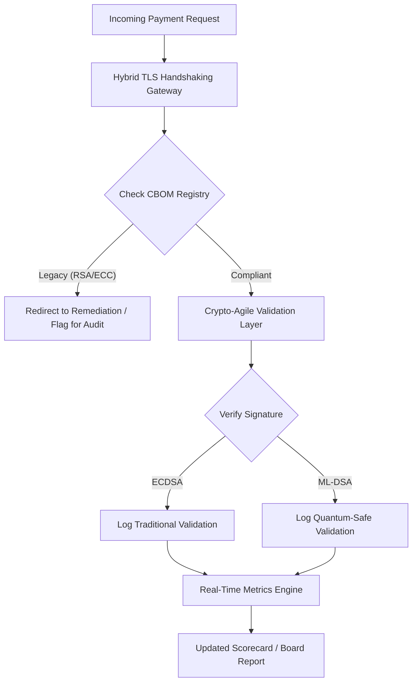

# 2026 後量子安全計分卡:受託密碼學敏捷性的董事會層級指標框架

<aside class="post-lead" aria-label="文章摘要">

<strong>TL;DR.</strong> 截至 2026 年 6 月,後量子密碼學(PQC)已從實驗性的技術議題,轉為首要的受託責任。董事會如今必須監督舊式加密系統的系統性遷移至 NIST FIPS 203 與 204 標準,以緩解 DORA 框架下的系統性財務與營運風險。

<strong>關鍵要點</strong>

<ul class="post-lead-takeaways">
  <li><strong>G20 對齊與硬性期限。</strong>國際監理機關已將 2020 年代末期訂為量子安全轉型的硬性期限,要求機構展現可量化的遷移進度。</li>
  <li><strong>密碼學物料清單(CBOM)。</strong>類比於軟體 BOM,CBOM 是一份即時、自動化的全部密碼學資產清單,用以確保供應鏈全鏈路的可見性。</li>
  <li><strong>Harvest-Now-Decrypt-Later(HNDL)曝險。</strong>對手正在持續攔截並儲存加密的高價值批發支付資料;緩解此風險需要立即部署混合式 PQC 架構。</li>
  <li><strong>透過密碼學敏捷性實現受託治理。</strong>密碼學敏捷性是可量測的治理指標。在不重構核心系統的前提下抽換密碼學原語的能力(使用 KyberLib 等函式庫)如今已是 SM&CR 框架下的董事會層級問責項目。</li>
</ul>

<strong>延伸閱讀:</strong><a href="https://sebastienrousseau.com/2026-06-12-kyberlib-post-quantum-banking-migration-standards-code-2026">KyberLib 與 2026 年的後量子銀行遷移</a>、<a href="https://sebastienrousseau.com/2023-11-19-crystals-kyber-the-safeguarding-algorithm-in-a-quantum-age/index.html">CRYSTALS-Kyber:量子時代的守護演算法</a>。

</aside>
後量子安全已不再是研究專案。「監理時鐘」正逼近 2020 年代末期的執法期限。[NIST FIPS 203(ML-KEM)](https://csrc.nist.gov/pubs/fips/203/final)與 [NIST FIPS 204(ML-DSA)](https://csrc.nist.gov/pubs/fips/204/final)的定稿,已將金鑰封裝與數位簽章的標準確立下來。

監理機關如今期待第一級銀行跳出試點階段。2026 年,焦點已轉向這些標準的工業化落地。未能展現清晰的遷移路徑,將在[數位營運韌性法案(DORA)](https://eur-lex.europa.eu/eli/reg/2022/2554/oj)框架下承擔重大監理處罰,而忽視量子解密這項可預見威脅的董事,則可能面臨個人法律責任。

## 01. 董事會層級的量子計分卡

下列指標為董事會評估商業銀行與投資銀行(CIB)版圖中量子準備度與密碼學健康狀況,提供一套標準化框架。

### 表 1:PQC 計分卡指標與容忍度

| 指標 | 數學公式 | 董事會核可容忍度 | 超出容忍度的風險 |
| ---- | ---- | ---- | ---- |
| **庫存完整度比率(ICP)** | (已識別密碼學資產 / 估計總資產) × 100 | > 98% | 高價值清算資料路徑中的影子加密與盲點。 |
| **HNDL 曝險率(HER)** | (舊式密碼學上的長壽命資料 / 全部長壽命資料) × 100 | < 5% | 商業秘密、主權債務分類帳與批發支付紀錄遭永久性洩漏。 |
| **NIST 遷移進度率(MPR)** | (執行 FIPS 203/204 的系統 / 全部關鍵系統) × 100 | > 60%(至 2026 年底) | 監理不合規,並被排除於 G20 對齊的交易對手之外。 |
| **密碼學敏捷性準備度指數(CARI)** | (具備抽象化密碼學分層的應用 / 全部核心應用) × 100 | > 85% | 嚴重的技術債,且無力回應未來的演算法淘汰。 |

## 02. 密碼學物料清單(CBOM)

ICP 指標需以一套完整的 **CBOM 探勘階段**為基準。此為自動化流程,用以識別企業中每一個密碼學端點。

- **端點探勘。**掃描內部與雲端網路上的活躍 TLS 工作階段,識別舊式 RSA 或 ECC 用法。
- **金鑰盤點。**將公私鑰對對應至各自的擁有者,並對應精確的到期日期。
- **相依性對應。**識別仰賴已淘汰演算法的第三方函式庫與 API。

此探勘階段建立單一事實來源,讓 CISO 得以用與財務績效相同的細緻度,回報密碼學健康狀況。

## 03. 消除批發支付中的 HNDL 曝險

對手正積極鎖定批發支付與長壽命的企業資料庫。這些「Harvest-Now-Decrypt-Later」(HNDL)攻擊牽涉到對當前加密流量的攔截與封存。

即便密碼學上相關的量子電腦(CRQC)今日尚不存在,如今攔截的資料未來仍將暴露於風險之下。緩解此風險,需要對長壽命資料(例如身分紀錄、30 年期債券契約與法律檔案)進行高優先級遷移,此舉直接降低 HER 指標。將支付通道升級為混合 PQC—傳統加密(ML-KEM 搭配 X25519),可立即抵禦封存威脅。

## 04. 透過妥善設計的介面落實密碼學敏捷性

密碼學敏捷性透過工程抽象化得以實現。[KyberLib](https://sebastienrousseau.com/2026-06-12-kyberlib-post-quantum-banking-migration-standards-code-2026) 等現代函式庫展示了開發者如何在不重寫整個應用程式堆疊的前提下,落實量子安全模組。

- **抽象化包裝層。**應用程式呼叫通用的 `encrypt()` 或 `sign()` 函式,而非特定演算法的常式。
- **執行期切換。**底層模組可透過組態變更從 ECDSA 切換為 ML-DSA,而非繁複的程式碼部署。

此架構確保未來若特定 PQC 演算法遭破解,組織得以於數小時內完成轉換,而非數年。

## 05. 量子安全入向驗證流程

下列圖示展示在量子敏捷的銀行環境中,進入安全邊界的資料生命週期。

## 結論

第一級銀行的密碼學版圖已不再僅是 CISO 的議題。它是受託基礎建設。NIST FIPS 203 與 204 設定演算法;DORA 第 5 條設定問責面;SM&CR 則將其釘在指名的高階主管身上。上述計分卡——庫存完整度、HNDL 曝險、遷移進度、密碼學敏捷性——為董事會提供治理此一版圖所需的四個數字,毋須親自讀懂密碼學程式碼。

最關鍵的數字是 HNDL 曝險。每一筆今日仍以舊式加密躺在批發支付封存庫中的紀錄,都會在第一台密碼學上相關的量子電腦上市的當天變得可讀。倒數計時是無聲且不對稱的:防守方僅能對手上持有的資料採取行動,對手卻能對多年前已外洩的資料採取行動。一份 2024 年以 RSA-2048 加密的 30 年期企業債契約,將在 CRQC 上線當日失去其機密性保證。

[KyberLib](https://sebastienrousseau.com/2026-06-12-kyberlib-post-quantum-banking-migration-standards-code-2026) 及其同類函式庫,將此從多年期的平台改寫,轉化為一次組態變更。董事會的職責不是寫程式。董事會的職責是要求密碼學敏捷性準備度指數——亦即位於抽象化密碼學介面之後的核心應用占比——於十二個月內穿越 85%,並逐季閱讀計分卡。

<aside class="author-card" aria-label="關於作者"><strong class="author-card-name"><a href="/about/index.html">Sebastien Rousseau</a></strong>資深銀行科技人,專注於應用 AI、ISO 20022 遷移、金融服務後量子密碼學,以及批發支付的結構性轉型。逾 20 年資歷,橫跨 HSBC 商業與投資銀行、PayPal、Barclays、Shazam。<a href="https://www.linkedin.com/in/sebastienrousseau/" rel="external noopener">LinkedIn</a> &middot; <a href="https://github.com/sebastienrousseau" rel="external noopener">GitHub</a></aside>

最後審閱日期 <time datetime="2026-06-29">2026-06-29</time>。

