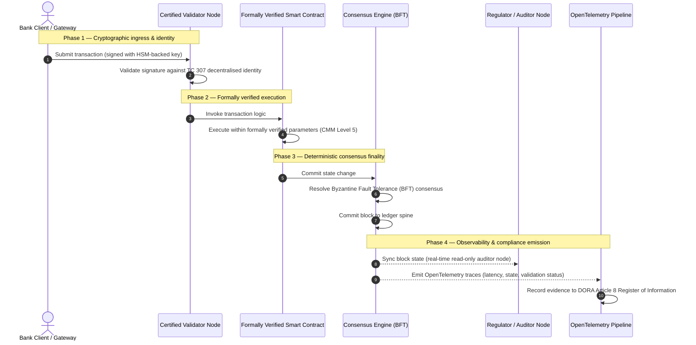

# 從證據到真相：為何認證區塊鏈將定義銀行信任的下一個時代

## 策略摘要（要點）

批發銀行業務與全球交易在2026年正處於歷史性轉折點。隨著金融服務向原生數位化、即時清算網路遷移，且人工智慧引入機率性的非決定性，傳統的類比式、追溯式保證模型（如靜態的、基於實體的稽核）已無法滿足現代風險管理與受託責任的要求。

ISO/IEC技術委員會TC 307已為分散式帳本技術確立了標準化基礎。然而，真正的機構採用需要從描述性指引轉向規範性的、可獨立認證的區塊鏈保證。透過依據嚴格的五級能力成熟度模型（CMM）對帳本治理、共識完整性、智慧合約安全性與加密敏捷性進行評分，銀行可以從零散的、特定於供應商的假設，邁向可認證、董事會可稽核的金融真相。

## 關鍵要點

* **受託摩擦缺口**：如今我們能夠認證銀行（Basel III）、雲端（ISO 27001）與AI治理系統（ISO 42001），但尚無法認證那個日益決定何為真相的分散式帳本。這種不對稱是一項重大的營運脆弱性。  
* **DORA強制施加直接受託責任**：根據DORA第5條，銀行董事會對所有第三方與帳本部署的營運韌性承擔直接的、不可委託的個人責任，若失職則在SM&CR制度下面臨嚴厲的個人處罰。  
* **AI的稽核脊柱**：在機器學習產生不可重現的機率性結果之處，認證區塊鏈提供決定性的狀態擷取。將模型版本、輸入與驗證決策記錄於鏈上，可滿足ISO 42001與模型風險管理標準。  
* **認證區塊鏈指數**：該指數將治理、共識、智慧合約與可觀測性形式化為一張可驗證、稽核就緒的評分卡，採用0至5的CMM刻度，將工程指標轉化為董事會核准的風險偏好聲明。

## 01. 數位銀行業務中的受託摩擦缺口

在傳統銀行業中，信任是關係性的、機構性的與追溯性的。它依賴獨立的第三方稽核師在固定時點審查財務狀態，並調和雙邊帳本孤島之間的差異。在2026年即時、API驅動的市場中，這一模型引入了令人卻步的延遲與結構性風險。

當交易即時結算、日內流動性池由API閘道動態管理、資產所有權在共享帳本上被代幣化時，追溯式稽核便淪為鑑識式操練而非預防性控制。受託人不再能僅依賴對法人實體的認證。他們必須認證數位基質本身。

目前，銀行營運於一種顯而易見的架構不對稱之下：

1. **經認證的雲端基礎設施**：硬體節點、虛擬化容器與實體資料中心依據ISO/IEC 27001與SOC 2 Type II控制進行驗證。  
2. **經認證的管理流程**：營運風險政策、業務持續計畫與演算法部署受嚴格的風險框架管轄。  
3. **未經認證的帳本引擎**：分散式共識機制、驗證節點供應鏈、智慧合約邊界與網路治理模型被交給未經認證的、客製的或特定於聯盟的假設。

這種不對稱是一個關鍵的失效點。銀行可以在安全的、經ISO 27001認證的雲端容器內執行一個經驗證的應用，但如果該容器寫入一個具有集中式驗證者控制、脆弱共識參數或未稽核智慧合約的分散式帳本，交易完整性便遭到損害。要彌合這一缺口，帳本引擎本身必須成為可認證的保證對象。

## 02. ISO/IEC TC 307標準化基礎

標準化分散式帳本所需的基礎性工作，正由ISO/IEC技術委員會TC 307（區塊鏈與分散式帳本技術）確立。TC 307並未將區塊鏈視為孤立的技術協定，而是將其視為機構性信任基礎設施，並圍繞五大核心支柱組織其工作：

1. **分類法與詞彙（ISO 22739）**：確立通用命名法，確保在不同司法管轄區、金融方案與機構之間保持一致的法律與營運定義。  
2. **參考架構（ISO/TR 23245）**：定義合規分散式帳本系統的邊界、層次、資料流與功能組件。  
3. **安全、隱私與智慧合約（ISO/TR 23244 / ISO 23613）**：為數位資產系統確立基線安全指引，並詳述智慧合約漏洞緩解與生命週期治理的最佳實務。  
4. **互通性框架**：處理異質帳本網路之間的資料與資產交換機制，防止形成孤立的代幣化孤島。  
5. **去中心化身分與信任錨**：將基於帳本的加密識別碼與正式的公開金鑰基礎設施（PKI）與國家授權的註冊機構相整合。

整體而言，TC 307標誌著DLT從客製的工程選擇向標準化架構學科的過渡。然而，TC 307仍主要是描述性的。它定義了卓越的樣貌（指引），但並未提供風險官員與監理者授權關鍵或重要職能（CIF）生產部署所需的規範性驗證協定（保證）。

## 03. 指引與保證：受託區分

金融市場參與者部署一項技術，並非因為它創新或優雅；而是當它能夠被治理、稽核、辯護並與資本準備要求相調和時。這正是為何銀行業的標準化自然分解為兩個層次：

* **指引（框架）**：概述最佳實務、參考目標與架構準則（如ISO/IEC TC 307、NIST框架）。  
* **保證（證明）**：提供獨立、持續且第三方可驗證的證據，證明框架已實施並依設計運行（如ISO 27001認證、SOC 2稽核、監理檢查）。

在認證雲端基礎設施的同時依賴未經認證的帳本共識，是一個關鍵的監理缺口。一個「不可變」的區塊鏈未必「在機構層面可信」。不可變性僅保證錄入的資料不被更改；它並不驗證驗證節點是否安全、共識協定是否能抵禦共謀、智慧合約邏輯是否數學上健全，或加密金鑰管理是否符合後量子要求。

為彌合這一缺口，2026年認證區塊鏈指數將這些要求形式化為一個可量化的能力成熟度模型（CMM），並對應到全球銀行法規。

## 04. 2026年認證區塊鏈指數

為使高階管理層能夠評估與認證其帳本平台，該指數將分散式帳本基礎設施建構為五個可稽核的營運層，採用0至5的CMM刻度評分。

## 表1：認證區塊鏈指數架構

| 指數層 | 成熟度等級（CMM） | 技術與營運指標 | 監理/受託控制參照 |
| ---- | ---- | ---- | ---- |
| **帳本治理** | **0級**：臨時聯盟**3級**：自動化驗證者審查與輪換**5級**：去中心化的多方加密身分錨定 | 由經審查金融實體營運的驗證節點百分比；驗證者糾紛解決平均時長；節點地理分布 | **DORA第5條**（治理與組織）；**CPMI-IOSCO PFMI原則2**（治理）與**原則3**（全面風險管理框架） |
| **共識完整性** | **0級**：單節點或不透明PoW**3級**：具決定性最終性的經稽核BFT**5級**：具持續延遲監控的多司法管轄、形式化驗證共識 | 最大可容忍共識延遲；抗共謀閾值；模擬節點分區下的可用性SLA | **DORA第6條**（ICT風險管理框架）；**CPMI-IOSCO PFMI原則8**（結算最終性） |
| **身分與加密** | **0級**：弱RSA/ECDSA金鑰**3級**：具HSM支援金鑰管理的多重簽章**5級**：量子安全混合金鑰（FIPS 203 ML-KEM）與零知識隱私閘 | 以HSM支援金鑰簽署的帳本交易百分比；PQC遷移就緒度評分；ZK證明延遲 | **NIST FIPS 203 / 204**；**ISO/IEC 27001**（資訊安全管理） |
| **智慧合約保證** | **0級**：未稽核的Solidity腳本**3級**：自動化編譯器驗證與外部稽核**5級**：具斷路器升級的形式化驗證、不可變智慧合約 | 具數學形式化驗證的智慧合約百分比；編譯器警告數；漏洞掃描覆蓋率 | **EBA委外指引**（第81、113-117段）；**DORA第30條**（最低合約條款） |
| **稽核與可觀測性** | **0級**：手動日誌擷取**3級**：結構化OTel追蹤與唯讀稽核者節點**5級**：與第8條登記冊的自動化持續對帳 | 由OpenTelemetry追蹤涵蓋的交易百分比；從區塊提交到稽核者節點同步的延遲 | **BCBS 239**（風險資料彙總）；**DORA第8條**（資訊登記冊 / ITS模式） |

## 表2：對應至全球銀行標準的關鍵信任訊號

| 訊號 / 基準 | 指標 | 對銀行平台的影響 | 監理來源 |
| ---- | ---- | ---- | ---- |
| **ISO/IEC TC 307進展** | 從ISO/TR技術報告轉向正式認證方案 | 確立首個用於認證分散式帳本引擎的標準化框架 | **ISO/IEC JTC 1 / SC 44**（分散式帳本技術） |
| **Agorá專案原型階段** | 40餘家參與商業銀行；代幣化存款的統一帳本測試 | 將跨境清算從訊息傳遞（SWIFT）轉向原子化代幣化結算 | **國際清算銀行（BIS）創新中心** |
| **DORA第30條第三方稽核** | 100%的節點供應商與基礎設施主機依據安全標準接受稽核 | 消除「影子驗證節點」；強制要求供應鏈完全透明 | **歐洲監理當局（ESA）** |
| **ISO/IEC 42001（AI治理）** | 將AI模型與訓練日誌在鏈上加密固化為不可變 | 將區塊鏈用作機器學習的不可變證據登記冊（「稽核脊柱」） | **ISO/IEC 42001:2023**（資訊技術 — 人工智慧） |
| **Basel III資本適足率** | 基於已記錄的複雜性降低而削減營運風險資本緩衝 | 標準化的營運風險框架直接認可經驗證的帳本韌性 | **巴塞爾銀行監理委員會（BCBS）** |

## 05. AI的「稽核脊柱」：決定性基礎設施上的機率性智慧

認證區塊鏈在2026年最強大的策略角色之一，是充當人工智慧部署的**「稽核脊柱」**。現代金融系統日益機率化。信用評分、即時詐欺偵測、演算法交易與自主客戶互動，皆由隨時間演進、漂移與適應的機器學習模型驅動。這些模型是非決定性的：同一輸入在兩個不同時點，可能因動態權重與持續訓練而產生不同輸出。

這種非決定性在**ISO/IEC 42001（AI治理）**與模型風險管理（MRM）標準（如**美聯儲SR 11-7**與**英國PRA SS1/23**）下提出了深刻的治理挑戰：*如何稽核、解釋與辯護那些並非嚴格可重現的決策？*

認證分散式帳本提供了決定性的制衡。在AI模型機率性運作之處，認證區塊鏈決定性地記錄其參數，確立一條不可更改的證據脊柱：

* **模型版本管理與權重錨定**：每個已部署的模型版本、其關聯權重及其訓練資料的校驗和，在建置時被雜湊並寫入帳本，滿足**SLSA Level 3**供應鏈要求。  
* **情境輸入日誌記錄**：當AI模型執行關鍵決策（如核准貸款或標記交易）時，精確的情境輸入與模型雜湊被寫入帳本，形成防竄改的歷史。  
* **無需程式碼存取的可稽核性**：若監理者問「你的模型為何在6月3日拒絕這筆信貸申請？」，銀行既無需揭露其專有程式碼，也無需嘗試重建精確的模型狀態。它出示經加密簽署的、關於輸入、權重與驗證狀態的鏈上記錄。

透過將機器學習模型的機率性決策錨定於認證區塊鏈的決定性共識，機構創造出一條可辯護、可重建且可獨立驗證的自動化行動時間軸。

## 06. 認證的共識至稽核流水線的視覺化

以下時序圖展示了一筆交易通過認證區塊鏈平台的生命週期，說明驗證閘、共識完整性、智慧合約執行與遙測發射如何相互咬合，以產生董事會就緒的監理證據：

該交易序列的關鍵路徑要求每一個驗證、執行與共識步驟都經過加密簽署，確保端到端的溯源。監理者的稽核者節點即時同步區塊狀態，消除了追溯式、手動財務對帳的需要。

## 07. 面向高階管理者的董事會手冊

為成功駕馭從組織信任向基礎設施信任的過渡，銀行高階主管與高階管理者應立即執行四項關鍵指令：

1. **在企業風險管理（ERM）中強制帳本稽核**：執行一項政策，規定任何分散式帳本平台——無論私有、公有或聯盟——未依據五層**認證區塊鏈指數架構**（最低CMM 3級）接受稽核，均不得部署於關鍵或重要職能（CIF）。  
2. **將區塊鏈整合為ISO 42001的AI證據脊柱**：指示財務長首席風險官與首席AI架構師，將所有高影響機器學習模型與認證區塊鏈整合，建立一個關於模型版本、權重、輸入與決策的防竄改稽核登記冊。  
3. **稽核驗證節點供應鏈（DORA第30條）**：要求採購部門稽核所有託管驗證節點或為DLT網路管理雲端託管的第三方實體，並強制施行與銀行內部雲端節點相同的網路安全與營運韌性標準。  
4. **使帳本架構與CPMI-IOSCO與BCBS 239保持一致**：指示平台工程團隊使帳本輸出遙測直接與**BCBS 239**資料報告要求保持一致，並確保共識與結算最終性參數嚴格符合**CPMI-IOSCO原則8與9**。

## 08. 常見問題

**ISO/IEC TC 307是認證標準嗎？**  
不是。ISO/IEC TC 307是一個確立詞彙、參考架構與安全指引的技術委員會。儘管它定義了「卓越的樣貌」（指引），但業界必須將這些文件付諸營運，形成正式的、可稽核的認證方案（保證），以滿足銀行監理者。

**認證區塊鏈如何支援DORA合規？**  
根據DORA第5條，銀行董事會對技術韌性承擔直接的個人責任。認證區塊鏈提供關於共識完整性、驗證者供應鏈控制與智慧合約安全性的可驗證加密證據，為董事會成員提供在SM&CR下抗辯個人責任主張所需的、可記錄的「合理措施」。

傳統帳本稽核與認證區塊鏈稽核有何區別？  
傳統稽核是追溯式的：它在交易結算後驗證手動記項與靜態檔案。認證區塊鏈稽核是持續且即時的；驗證節點、BFT共識引擎與形式化驗證的智慧合約被認證以決定性地執行交易，並發射結構化遙測（OpenTelemetry），持續驗證系統的健康狀況。

公有區塊鏈能否被認證用於銀行用途？  
在大多數司法管轄區，純粹無許可的公有區塊鏈因缺乏驗證者身分驗證、交易成本不可預測以及非決定性最終性（如機率性proof-of-work/stake分叉），無法滿足銀行法規。銀行中的認證區塊鏈通常採用企業許可架構或受嚴格監理的公有-混合架構，其中驗證節點營運者是經識別與稽核的金融實體。

## 09. 參考文獻

* 巴塞爾銀行監理委員會（BCBS），2013. *Principles for effective risk data aggregation and reporting (BCBS 239)*. 巴塞爾：國際清算銀行。可存取：[https://www.bis.org/publ/bcbs239.pdf](https://www.bis.org/publ/bcbs239.pdf)。  
* Committee on Payments and Market Infrastructures 與 Technical Committee of the International Organization of Securities Commissions (CPMI-IOSCO)，2012. *Principles for financial market infrastructures*. 巴塞爾：國際清算銀行。可存取：[https://www.bis.org/cpmi/publ/d101.htm](https://www.bis.org/cpmi/publ/d101.htm)。  
* 歐洲銀行管理局（EBA），2019. *EBA/GL/2019/02 — Guidelines on outsourcing arrangements*. 巴黎：EBA。可存取：[https://www.eba.europa.eu/regulation-and-policy/internal-governance/guidelines-on-outsourcing-arrangements](https://www.eba.europa.eu/regulation-and-policy/internal-governance/guidelines-on-outsourcing-arrangements)。  
* 歐洲議會與歐盟理事會，2022. *關於金融部門數位營運韌性的條例（EU）2022/2554（DORA）*. 布魯塞爾：歐盟官方公報。可存取：[https://eur-lex.europa.eu/legal-content/EN/TXT/?uri=CELEX%3A32022R2554](https://eur-lex.europa.eu/legal-content/EN/TXT/?uri=CELEX%3A32022R2554)。  
* ISO/IEC JTC 1/SC 42，2023. *ISO/IEC 42001:2023 — Information technology — Artificial intelligence — Management system*. 日內瓦：國際標準化組織。可存取：[https://www.iso.org/standard/81230.html](https://www.iso.org/standard/81230.html)。  
* 技術委員會 ISO/IEC 307，2020. *ISO/IEC 22739:2020 — Blockchain and distributed ledger technologies — Vocabulary*. 日內瓦：國際標準化組織。可存取：[https://www.iso.org/standard/73771.html](https://www.iso.org/standard/73771.html)。  
* National Institute of Standards and Technology (NIST)，2026. *First Three Finalized Post-Quantum Encryption Standards (FIPS 203, 204, and 205)*. 蓋瑟斯堡：U.S. Department of Commerce。可存取：[https://www.nist.gov/news-events/news/2024/08/nist-releases-first-3-finalized-post-quantum-encryption-standards](https://www.nist.gov/news-events/news/2024/08/nist-releases-first-3-finalized-post-quantum-encryption-standards)。
