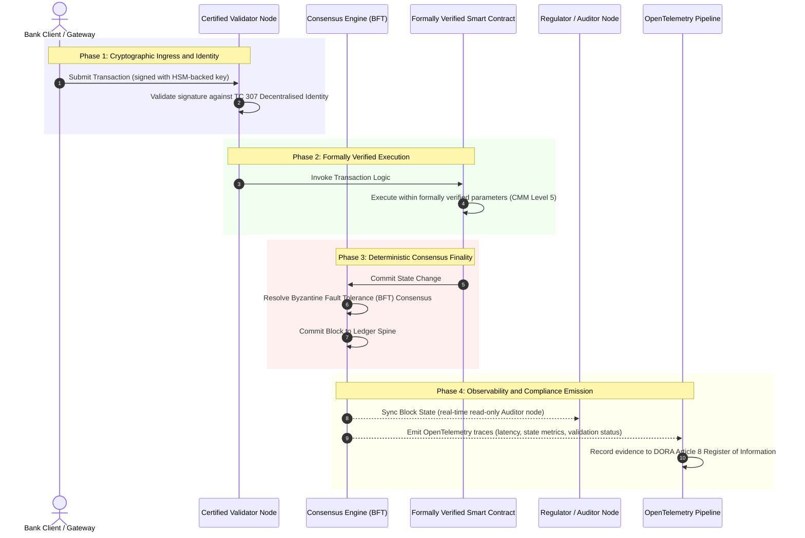

# 從證據到真實：為何認證區塊鏈將定義銀行信任的下一個時代

**不可竄改不等於受信任。** 當大額批發銀行邁向即時結算與機率式人工智慧，那個決定何謂真實的帳本，已成為銀行至今仍無法認證的唯一一層。銀行依 Basel III 認證法人實體、依 ISO 27001 認證雲端、依 ISO 42001 認證其人工智慧，但分散式帳本本身，連同它的治理、共識、密碼學與智慧合約，卻被留給各廠商各自的假設。本報告主張，要彌合這道受託責任缺口，必須從 ISO/IEC TC 307 的指引邁向規範性的保證：依五級認證區塊鏈指數為帳本評分，把工程指標化為董事會可稽核、可用於 DORA 抗辯的真實。

<!-- lead-start -->
<aside class="post-lead" aria-label="文章摘要">

<strong>摘要重點。</strong> 銀行認證了法人實體、雲端與其人工智慧，卻沒有認證那個日益決定何謂真實的帳本。ISO/IEC TC 307 提供的是指引，而非保證。五級認證區塊鏈指數依能力成熟度模型，為帳本治理、共識完整性、身分與密碼學、智慧合約保證及可觀測性評分，彌合受託責任缺口，並為機率式人工智慧提供確定性的稽核脊柱。

<strong>關鍵要點</strong>

<ul class="post-lead-takeaways">
  <li><strong>受託責任的摩擦缺口。</strong> 銀行（Basel III）、雲端（ISO 27001）與人工智慧治理系統（ISO 42001）都可以被認證；那個決定何謂真實的分散式帳本卻還不能。這種不對稱是一個活生生的營運弱點。</li>
  <li><strong>DORA 讓責任落到個人身上。</strong> 依 DORA Article 5，銀行董事會對第三方及帳本部署的韌性負有直接、不可委外的責任，一旦失職，還要面對 SM&amp;CR 下的個人罰則。</li>
  <li><strong>人工智慧的稽核脊柱。</strong> 機器學習不可重現；認證區塊鏈把模型版本、輸入與驗證決策以確定性方式記錄於鏈上，滿足 ISO 42001 及模型風險管理標準。</li>
  <li><strong>認證區塊鏈指數。</strong> 治理、共識、密碼學、智慧合約與可觀測性化為 0 到 5 的 CMM 計分卡，把工程指標轉譯為董事會核可的風險胃納聲明。</li>
</ul>

<strong>延伸閱讀：</strong> <a href="https://sebastienrousseau.com/2026-07-02-certified-blockchains-banking-trust-tc307-assurance-2026">認證區塊鏈與銀行信任：TC 307 保證</a>、<a href="https://sebastienrousseau.com/2026-07-24-global-payments-outlook-operating-model-risk-revenue">2026 年全球支付展望</a>。

</aside>
<!-- lead-end -->

> **執行摘要**
>
> - **大額批發銀行正處於轉折點。** 即時清算與機率式人工智慧打破了類比式、回溯式的保證模式：靜態、以法人實體為本的稽核，已無法滿足現代風險管理或受託責任的要求。
> - **TC 307 是基線，不是證書。** ISO/IEC TC 307 已為分散式帳本標準化了詞彙、參考架構與安全指引，但它是描述性的。它定義了何謂良好；它並未提供風險官與監理機關授權正式部署所需的規範性驗證。
> - **保證意味著為帳本評分。** 治理、共識完整性、智慧合約安全與密碼學敏捷性，依嚴格的五級能力成熟度模型評分，讓銀行從拼湊式、各廠商各自的假設，走向可認證、董事會可稽核的金融真實。
> - **帳本是人工智慧的稽核脊柱。** 把模型版本、輸入與驗證決策錨定於確定性共識，讓不可重現的機器學習在 ISO 42001、SR 11-7 與 PRA SS1/23 之下擁有可抗辯、可重建的證據紀錄。

## 數位銀行中的受託責任摩擦缺口

在傳統銀行業，信任是關係性的、機構性的，也是回溯式的。它仰賴獨立的第三方稽核人員在靜態時點檢視財務狀態，跨雙邊帳本孤島調節差異。在 2026 年這個即時、由 API 驅動的市場中，這套模式帶來難以承受的延遲與結構性風險。

當交易即時結算、日內流動性池由 API 閘道動態管理、資產所有權在共享帳本上被代幣化，回溯式稽核便從預防性控制淪為事後鑑識工作。受託人再也不能只靠認證公司法人實體。他們必須認證數位底層本身。

目前，銀行運作於一種顯而易見的架構不對稱之下：

1. **已認證的雲端基礎設施**：硬體節點、虛擬化容器與實體資料中心，依 ISO/IEC 27001 與 SOC 2 Type II 控制項進行驗證。  
2. **已認證的管理流程**：營運風險政策、業務持續計畫與演算法部署，受嚴格的風險框架治理。  
3. **未認證的帳本引擎**：核心的分散式共識機制、驗證者節點供應鏈、智慧合約邊界與網路治理模型，卻被留給未經認證、客製化或特定聯盟的假設。

這種不對稱是一個重大的失效點。銀行可以在安全、通過 ISO 27001 認證的雲端容器內執行一個經驗證的應用程式，但若該容器寫入的分散式帳本存在中心化的驗證者控制、脆弱的共識參數或未經稽核的智慧合約，交易的完整性便已受損。要跨越這道缺口，帳本引擎本身必須成為一個可認證的保證對象。

## ISO/IEC TC 307 標準化基線

標準化分散式帳本所需的奠基工作，正由 ISO/IEC 技術委員會 307（TC 307）（區塊鏈與分散式帳本技術）建立。TC 307 並未把區塊鏈當作孤立的技術協定，而是視之為機構性的信任基礎設施，並將其工作組織成五大核心支柱：

1. **分類與詞彙（ISO 22739）**：建立共同的命名法，確保跨不同司法管轄區、金融機制與機構的法律與營運定義一致。  
2. **參考架構（ISO/TR 23245）**：定義合規分散式帳本系統的邊界、分層、資料流與功能組件。  
3. **安全、隱私與智慧合約（ISO/TR 23244 / ISO 23613）**：為數位資產系統建立基線安全指引，並詳述智慧合約漏洞緩解與生命週期治理的最佳實務。  
4. **互通性框架**：處理異質帳本網路之間的資料與資產交換機制，防止形成孤立的代幣化孤島。  
5. **去中心化身分與信任錨**：把帳本上的密碼學識別符與正式的公開金鑰基礎設施（PKI）及國家授權的登記機構整合。

整體而言，TC 307 標誌著 DLT 從一項客製化的工程選擇，轉變為一門標準化的架構學科。然而，TC 307 仍以描述性為主。它定義了何謂良好（指引），卻未提供風險官與監理機關授權關鍵或重要功能（CIFs）正式部署所需的規範性驗證協定（保證）。

## 指引與保證：受託責任上的分野

金融市場參與者不會因為某項技術創新或優雅就採用它；他們是在該技術能被治理、稽核、抗辯，並與資本準備要求相調節時才採用。這正是為何銀行業的標準化自然而然地分成兩層：

* **指引（框架）**：勾勒最佳實務、參考目標與架構準則（例如 ISO/IEC TC 307、NIST 框架）。  
* **保證（證明）**：提供獨立、持續且可由第三方驗證的證據，證明框架已依設計實作並如常運作（例如 ISO 27001 認證、SOC 2 稽核、監理檢查）。

在認證雲端基礎設施的同時卻仰賴未經認證的帳本共識，是一道關鍵的法規缺口。一條「不可竄改」的區塊鏈未必就「受機構信任」。不可竄改性只保證已寫入的資料未被更動；它並不驗證驗證者節點是否安全、共識協定是否能抵抗共謀、智慧合約邏輯在數學上是否健全，或密碼學金鑰管理是否符合後量子的要求。

為彌合這道缺口，2026 認證區塊鏈指數將這些要求正式化為一套可量化的能力成熟度模型（CMM），並對映到全球銀行法規。

## 2026 認證區塊鏈指數

為使高階管理層能評估並認證其帳本平台，本指數把分散式帳本基礎設施結構化為五個可稽核的營運層，並以 0 到 5 的 CMM 尺度評分。

### 表 1：認證區塊鏈指數架構

| 指數層 | 能力成熟度等級（CMM） | 技術與營運指標 | 法規／受託責任控制參照 |
| ---- | ---- | ---- | ---- |
| **帳本治理** | **Level 0**：臨時性聯盟**Level 3**：自動化驗證者審查與輪替**Level 5**：去中心化、多方密碼學身分錨定 | 由經審查金融機構營運的驗證者節點百分比；解決驗證者爭議的平均時間；節點的地理分布 | **DORA Article 5**（治理與組織）；**CPMI-IOSCO PFMI Principle 2**（治理）與 **Principle 3**（全面風險管理框架） |
| **共識完整性** | **Level 0**：單一節點或不透明 POW**Level 3**：經稽核、具確定性最終性的 BFT**Level 5**：跨多司法管轄、經形式化驗證且持續監測延遲的共識 | 可容忍的最大共識延遲；抗共謀門檻；模擬節點分割下的正常運行時間 SLA | **DORA Article 6**（ICT 風險管理框架）；**CPMI-IOSCO PFMI Principle 8**（結算最終性） |
| **身分與密碼學** | **Level 0**：脆弱的 RSA／ECDSA 金鑰**Level 3**：以 HSM 為後盾的多重簽章金鑰管理**Level 5**：抗量子混合金鑰（FIPS 203 ML-KEM）與零知識隱私閘 | 以 HSM 為後盾金鑰簽署的帳本交易百分比；PQC 遷移就緒度分數；ZK 證明延遲 | **NIST FIPS 203 / 204**；**ISO/IEC 27001**（資訊安全管理） |
| **智慧合約保證** | **Level 0**：未經稽核的 solidity 腳本**Level 3**：自動化編譯器驗證與外部稽核**Level 5**：經形式化驗證、不可竄改且具斷路器升級機制的智慧合約 | 經數學形式化驗證的智慧合約百分比；編譯器警告數量；漏洞掃描涵蓋率 | **EBA Guidelines on Outsourcing Arrangements**（第 81、113-117 段）；**DORA Article 30**（最低契約條款） |
| **稽核與可觀測性** | **Level 0**：人工日誌爬取**Level 3**：結構化 OTel 追蹤與唯讀稽核者節點**Level 5**：對 Article 8 登記冊的自動化、持續調節 | 由 OpenTelemetry 追蹤涵蓋的交易百分比；從帳本區塊提交到稽核者節點同步的延遲 | **BCBS 239**（風險資料彙總）；**DORA Article 8**（資訊登記冊／ITS 綱要） |

### 表 2：對映至全球銀行標準的關鍵信任信號

| 信號／基準 | 指標 | 對銀行平台的影響 | 法規來源 |
| ---- | ---- | ---- | ---- |
| **ISO/IEC TC 307 進展** | 從 ISO/TR 技術報告轉向正式認證機制 | 建立第一套認證分散式帳本引擎的標準化框架 | **ISO/IEC JTC 1 / SC 44**（分散式帳本技術） |
| **Project Agorá 原型階段** | 40 家以上參與的商業銀行；代幣化存款的統一帳本測試 | 把跨境清算從訊息傳遞（SWIFT）轉向原子式代幣化結算 | **國際清算銀行（BIS）創新中心** |
| **DORA Article 30 第三方稽核** | 100% 的節點供應商與基礎設施代管商依安全準則接受稽核 | 消除「影子驗證者節點」；強制全供應鏈透明 | **歐洲監理機關（ESA）** |
| **ISO/IEC 42001（人工智慧治理）** | 以密碼學方式在鏈上使人工智慧模型與訓練日誌不可竄改 | 以區塊鏈作為機器學習不可竄改的證據帳本（「稽核脊柱」） | **ISO/IEC 42001:2023**（資訊技術，人工智慧） |
| **Basel III 資本適足性** | 依據有文件佐證的複雜度降低來削減營運風險資本緩衝 | 標準化的營運風險框架直接認列經驗證的帳本韌性 | **巴塞爾銀行監理委員會（BCBS）** |

## 人工智慧「稽核脊柱」：確定性基礎設施上的機率式智慧

認證區塊鏈在 2026 年最有力的策略角色之一，是作為人工智慧部署的 **「稽核脊柱」**。現代金融系統日益機率化。信用評分、即時詐欺偵測、演算法交易與自主客戶互動，都由會隨時間演化、漂移並適應的機器學習模型驅動。這些模型是非確定性的：在兩個不同時點給予相同輸入，由於動態權重與持續訓練，它們可能產生不同輸出。

這種非確定性，在 **ISO/IEC 42001（人工智慧治理）** 與 **模型風險管理（MRM）** 標準（例如 **美國聯準會 SR 11-7** 與 **英國 PRA SS1/23**）之下帶來一項深刻的治理挑戰：*你要如何稽核、解釋並抗辯那些並非嚴格可重現的決策？*

認證分散式帳本提供了確定性的制衡。當人工智慧模型以機率方式運作時，認證區塊鏈以確定性方式記錄其參數，建立一條不可更動的證據脊柱：

* **模型版本控管與權重錨定**：每個已部署的模型版本、其相關權重及其訓練資料校驗和，都在建置時被雜湊並寫入帳本，滿足 **SLSA Level 3** 供應鏈要求。  
* **情境輸入記錄**：當人工智慧模型執行關鍵決策（例如核准一筆貸款或標記一筆交易）時，確切的情境輸入與模型雜湊會被寫入帳本，形成一段防竄改的歷史。  
* **不需存取程式碼的可稽核性**：若監理機關詢問：「你的模型為何在 6 月 3 日拒絕這筆信貸申請？」銀行不需要揭露專有程式碼，也不需試圖重建確切的模型狀態。它出示的是經密碼學簽署、記於鏈上的輸入、權重與驗證狀態紀錄。

透過把機器學習模型的機率式決策錨定於認證區塊鏈的確定性共識，機構便建立起一條可抗辯、可重建且可獨立驗證的自動化行動時間軸。

## 將認證的「共識到稽核」流程視覺化

以下時序圖說明一筆交易通過認證區塊鏈平台的生命週期，展示驗證閘、共識完整性、智慧合約執行與遙測發送如何互鎖，以產生董事會就緒的法規證據：

這段交易序列的關鍵路徑要求每一個驗證、執行與共識步驟都經密碼學簽署，確保端到端的來源可追溯。監理機關的稽核者節點即時同步區塊狀態，消除了回溯式、人工財務調節的需求。

## 給高階管理者的董事會行動手冊

要順利管理從組織信任邁向基礎設施信任的轉變，銀行高階主管與資深經理人應立即執行四項關鍵指令：

1. **在企業風險管理（ERM）中強制帳本稽核**：施行一項政策——任何分散式帳本平台，無論屬於私有、公開或聯盟型，除非已依五層 **認證區塊鏈指數架構**（至少 CMM Level 3）接受稽核，否則不得部署於關鍵或重要功能（CIFs）。  
2. **將區塊鏈整合為 ISO 42001 人工智慧證據脊柱**：指示風險長與首席人工智慧架構師，把所有高影響的機器學習模型與認證區塊鏈整合，建立一份防竄改的稽核帳本，記錄模型版本、權重、輸入與決策。  
3. **稽核驗證者節點供應鏈（DORA Article 30）**：要求採購部門稽核所有代管驗證者節點或為 DLT 網路管理雲端代管的第三方機構，強制其遵循與銀行內部雲端節點相同的資安與營運韌性標準。  
4. **使帳本架構對齊 CPMI-IOSCO 與 BCBS 239**：指示平台工程團隊使帳本輸出的遙測直接對齊 **BCBS 239** 資料報告要求，並確保共識與結算最終性參數嚴格遵循 **CPMI-IOSCO Principles 8 and 9**。

## 常見問答

**ISO/IEC TC 307 是一項認證標準嗎?**  
不是。ISO/IEC TC 307 是一個技術委員會，負責建立詞彙、參考架構與安全指引。雖然它定義了「何謂良好」（指引），業界仍必須把這些文件落實為正式、可稽核的認證機制（保證），才能滿足銀行監理機關。

**認證區塊鏈如何支援 DORA 遵循?**  
依 DORA Article 5，銀行董事會對技術韌性負有直接的個人責任。認證區塊鏈提供可驗證的密碼學證據，證明共識完整性、驗證者供應鏈控制與智慧合約安全，讓董事會成員擁有可佐證的「合理步驟」，以抗辯 SM&CR 下的個人責任主張。

**傳統帳本稽核與認證區塊鏈稽核有何差異?**  
傳統稽核是回溯式的，在交易清算後驗證人工輸入與靜態檔案。認證區塊鏈稽核則是持續且即時的；驗證者節點、BFT 共識引擎與經形式化驗證的智慧合約，都經認證能以確定性方式執行交易，並發送結構化遙測（OpenTelemetry），持續驗證系統的健康狀態。

**公有區塊鏈能被認證用於銀行業嗎?**  
在多數司法管轄區，純粹無許可的公有區塊鏈因缺乏驗證者身分驗證、gas／交易成本不可預測，以及非確定性最終性（例如機率式的工作量／權益證明分叉），而無法滿足銀行法規。銀行業的認證區塊鏈通常採用企業許可制，或高度受監管的公有混合架構，其中驗證者節點營運者是經識別並經稽核的金融機構。

## 參考資料

* Basel Committee on Banking Supervision (BCBS), 2013\. *Principles for effective risk data aggregation and reporting (BCBS 239\)*. Basel: Bank for International Settlements. Available at: [Basel Committee on Banking Supervision (BCBS), 2013\.](https://www.bis.org/publ/bcbs239.pdf "Basel Committee on Banking Supervision (BCBS), 2013\.").  
* Committee on Payments and Market Infrastructures and Technical Committee of the International Organisation of Securities Commissions (CPMI-IOSCO), 2012\. *Principles for financial market infrastructures*. Basel: Bank for International Settlements. Available at: [Committee on Payments and Market Infrastructures and Technical Committee of the International Organisation of Securities Commissions (CPMI-IOSCO), 2012\.](https://www.bis.org/cpmi/publ/d101a.pdf "Committee on Payments and Market Infrastructures and Technical Committee of the International Organisation of Securities Commissions (CPMI-IOSCO), 2012\.").  
* European Banking Authority (EBA), 2019\. *EBA/GL/2019/02, Guidelines on outsourcing arrangements*. Paris: EBA. Available at: [European Banking Authority (EBA), 2019\.](https://www.eba.europa.eu/regulation-and-policy/internal-governance/guidelines-on-outsourcing-arrangements "European Banking Authority (EBA), 2019\.").  
* European Parliament and Council of the European Union, 2022\. *Regulation (EU) 2022/2554 on digital operational resilience for the financial sector (DORA)*. Brussels: Official Journal of the European Union. Available at: [European Parliament and Council of the European Union, 2022\.](https://eur-lex.europa.eu/legal-content/EN/TXT/?uri=CELEX%3A32022R2554 "European Parliament and Council of the European Union, 2022\.").  
* ISO/IEC JTC 1/SC 42, 2023\. *ISO/IEC 42001:2023, Information technology, Artificial intelligence, Management system*. Geneva: International Organisation for Standardisation. Available at: [ISO/IEC JTC 1/SC 42, 2023\.](https://www.iso.org/standard/81230.html "ISO/IEC JTC 1/SC 42, 2023\.").  
* ISO/IEC Technical Committee 307, 2020\. *ISO/IEC 22739:2020, Blockchain and distributed ledger technologies, Vocabulary*. Geneva: International Organisation for Standardisation. Available at: [ISO/IEC Technical Committee 307, 2020\.](https://www.iso.org/standard/73771.html "ISO/IEC Technical Committee 307, 2020\.").  
* National Institute of Standards and Technology (NIST), 2026\. *First Three Finalised Post-Quantum Encryption Standards (FIPS 203, 204, and 205\)*. Gaithersburg: U.S. Department of Commerce. Available at: [National Institute of Standards and Technology (NIST), 2026\.](https://www.nist.gov/news-events/news/2024/08/nist-releases-first-3-finalised-post-quantum-encryption-standards "National Institute of Standards and Technology (NIST), 2026\.").

