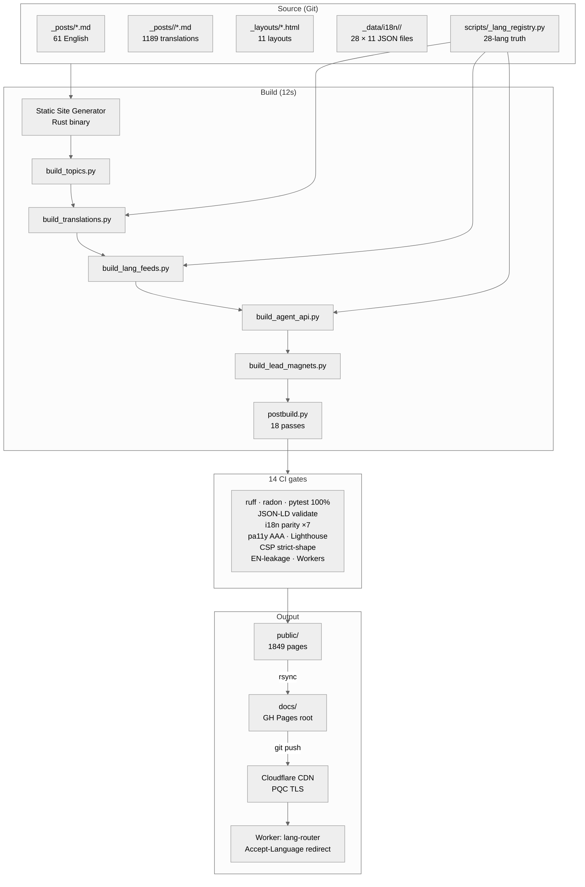
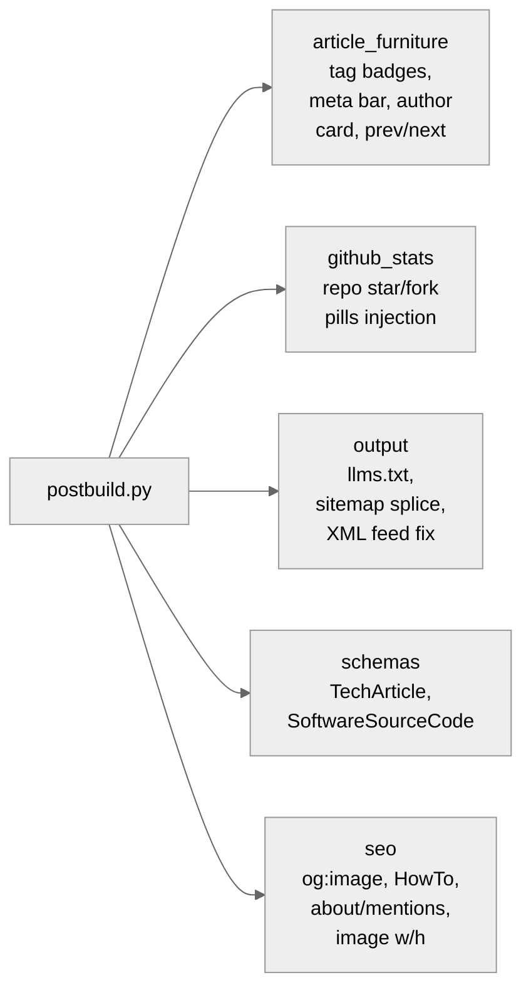
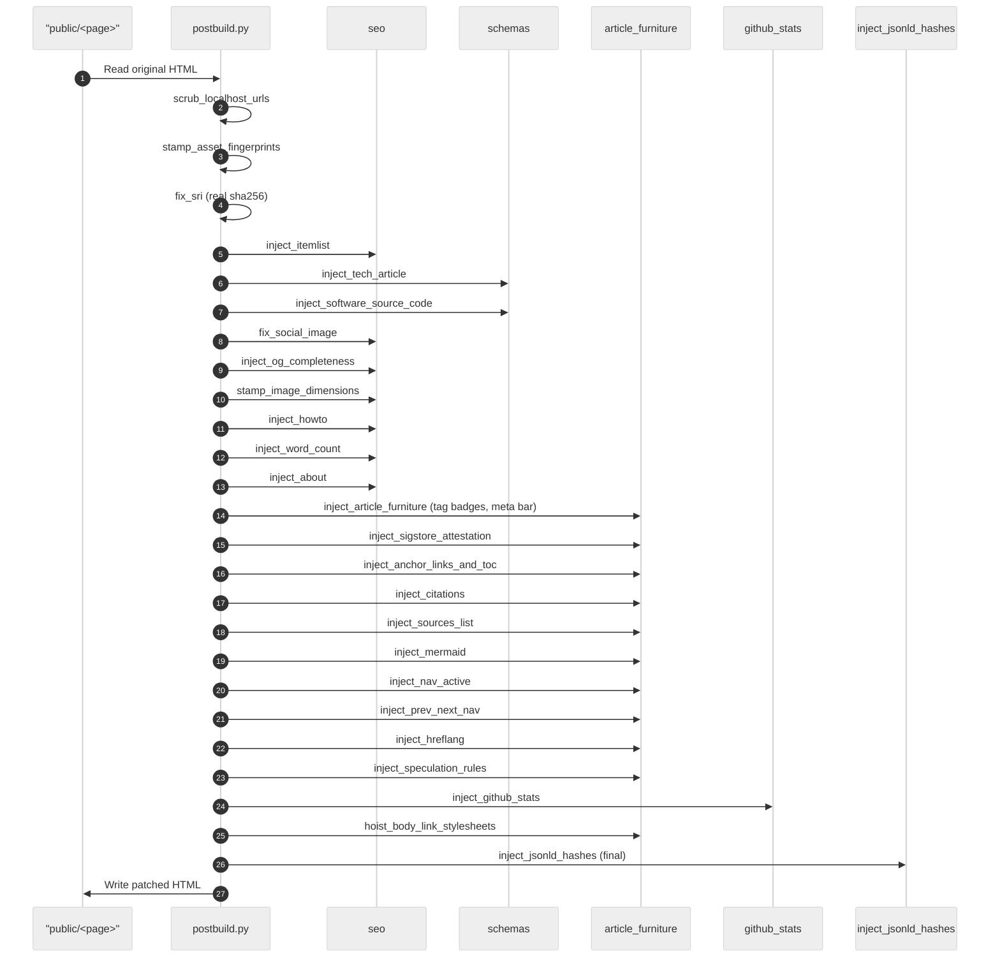
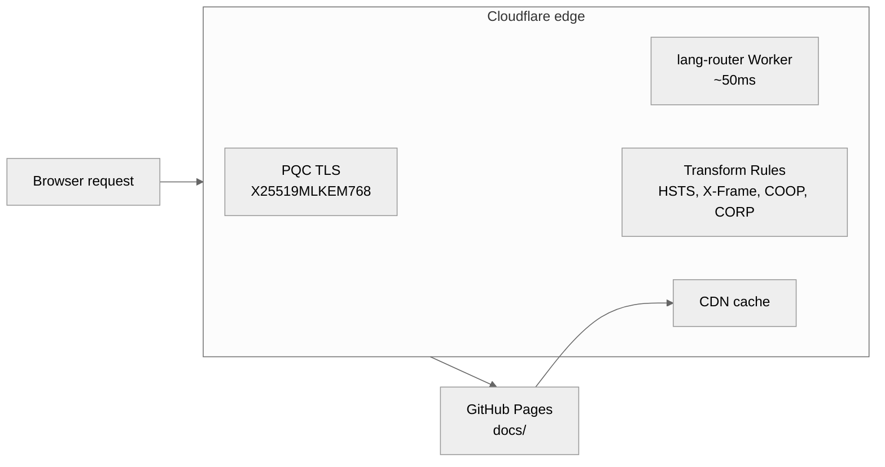

<!-- SPDX-License-Identifier: Apache-2.0 -->

# Architecture

End-to-end map of the build pipeline. Read this if you want to understand how a Markdown source ends up as a 1849-page CDN-served static site in 28 languages with strict CSP, real SRI, and complete Schema.org structured data.

## Contents

- [Top-level flow](#top-level-flow)
- [The seven build stages](#the-seven-build-stages)
- [`scripts/` inventory](#scripts-inventory)
- [`postbuild_lib/` modules](#postbuild_lib-modules)
- [Single-page postbuild orchestration](#single-page-postbuild-orchestration)
- [Pure-function discipline](#pure-function-discipline)
- [Edge layer (Cloudflare)](#edge-layer-cloudflare)

---

## Top-level flow



The build is a strict pipeline — each stage reads from disk, writes to disk, and produces no in-memory state shared with the next. That means you can re-run a single stage to debug it.

---

## The seven build stages

### 1. `ssg` (Static Site Generator)

The Rust binary `ssg` reads `_posts/*.md` + `_layouts/*.html` and emits `public/<slug>/index.html` for every English source. It picks the layout from each post's `layout:` frontmatter (`report` for long-form, `link` for the link-board, etc.).

**Frontmatter convention:** YAML between two `---` markers. Required fields: `title`, `description`, `date`, `layout`, `language`, `keywords`. Optional but heavily used: `banner`, `banner_alt`, `subtitle`, `seo_title`, `last_reviewed`, `tags`, `twitter_*`, `item_*`.

**Asset fingerprinting:** Static Site Generator extracts inline CSS into a single bundle under `/_csp/<hash>.css` and inline JS into `/_csp/<hash>.js`. The references in the rendered HTML carry placeholder `integrity="sha256-<short-hex>"` that `postbuild.py` later replaces with real base64 SHA-256.

### 2. `scripts/build_topics.py`

Five hand-curated topic clusters:

```
post-quantum-cryptography
iso-20022-payments
applied-ai-banking
rust-open-source
blockchain-digital-assets
```

Each is a manually-maintained list of article slugs + a per-language translation of the title + lede. Output: `public/topics/<topic>/index.html` × 5 + a hub at `public/topics/index.html`.

### 3. `scripts/build_translations.py`

The translation pipeline. For each active non-EN language in [`scripts/_lang_registry.py`](../scripts/_lang_registry.py):

1. **Read** the EN-rendered shell (from `public/<slug>/index.html`).
2. **Apply chrome patches** — 71 regex patches per locale (`_data/i18n/<lang>/chrome_patches.json`) localising nav, footer, search bar, CTAs, aria-labels.
3. **Apply body patches** — ~78 home patches + ~254 static patches transforming card text, eyebrows, descriptions.
4. **Auto-generate patches from `strings.json`** via `_lang_registry.build_chrome_patches(lang)` — mechanical attribute-and-text swaps inferred from a 52-key UI strings dictionary.
5. **Patch JSON-LD** — `inLanguage` set to the locale's BCP-47 tag; cross-page references rewritten.
6. **Rewrite slug links** — `/en-slug/` → `/<lang>/<lang-slug>/` using `_data/i18n/<lang>/slugs.json`.
7. **Localise dates** — "May 2026" rendered via the locale's month names.
8. **Set `<html lang>`, `og:locale`, hreflang reciprocity.**
9. **Write** `public/<lang>/<lang-slug>/index.html`.

The output is a 67-page tree per lang (44 articles + hub + 21 static pages) plus a per-language search-index.

### 4. `scripts/build_lang_feeds.py`

Per-language RSS, Atom, news-sitemap, and JSON-Feed 1.1 outputs. Same article ordering as the EN feeds. Reads frontmatter from `_posts/<lang>/*.md` directly (single- or double-quoted YAML, both supported).

### 5. `scripts/build_agent_api.py`

Machine-readable JSON for AI / agentic clients:

```
/api/agents/index.json — discovery document
/api/agents/posts.json — every dated post with metadata
/api/agents/topics.json — curated topic clusters + slug lists
/api/agents/person.json — author profile (Person + Organization)
```

Cross-linked from `/.well-known/ai-plugin.json` and described by `/.well-known/openapi.json` (OpenAPI 3.1).

### 6. `scripts/build_lead_magnets.py`

Renders the markdown source under `_data/lead-magnets/*.md` to PDF (currently 1: `/resources/pacs008-checklist.pdf`).

### 7. `scripts/postbuild.py`

The single-page orchestrator. Reads every `public/**/*.html`, applies 18 transforms, writes back. See [POSTBUILD.md](POSTBUILD.md).

---

## `scripts/` inventory

37 Python modules total. Grouped by responsibility:

| Group | Modules |
|---|---|
| **Build stages** | `build_topics.py`, `build_translations.py`, `build_lang_feeds.py`, `build_fr_feeds.py` (legacy), `build_agent_api.py`, `build_lead_magnets.py`, `postbuild.py` |
| **Postbuild library** | `postbuild_lib/__init__.py`, `article_furniture.py`, `github_stats.py`, `output.py`, `schemas.py`, `seo.py` |
| **Single source of truth** | `_lang_registry.py` (28-language matrix), `build_topics.py` (topic taxonomy), `gen_projects.py` (projects portfolio source) |
| **In-repo CI gates** | `test_csp_strict.py`, `test_hreflang_reciprocity.py`, `test_i18n_*.py` (5 × parity gates), `test_jsonld_localized.py`, `test_lang_no_leakage.py`, `test_rtl_safe.py`, `test_search_indexes.py`, `test_sitemap_completeness.py` |
| **One-shot generators** | `gen_articles.py`, `gen_projects.py`, `gen_layouts.py`, `fetch_github_stats.py`, `fix_cdn_urls.py`, `fix_seo_meta.py`, `topic_link.py`, `postbuild.py:scrub_localhost_urls()`, `sigstore_sign.py` |
| **External validators** | `validate_jsonld.py`, `audit_links.py` |

---

## `postbuild_lib/` modules

`scripts/postbuild.py` delegates almost everything to submodules:



| Module | Stmts | Coverage | Responsibility |
|---|---:|---:|---|
| `article_furniture.py` | 470 | 100% | Tag badges, article meta bar, anchor links + ToC, citations graph, sources list, prev/next nav, hreflang, sigstore attestation, mermaid blocks. |
| `github_stats.py` | 130 | 100% | Inject star/fork/license/last-commit pills onto project cards. |
| `output.py` | 392 | 100% | `llms.txt`, `llms-full.txt`, sitemap splice, RSS/Atom/news-sitemap URL repair, JSON Feed write, robots.txt. |
| `schemas.py` | 168 | 100% | TechArticle JSON-LD on technical posts; SoftwareSourceCode JSON-LD on /projects/. |
| `seo.py` | 209 | 100% | `og:image` repair, HowTo schema, `about`/`mentions` Wikidata cross-links, image w/h stamping, `og:url`/`og:locale`/`og:site_name` completion, word count injection. |

Plus the bare orchestrator `postbuild.py` (~700 lines) which wires the pieces together.

---

## Single-page postbuild orchestration

The order matters. `inject_word_count` must run before `inject_article_furniture` (which renders word count into the meta bar). `inject_about` must run before `inject_jsonld_hashes` (which computes the page's per-block CSP hashes — adding to the JSON-LD after invalidates the hash).



The final `inject_jsonld_hashes` pass computes SHA-256 of every inline JSON-LD block + the `<script type="speculationrules">` block, strips `'unsafe-inline'` from `script-src`, and adds the per-page hash allowlist. After this pass, ANY further mutation to JSON-LD content invalidates browser enforcement — so it has to run last.

---

## Pure-function discipline

Every transform is a pure `(html, ...) -> html`. Module-level state is regex constants only — no caches, no globals mutated by call order. This is what makes 100% coverage tractable: each function is testable in isolation with a 3-line setup.

Counter-examples (state we *do* hold):

- `_lang_registry.LANGUAGES` — read-only registry of 28 languages, cached at module import.
- `postbuild_lib/article_furniture._post_nav_index` — single read-only index of post slugs ↔ URLs, built once at the start of postbuild from `_posts/`.

Everywhere else, transforms read HTML and write HTML, nothing more.

---

## Edge layer (Cloudflare)



Three configurable surfaces, all documented in [`DEPLOY.md`](../DEPLOY.md):

1. **PQC TLS toggle** — Cloudflare dashboard SSL/TLS → Edge Certificates → enable "Post-quantum hybrid TLS".
2. **Transform Rules** — sets HSTS, COOP, CORP, X-Frame-Options, Origin-Agent-Cluster (headers that can't be set via meta CSP).
3. **Worker** — `workers/lang-router.js` redirects `/` to `/<lang>/` based on the visitor's `Accept-Language`.

Everything else is static — `docs/` on GitHub Pages, fronted by Cloudflare's cache.
