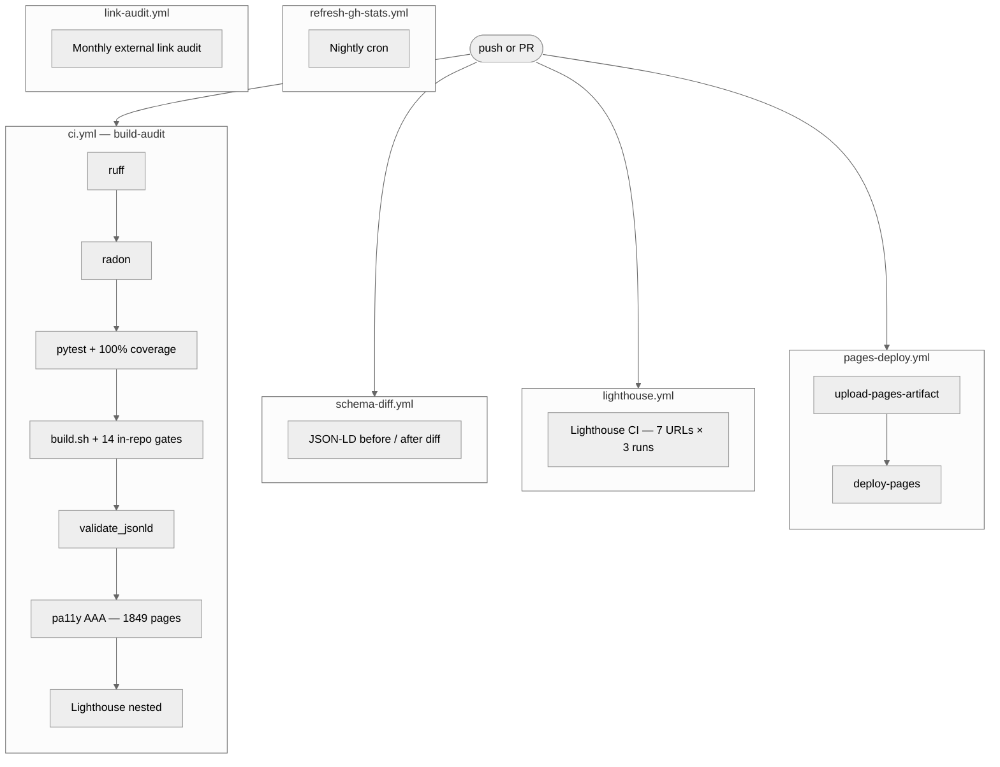

<!-- SPDX-License-Identifier: Apache-2.0 -->

# CI gates

Every push and PR runs through 14 distinct gates across 6 GitHub Actions workflows. This document explains what each gate checks, how to run them locally, and the common failure modes.

## Contents

- [Gate landscape](#gate-landscape)
- [In-repo gates](#in-repo-gates)
- [External gates](#external-gates)
- [Local equivalence](#local-equivalence)
- [Common failure modes](#common-failure-modes)
- [Gate timing](#gate-timing)

---

## Gate landscape



Six workflows; together they run 14 distinct gates. Triggers:

| Workflow | Trigger |
|---|---|
| `ci.yml` (build-audit) | every push + PR |
| `lighthouse.yml` | every push + weekly cron |
| `pages-deploy.yml` | push to `main` |
| `schema-diff.yml` | every PR |
| `refresh-gh-stats.yml` | nightly cron + manual |
| `link-audit.yml` | first of every month |

---

## In-repo gates

These run inside `build.sh` and fail the build immediately if violated:

### 1. `test_search_indexes`

Asserts EN + per-lang search-index files exist and carry the required shape (`title`, `url`, `content`, `headings`). 28 search-index files on a clean build.

### 2. `test_i18n_parity`

Every active non-EN language renders the same article count as EN (44 articles per lang).

### 3. `test_i18n_strings`

UI strings keyset matches EN reference. 52 keys.

### 4. `test_i18n_labels`

Body labels keyset matches EN reference. 12 keys.

### 5. `test_i18n_takeaway_labels`

Takeaway labels keyset matches EN reference. 29 keys.

### 6. `test_i18n_render_data`

Patch-table count matches FR canonical: `home_patches.json` = 78, `static_patches.json` = 254, `chrome_patches.json` = 71, static_bodies = 10.

### 7. `test_i18n_author`

Author-card metadata keyset matches across locales (`name`, `url`).

### 8. `test_hreflang_reciprocity`

Every translated page's hreflang set is symmetric. 1848 paired pages on a clean build.

### 9. `test_jsonld_localized`

JSON-LD `inLanguage` matches `<html lang>` on every page.

### 10. `test_sitemap_completeness`

Every rendered page is present in `sitemap.xml`. 108k entries across 28 languages.

### 11. `test_lang_no_leakage`

No English UI strings leaked into non-EN chrome. 47 reference strings checked across 27 non-EN langs.

### 12. `test_rtl_safe --strict`

RTL languages don't use physical CSS properties that don't flip with `dir="rtl"`.

### 13. `test_csp_strict`

CSP has no `unsafe-inline`/`unsafe-eval`; `img-src` has no blanket `https:`; every inline JSON-LD has its sha256 in `script-src`; `default-src 'self'` / `object-src 'none'` / `base-uri 'self'` all present.

### 14. `workers/test_lang_router.mjs`

Cloudflare Worker pure-logic tests (parseAcceptLanguage, pickSiteLang, isPageNavigation, getCookie, ACTIVE_LANGS shape).

---

## External gates

These run as separate jobs (parallel to `build-audit`):

### `pytest + coverage`

```bash
pytest tests/ --cov=scripts/postbuild_lib --cov-fail-under=100 -q
```

359 unit tests. 100% line coverage on `postbuild_lib/` required to pass.

### `ruff check scripts/ tests/`

Python lint. Zero errors required.

### `radon cc scripts/postbuild_lib/`

Cyclomatic complexity. No C-grade (≥11) functions allowed.

### `validate_jsonld.py`

Per-page Schema.org required-property check + XML feed shape (no `localhost`/`.meta/` dev artefacts). Zero errors required.

### `pa11y-ci`

WCAG 2.2 AAA accessibility audit across every rendered page (1849 in current state). Hide-elements filter excludes Spotify iframes (intermittent "context destroyed" race) and reCAPTCHA iframes (upstream missing title).

### `Lighthouse CI` (nested in build-audit)

7 representative URLs × 3 runs. Thresholds:

| Category | Warn | Error |
|---|---|---|
| Performance | <0.90 | — |
| Accessibility | — | <0.95 |
| Best Practices | — | <0.95 |
| SEO | — | <0.95 |

### `lighthouse.yml` (separate workflow)

Weekly Lighthouse 12 sweep — stricter `target-size` audit, latest spec.

### `schema-diff.yml`

Builds the PR base + HEAD, diffs the JSON-LD shape, posts a PR comment. Read-only — never fails the build, just informs the reviewer.

---

## Local equivalence

The full CI sequence runnable locally:

```bash
# 1. Lint + complexity
ruff check scripts/ tests/
radon cc scripts/postbuild_lib/ -nC

# 2. Tests + coverage
pytest tests/ --cov=scripts/postbuild_lib --cov-fail-under=100 -q

# 3. Build (chains all 14 in-repo gates)
./build.sh

# 4. JSON-LD + feed validate
python3 scripts/validate_jsonld.py

# 5. External link audit
python3 scripts/audit_links.py

# 6. Worker pure-logic tests
node workers/test_lang_router.mjs
```

The one-liner: `make build && make test && make audit && make validate`.

---

## Common failure modes

### `i18n parity defect: <lang>/labels.json missing keys`

A new label was added to EN reference but not to other locales. Add the key to all 28 `_data/i18n/<lang>/labels.json` files with translated values.

### `EN string leaked into non-EN chrome: 'Get in touch'`

The chrome patch list doesn't contain a translation for this string. Add a patch entry to the failing lang's `chrome_patches.json`.

### `validate_jsonld: missing .author-card`

The article's source markdown is missing the `<!-- enrich-start -->...<!-- enrich-end -->` block that should contain the author-card HTML. Add it; postbuild won't synthesize it from nothing.

### `validate_jsonld: <id> contains dev artefact (.meta/...)`

Static Site Generator emits `.meta/<lang>/` paths into atom/RSS for translated articles. `postbuild_lib/output.py:_build_title_index` walks `_posts/<lang>/*.md` and synthesises a per-lang URL from the post path. If a translated post is missing or has no `title:` in frontmatter, the URL can't be looked up — make sure the source file has a non-empty title.

### `Coverage failure: 99%, fail-under=100`

You added new code without tests. Find the uncovered lines via `pytest --cov-report=term-missing`, add tests, push.

### `radon: C-grade complexity in <function>`

A function has cyclomatic complexity ≥11. Split into helper functions until each is ≤10 branches.

### `pa11y: insufficient contrast, ratio of 6.x:1`

WCAG AAA requires ≥7:1 for normal text. Either bump the colour darker, ensure the page renders with the page's chosen `--bg` (#ffffff in light mode), or — last resort — hide the failing element via the pa11y `hideElements` config.

### `pa11y: Execution context was destroyed`

A third-party iframe (Spotify, reCAPTCHA) fires a navigation event that races with pa11y's measurement. Add the iframe's `src` pattern to `hideElements` in `.github/workflows/ci.yml`.

### `Schema-diff: 26 schemas changed`

Expected when adding/removing Schema.org types. Read the diff in the PR comment, confirm the changes are intentional.

---

## Gate timing

Approximate gate runtimes on GitHub-hosted runners:

| Gate | Time |
|---|---:|
| ruff | ~2s |
| radon | ~1s |
| pytest + coverage | ~3s |
| `build.sh` (incl. 14 in-repo gates) | ~15s |
| `validate_jsonld` | ~3s |
| pa11y AAA × 1849 pages | **35-45 min** |
| Lighthouse CI nested (7 URLs × 3 runs) | 7-15 min |
| Lighthouse CI standalone weekly | 15-20 min |
| pages-deploy | 1-2 min |
| schema-diff (build PR base + HEAD) | 5-7 min |

**pa11y is the long pole.** A full sweep over 1849 pages takes 35-45 minutes. There's no shortcut — every page must be rendered and probed for WCAG violations. For tight iteration loops, run pa11y locally against a subset:

```bash
echo "http://127.0.0.1:8000/2026-05-21-best-cloud-infrastructure-architecture-2026/" > pa11y-subset.txt
npx pa11y-ci --sitemap none --threshold 0 --reporter junit < pa11y-subset.txt
```
