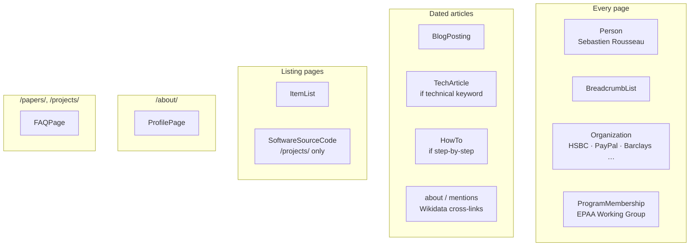
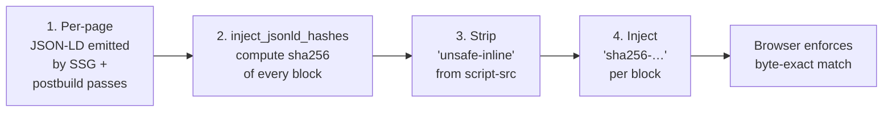

<!-- SPDX-License-Identifier: Apache-2.0 -->

# Schema.org coverage

Every page on the site emits structured data — Google, Bing, AI agents, and Schema.org-aware readers all benefit. This document lists every `@type` emitted, where, and how it interacts with the strict CSP.

## Contents

- [Type matrix](#type-matrix)
- [Per-type details](#per-type-details)
- [CSP hash discipline](#csp-hash-discipline)
- [Validation](#validation)
- [Why TechArticle and SoftwareSourceCode were added](#why-techarticle-and-softwaresourcecode-were-added)

---

## Type matrix



| Type | Pages emitted | Source |
|---|---:|---|
| `Person` | 1849 | [`scripts/build_agent_api.py`](../scripts/build_agent_api.py) + per-page JSON-LD |
| `BlogPosting` | 1232 | Per-article frontmatter via Static Site Generator |
| `TechArticle` | 613 | [`scripts/postbuild_lib/schemas.py:inject_tech_article`](../scripts/postbuild_lib/schemas.py) |
| `SoftwareSourceCode` | 26 | [`scripts/postbuild_lib/schemas.py:inject_software_source_code`](../scripts/postbuild_lib/schemas.py) |
| `HowTo` | 16 | [`scripts/postbuild_lib/seo.py:inject_howto`](../scripts/postbuild_lib/seo.py) |
| `ItemList` | 3 | [`scripts/postbuild.py:inject_itemlist`](../scripts/postbuild.py) |
| `BreadcrumbList` | 1849 | Per-page Static Site Generator emission |
| `FAQPage` | 2 | Per-page Static Site Generator emission |
| `ProfilePage` | 1 | `/about/` frontmatter |
| `Organization` | 1849 | Author Person.worksFor chain |
| `ProgramMembership` | 1849 | Author Person.memberOf |

(Counts are typical clean-build values; will scale with the 28-language matrix.)

---

## Per-type details

### `Person`

```json
{
  "@context": "https://schema.org",
  "@type": "Person",
  "@id": "https://sebastienrousseau.com/#person",
  "name": "Sebastien Rousseau",
  "url": "https://sebastienrousseau.com",
  "jobTitle": "Senior Product Manager",
  "worksFor": {"@type": "Organization", "name": "HSBC Commercial & Investment Bank"},
  "knowsAbout": ["Post-quantum cryptography", "ISO 20022", …],
  "memberOf": {"@type": "ProgramMembership", …},
  "sameAs": ["https://twitter.com/wwdseb", "https://github.com/sebastienrousseau", …]
}
```

Emitted on every page. The `@id` is stable across pages — search engines collapse multiple Person mentions into a single entity.

### `BlogPosting`

Standard article schema with `headline`, `datePublished`, `dateModified`, `author` (Person `@id` reference), `inLanguage`, `keywords`, `wordCount`, `image`, `mainEntityOfPage`. Plus enrichment from postbuild:

- **`about`** — entities the article is *about* (Wikidata cross-links). Driven by `ENTITY_AUTHORITY` in [`scripts/postbuild_lib/seo.py`](../scripts/postbuild_lib/seo.py) — e.g. "post-quantum cryptography" maps to `https://en.wikipedia.org/wiki/Post-quantum_cryptography` + `https://www.wikidata.org/wiki/Q1364608`.
- **`mentions`** — entities mentioned (not central). Same authority source.
- **`citation`** — every external URL the article references. Auto-extracted from `<a href>` and `<cite>`.

### `TechArticle`

Emitted on dated posts whose keywords name a programming language or one of the site's technical domains:

```python
_LANG_TOKENS = {"rust": "Rust", "python": "Python", "javascript": "JavaScript", "typescript": "TypeScript",
                "go": "Go", "wasm": "WebAssembly", "webassembly": "WebAssembly", "solidity": "Solidity"}

_DEP_TOKENS = {"iso 20022": "ISO 20022", "pain.001": "ISO 20022 pain.001", "pacs.008": "ISO 20022 pacs.008",
               "post-quantum": "Post-Quantum Cryptography", "crystals-kyber": "CRYSTALS-Kyber (NIST FIPS 203)",
               "kyber": "CRYSTALS-Kyber", "nist": "NIST", "fips 203": "NIST FIPS 203",
               "swift gpi": "SWIFT gpi", "sepa": "SEPA Instant Payments", …}
```

When the article's keywords match ≥1 entry, `TechArticle` is emitted alongside `BlogPosting` with `programmingLanguage` + `dependencies` fields. Google's Rich Results Test treats TechArticle as a richer Article subtype.

### `SoftwareSourceCode`

`/projects/index.html` only. Each of the 26 project cards (`<article class="newsroom-card">`) becomes one `SoftwareSourceCode` item inside an `ItemList`:

```json
{
  "@type": "SoftwareSourceCode",
  "name": "pain001",
  "url": "https://pain001.com",
  "applicationCategory": "Finance — Payments",
  "description": "A Python library that automates ISO 20022 pain.001 …",
  "programmingLanguage": "Python",
  "codeRepository": "https://github.com/sebastienrousseau/pain001",
  "author": {"@type": "Person", "name": "Sebastien Rousseau", "url": "…"}
}
```

`programmingLanguage` is inferred from the eyebrow text (`Featured · Python · ISO 20022` → `Python`). `codeRepository` defaults to the canonical `github.com/sebastienrousseau/<slug>` if the card's `href` is an external project site, otherwise uses the `href` directly.

### `HowTo`

Step-by-step articles emit `HowTo` with `step` (array of `HowToStep`), `supply`, `tool`. Currently 16 articles flagged via [`scripts/postbuild_lib/seo.py:_HOWTO_SPECS`](../scripts/postbuild_lib/seo.py) — pain001 file generation, pacs.008 structured-address migration, etc.

### `ItemList`

Three listing pages — `/articles/`, `/papers/`, `/projects/` — wrap their card grid in an `ItemList`. Each `ListItem` carries `position`, `name`, `url`. Required-property check: `ListItem.name` must be present (Schema.org validator).

### `BreadcrumbList`

Every page emits a 3-level breadcrumb: `Home › <section> › <page>`. Per-language localised (e.g. `Accueil › Articles › Mon article` in French).

---

## CSP hash discipline

Inline `<script type="application/ld+json">` blocks are allowed strictly by SHA-256 hash. The pipeline runs in this order:



If a postbuild pass adds JSON-LD AFTER `inject_jsonld_hashes` runs, the page's CSP won't carry that block's hash and the browser refuses it. To guarantee correctness:

1. All JSON-LD-emitting passes (`inject_itemlist`, `inject_tech_article`, `inject_software_source_code`, `inject_howto`, …) run BEFORE `inject_jsonld_hashes`.
2. CI gate [`test_csp_strict.py`](../scripts/test_csp_strict.py) walks every rendered page, extracts every inline JSON-LD block, computes its hash, and confirms that hash appears in the page's `script-src`. Fails the build if not.

---

## Validation

[`scripts/validate_jsonld.py`](../scripts/validate_jsonld.py) runs in CI on every push:

- **Per-page**: required-property tables enforce that every `@type` has its mandatory fields (`Article.headline`, `Article.author`, `Article.datePublished`, `BlogPosting.image`, `ListItem.name`, etc.).
- **Per-feed** (RSS, Atom, news-sitemap): every entry has `<title>`, `<link>`, `<guid>`/`<id>`, `<pubDate>`/`<published>`. No `localhost`/`.meta/` dev artefacts allowed.
- **Furniture checks**: every BlogPosting page has `.article-tags`, `.article-meta`, `.author-card`, `.post-pagination` (the AI-citation surface).

External validators worth periodic checks:

```bash
# Rich Results Test (Google)
open "https://search.google.com/test/rich-results?url=https%3A%2F%2Fsebastienrousseau.com%2F2026-05-21-best-cloud-infrastructure-architecture-2026%2F"

# Schema.org validator
open "https://validator.schema.org/?url=https%3A%2F%2Fsebastienrousseau.com%2F"
```

---

## Why TechArticle and SoftwareSourceCode were added

Pre-2026, the site emitted only `BlogPosting` for articles. Two reasons to enrich:

1. **AI citation surface.** Generative search engines (ChatGPT Search, Perplexity, Bing Copilot) preferentially cite content with richer structured data. `TechArticle` signals "this is a technical document" — useful for differentiating from blog content. `SoftwareSourceCode` makes the projects portfolio discoverable as a code-centric resource.
2. **Rich Results eligibility.** Google's Rich Results Test treats `HowTo`, `FAQPage`, `SoftwareSourceCode` as eligible for enhanced SERP treatment.

The two new types were added via [`scripts/postbuild_lib/schemas.py`](../scripts/postbuild_lib/schemas.py) — 168 statements, 100% test coverage. See the [`tests/test_schemas.py`](../tests/test_schemas.py) suite (40 tests).
