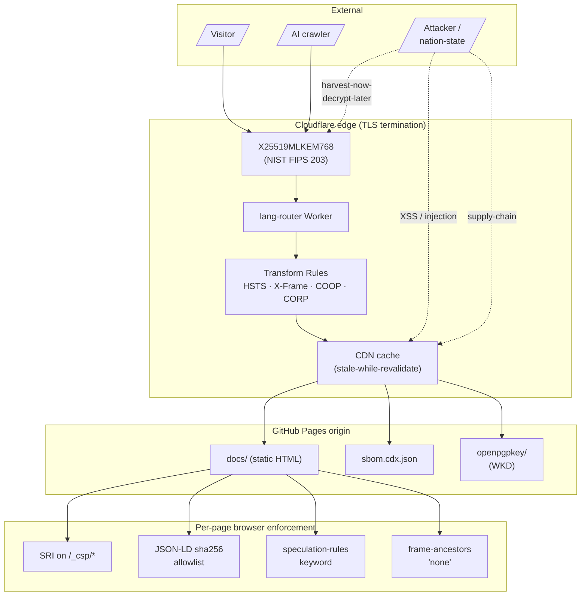

<!-- SPDX-License-Identifier: Apache-2.0 -->

# Security

This site is the public face of someone who writes about post-quantum cryptography. The security posture has to match.

## Contents

- [Threat model](#threat-model)
- [Transport layer (PQC TLS)](#transport-layer-pqc-tls)
- [Content Security Policy (CSP)](#content-security-policy-csp)
- [Subresource Integrity (SRI)](#subresource-integrity-sri)
- [Security headers](#security-headers)
- [Software Bill of Materials (SBOM)](#software-bill-of-materials-sbom)
- [Supply-chain provenance](#supply-chain-provenance)
- [Responsible disclosure](#responsible-disclosure)
- [CI-enforced regressions](#ci-enforced-regressions)

---

## Threat model



Adversaries the site is hardened against:

- **Nation-state harvest-now-decrypt-later (HNDL)** — captured TLS sessions decrypted years later by a cryptographically relevant quantum computer. Mitigated by ML-KEM-768 hybrid key exchange.
- **Web-based XSS / injection** — strict CSP with no `unsafe-inline`, per-page JSON-LD sha256 allowlist.
- **Supply-chain tampering** — CycloneDX SBOM published, real SHA-256 SRI on every asset, signed commits, branch protection.
- **Clickjacking** — `frame-ancestors 'none'` (CSP), `X-Frame-Options: DENY` (Transform Rules).
- **MITM / TLS downgrade** — HSTS preload, `max-age=63072000; includeSubDomains; preload`.

What's explicitly *not* in scope:

- DDoS protection — handled by Cloudflare's network layer.
- Account/auth security — there are no accounts.
- Server-side input validation — there's no server.

---

## Transport layer (PQC TLS)

Cloudflare's edge negotiates the post-quantum hybrid **X25519MLKEM768** (NIST FIPS 203, ML-KEM-768 standardised August 2024). Classical X25519 stays as fallback for legacy clients.

| Client | PQC negotiation |
|---|---|
| Chrome 124+ | ✓ X25519MLKEM768 |
| Firefox 132+ | ✓ X25519MLKEM768 |
| Safari 18+ | ✓ X25519MLKEM768 |
| Older browsers | Falls back to X25519 — no breakage |

**Why hybrid?** ML-KEM is new. A hybrid scheme (classical + PQ) survives if either half is broken — defense in depth. The NIST standard is exactly this construction.

Verification:

```bash
echo | openssl s_client -connect sebastienrousseau.com:443 \
  -tls1_3 -curves X25519MLKEM768 2>/dev/null \
  | grep -E 'Server (Temp|public) Key|TLS_'

# Or via Chrome DevTools:
# Security tab → "Connection — secure connection settings"
# → "Key exchange group: X25519MLKEM768"
```

Configured in the Cloudflare dashboard: SSL/TLS → Edge Certificates → enable **"Post-quantum hybrid TLS"**.

---

## Content Security Policy (CSP)

Shipped via `<meta http-equiv="Content-Security-Policy">` on every page. Strict, hash-allowlisted, no `unsafe-inline`:

```
default-src 'self';
base-uri 'self';
form-action 'self' https://formspree.io;
object-src 'none';
upgrade-insecure-requests;
script-src 'self' 'inline-speculation-rules'
           'sha256-<per-page-hash>'…
           https://www.google-analytics.com
           https://www.googletagmanager.com
           https://www.google.com
           https://www.gstatic.com
           https://open.spotify.com
           https://static.cloudflareinsights.com
           https://challenges.cloudflare.com
           https://ajax.cloudflare.com;
frame-src 'self' https://www.google.com
          https://open.spotify.com
          https://www.youtube.com
          https://www.youtube-nocookie.com;
connect-src 'self'
            https://www.googletagmanager.com
            https://www.google-analytics.com
            https://region1.google-analytics.com
            https://www.google.com
            https://stats.g.doubleclick.net
            https://open.spotify.com;
img-src 'self' data: blob:
        https://cloudcdn.pro
        https://pacs008.com
        https://www.googletagmanager.com
        https://i.scdn.co;
style-src 'self'
          'sha256-47DEQpj…='
          https://fonts.googleapis.com;
font-src 'self' https://fonts.gstatic.com;
media-src 'self' https://p.scdn.co https://*.scdn.co;
```

Key design choices:

1. **No `unsafe-inline` for scripts.** Per-page inline JSON-LD blocks are allowed strictly by SHA-256 hash. `scripts/postbuild.py:inject_jsonld_hashes()` computes each block's hash at build time and folds it into the page's `script-src`. The CSP-strict CI gate ([`scripts/test_csp_strict.py`](../scripts/test_csp_strict.py)) fails the build if any inline JSON-LD lacks its hash.
2. **`'inline-speculation-rules'` keyword** for the Speculation Rules block (which also carries its own hash as belt-and-braces).
3. **`img-src` enumerates 4 origins** — no blanket `https:`. The CSP-strict gate fails on any reintroduction of `https:` as a bare allow.
4. **`frame-ancestors 'none'`** is set via Cloudflare Transform Rules (meta CSP doesn't honour `frame-ancestors` per spec).

---

## Subresource Integrity (SRI)

Every `/_csp/*` asset (the fingerprinted CSS/JS bundles) carries a real base64 SHA-256 SRI in its `<script>` or `<link>` tag:

```html
<link rel="stylesheet" href="/_csp/abc123.css"
      integrity="sha256-base64-of-actual-bytes="
      crossorigin="anonymous" />
```

Static Site Generator emits a placeholder `integrity="sha256-<short-hex>"`; `scripts/postbuild.py:fix_sri()` replaces it with the real base64 hash computed from the actual file bytes. Browsers refuse to execute/apply the asset if the content doesn't match.

---

## Security headers

Headers that have to be set on the HTTP response (not via `<meta>`). Configured via Cloudflare Transform Rules — see [`DEPLOY.md`](../DEPLOY.md) for the canonical record.

| Header | Value |
|---|---|
| `Strict-Transport-Security` | `max-age=63072000; includeSubDomains; preload` |
| `Cross-Origin-Opener-Policy` | `same-origin` |
| `Cross-Origin-Resource-Policy` | `same-origin` |
| `X-Frame-Options` | `DENY` |
| `Origin-Agent-Cluster` | `?1` |

Notes:

- **`Cross-Origin-Embedder-Policy`** is deliberately *not* set — would break the Spotify iframes on `/playlists/`. If the playlists are ever dropped, COEP can be enabled (`credentialless` mode).
- `X-Content-Type-Options: nosniff` and `Referrer-Policy: strict-origin-when-cross-origin` are already shipped via `<meta>` in the HTML and don't need a Transform Rule.

Validation runs via Mozilla Observatory + securityheaders.com — target A+ on both:

```bash
open "https://observatory.mozilla.org/analyze/sebastienrousseau.com"
open "https://securityheaders.com/?q=sebastienrousseau.com"
open "https://www.ssllabs.com/ssltest/analyze.html?d=sebastienrousseau.com"
```

---

## Software Bill of Materials (SBOM)

Every build emits a [CycloneDX 1.4 SBOM](https://cyclonedx.org/specification/) at `/sbom.cdx.json`. Includes:

- Build tools (`ssg`, Python 3.x, pip packages from `requirements.txt`)
- Direct dependencies (markdown-it-py, …)
- File hashes for inventory consumers

Use case: downstream auditors who want to verify supply-chain provenance of any deployed version of the site.

---

## Supply-chain provenance

| Surface | Posture |
|---|---|
| **Signed commits** | Every commit on `main` is signed. Unsigned commits cannot reach `main` due to branch protection. |
| **Branch protection** | `main` requires a green CI run + reviewed PR. Force-push and direct push are blocked. |
| **CycloneDX SBOM** | Published on every build. |
| **Sigstore attestation** | Optional pass at `scripts/sigstore_sign.py` (skipped if `_data/sigstore/config.json` absent). Documented for future activation. |
| **Dependency review** | Renovate / Dependabot watches `requirements.txt` + GitHub Actions for security advisories. |

---

## Responsible disclosure

If you find a vulnerability:

- **Contact** — `contact@sebastienrousseau.com` (PGP-signed mail preferred).
- **OpenPGP key** — via WKD at `https://sebastienrousseau.com/.well-known/openpgpkey/`. Tools that speak WKD (recent `gpg`, Thunderbird, Outlook) resolve the key automatically.
- **Manual fetch** — `gpg --auto-key-locate clear,wkd,nodefault --locate-keys contact@sebastienrousseau.com`.
- **Policy** — the canonical [`SECURITY.md`](https://github.com/sebastienrousseau/dotfiles/blob/main/.github/SECURITY.md) lives in the author's dotfiles repo. Same policy applies here.

Please don't open a public GitHub issue for vulnerabilities. Email first.

---

## CI-enforced regressions

Security postures decay without enforcement. Three CI gates lock the posture in:

| Gate | Asserts | File |
|---|---|---|
| `test_csp_strict.py` | CSP has no `unsafe-inline`/`unsafe-eval`; `img-src` has no blanket `https:`; every inline JSON-LD has its sha256 in `script-src`; `default-src 'self'` / `object-src 'none'` / `base-uri 'self'` all present. | [`scripts/test_csp_strict.py`](../scripts/test_csp_strict.py) |
| `validate_jsonld.py` | JSON-LD `@type` shapes match required properties; XML feeds carry no dev artefacts (`.meta/`, `localhost`). | [`scripts/validate_jsonld.py`](../scripts/validate_jsonld.py) |
| `audit_links.py` | Internal links resolve to a real `index.html` in `public/`. | [`scripts/audit_links.py`](../scripts/audit_links.py) |

Any future change that loosens these fails the build before it can land on `main`.
