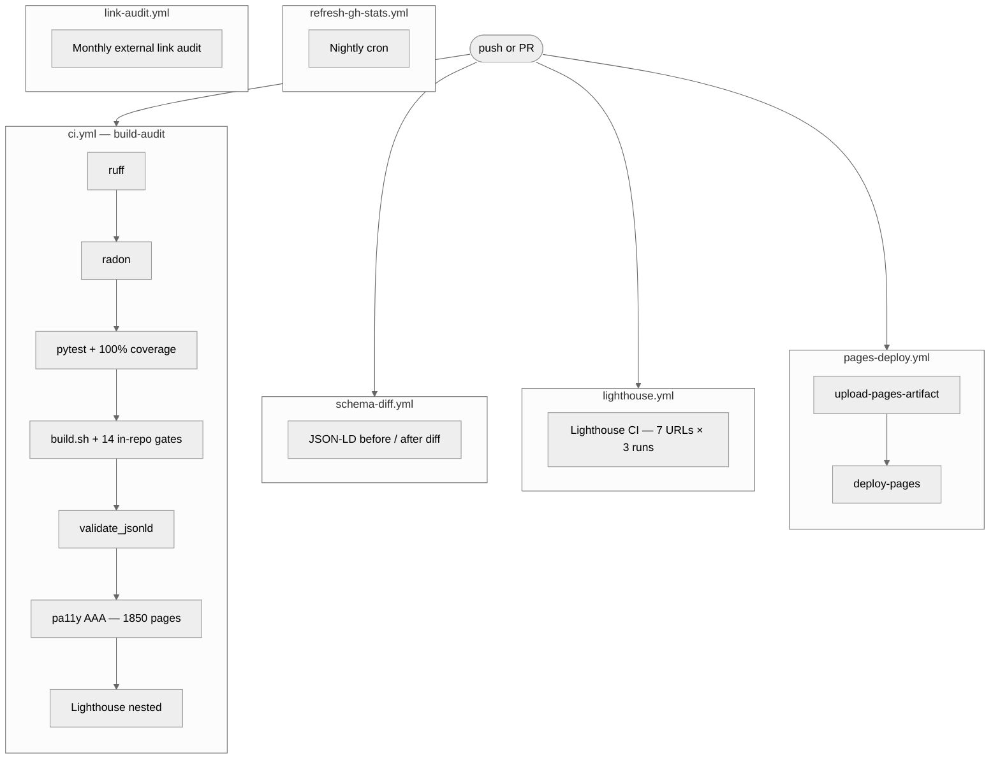

# CI gates

> Last Updated: June 4, 2026

Every push and pull request runs through fourteen main gates across six GitHub Actions runs to ensure complete site safety. This guide explains what each gate checks, how to run them locally, and the common failure modes.

## Contents

This list outlines the main topics in this guide.

- [Gate landscape](#gate-landscape)
- [In-repo gates](#in-repo-gates)
- [External gates](#external-gates)
- [Local equivalence](#local-equivalence)
- [Common failure modes](#common-failure-modes)
- [Gate timing](#gate-timing)

---

## Gate landscape

The diagram shows how changes trigger checks before deploying. Six jobs run fourteen gates based on specific rules.



Six jobs run fourteen gates based on specific rules.

| Workflow | Trigger |
|---|---|
| `ci.yml` (build-audit) | every push + PR |
| `lighthouse.yml` | every push + weekly cron |
| `pages-deploy.yml` | push to `main` |
| `schema-diff.yml` | every PR |
| `refresh-gh-stats.yml` | nightly cron + manual |
| `link-audit.yml` | first of every month |

---

## In-repo gates

These run inside `build.sh` and fail the build if a test fails.

### 1: `test_search_indexes`

This test checks that English and per-language search files exist and carry the correct keys, and the build generates twenty-eight search-index files.

### 2: `test_i18n_parity`

Each active language must render the same post count as the English source, and the user interface keys must match the English reference keys exactly.

### 3: `test_i18n_strings`

The user interface keys must match the English reference keys exactly, and the body labels must match the English reference list.

### 4: `test_i18n_labels`

The body labels must match the English reference list, which ensures that all layout labels are present in the translations.

### 5: `test_i18n_takeaway_labels`

The takeaway labels must match the English reference keys, and the patch count must match the French layout numbers to verify the build output.

### 6: `test_i18n_render_data`

The patch count must match the French layout numbers to verify that no manual translation edits are missing from the build output.

### 7: `test_i18n_author`

The author card keys must match across all locales, and each translated page must carry alternate language links that match its siblings.

### 8: `test_hreflang_reciprocity`

Each translated page must carry alternate language links that match its siblings, and the language key in the page schema must match the page language.

### 9: `test_jsonld_localized`

The language key in the page schema must match the page language, and each page must be present in the main sitemap XML file so that search engines can index the whole site structure.

### 10: `test_sitemap_completeness`

Each page must be present in the main sitemap XML file so that search engines can index the whole site structure.

### 11: `test_lang_no_leakage`

No English interface strings should appear in translated menus, and RTL layouts must use logical properties instead of physical directions.

### 12: `test_rtl_safe --strict`

RTL layouts must use logical properties instead of physical directions.

### 13: `test_csp_strict`

The policy must block unsafe scripts and allow inline blocks with hashes, and the Worker tests check routing and edge headers under full test coverage so that any new code path must come with tests to pass the gate.

### 14: `workers/test_lang_router.mjs`

The Worker tests check routing and edge headers under full test coverage. Any new code path must come with tests to pass the gate.

---

## External gates

These run as separate jobs alongside the build audit.

### `pytest + coverage`

```bash
pytest tests/ --cov=scripts/postbuild_lib --cov-fail-under=100 -q
```

All unit tests must pass and require full line coverage on the code to verify that all modules are covered by tests.

### `ruff check scripts/ tests/`

The Python lint tool checks all files to return zero errors.

### `radon cc scripts/postbuild_lib/`

We check the complexity to ensure that all functions remain simple, and the validator tool checks that all schemas have the required fields.

### `validate_jsonld.py`

This tool checks that all schemas have the required fields.

### `pa11y-ci`

This tool runs access tests to verify WCAG compliance while filtering out third-party players to prevent test timeouts, and the access suite runs on all remaining pages.

### `Lighthouse CI`

The tool checks key pages across multiple runs to verify performance, and a weekly sweep runs checks to verify the latest standards.

| Category | Warn | Error |
|---|---|---|
| Performance | <0.90 | — |
| Accessibility | — | <0.95 |
| Best Practices | — | <0.95 |
| SEO | — | <0.95 |

### `lighthouse.yml`

A weekly sweep runs checks to verify the latest standards.

### `schema-diff.yml`

This run compares schema shapes and posts a summary comment on the pull request.

---

## Local equivalence

You can run the full test sequence on your local machine using the commands below, and you can run the build, audit, and checks with a single make command.

---

## Common failure modes

This section lists common errors, their causes, and how to fix them.

### `i18n parity defect: <lang>/labels.json missing keys`

A new label key is missing from a file, so you must add it to all locales, and if a term lacks a match, you must add it to the patch lists.

### `EN string leaked into non-EN chrome: 'Get in touch'`

The patch lists do not contain a match for this term, so you must add it.

### `validate_jsonld: missing .author-card`

The markdown lacks the enrich blocks, so you must add them, and if the tool fails to resolve a URL, you must check the frontmatter keys.

### `validate_jsonld: <id> contains dev artefact (.meta/...)`

The tool failed to resolve a URL due to a missing title, so check the keys.

### `Coverage failure: 99%, fail-under=100`

You added new code paths without writing unit tests, or a function exceeds the complexity limits, so split it into helper blocks.

### `radon: C-grade complexity in <function>`

A function exceeds the complexity limits, so split it into helper blocks.

### `pa11y: insufficient contrast, ratio of 6.x:1`

 A text color lacks contrast, so update the colors to meet the rules, and if a player causes navigation events, add the pattern to the exclusion list.

### `pa11y: Execution context was destroyed`

A player causes navigation events, so add the pattern to the exclusion list.

### `Schema-diff: 26 schemas changed`

The schema changes are expected when modifying page types, so check the diffs.

---

## Gate timing

The table outlines typical run times on the integration runners, where the access sweep is the longest step. You can run checks locally against a subset of pages to iterate faster.

```bash
echo "http://127.0.0.1:8000/2026-05-16-best-cloud-infrastructure-architecture-2026/" > pa11y-subset.txt
npx pa11y-ci --sitemap none --threshold 0 --reporter junit < pa11y-subset.txt
```
