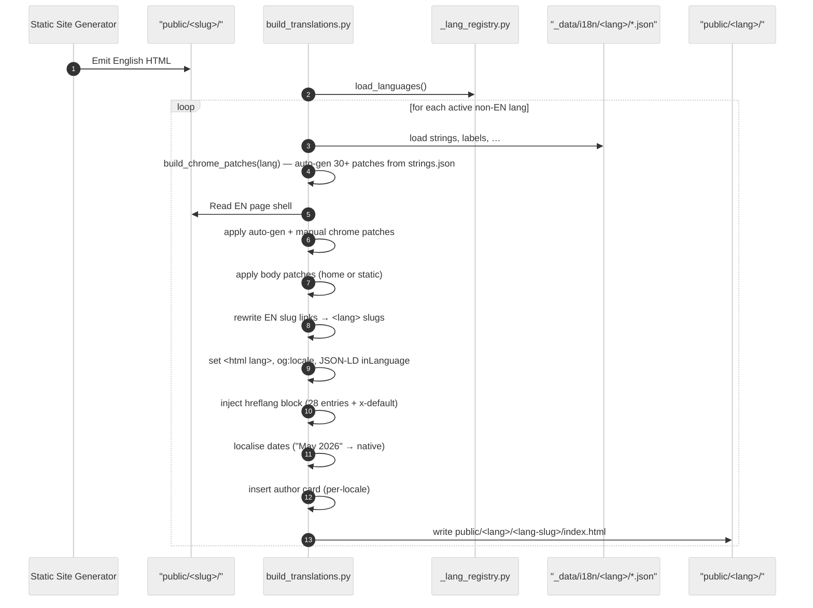
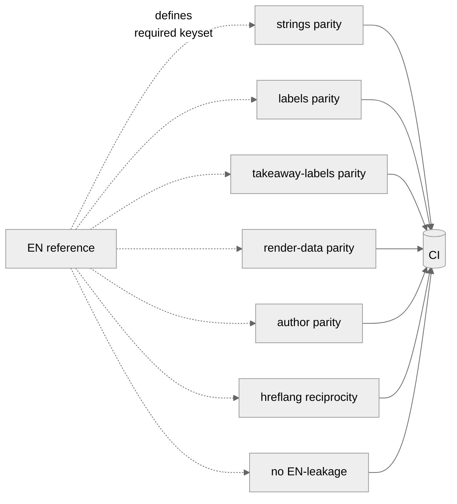
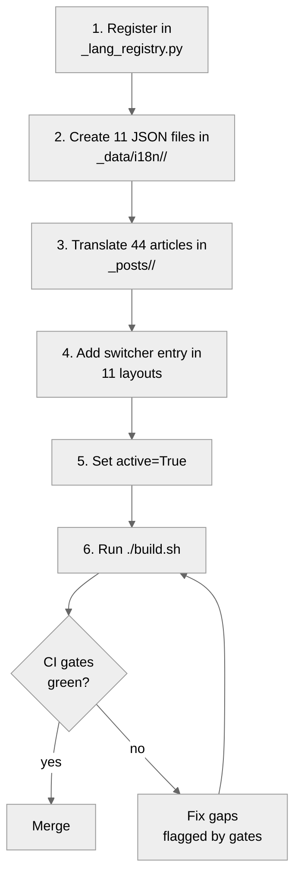

<!-- SPDX-License-Identifier: Apache-2.0 -->

# Internationalisation

The site ships **28 languages** with full chrome translation, article translations, per-language feeds, and CI-enforced parity. This document explains how that works, how to add a new language, and what guarantees the pipeline makes.

## Contents

- [Design rationale](#design-rationale)
- [The 28-language matrix](#the-28-language-matrix)
- [Per-language JSON glossaries](#per-language-json-glossaries)
- [Translation flow](#translation-flow)
- [Slug discipline](#slug-discipline)
- [RTL handling](#rtl-handling)
- [Hreflang reciprocity](#hreflang-reciprocity)
- [Per-language CI gates](#per-language-ci-gates)
- [Adding a new language](#adding-a-new-language)
- [Adding a new article (28 translations)](#adding-a-new-article-28-translations)

---

## Design rationale

Three design choices drive the i18n architecture:

1. **English is the source of truth.** All content authoring happens in English. Other languages are translations of English — never the other way around.
2. **FR-canonical fork pattern.** Non-EN renders fork the rendered EN HTML rather than re-rendering from layout templates. This guarantees layout parity by construction: any HTML change ships to all 28 languages without per-language template maintenance.
3. **JSON glossaries over Python translation tables.** Per-language strings live in 11 JSON files per locale. Easy to author, easy to review in PRs, easy for translators (non-developers) to edit.

Trade-off: the chrome/body string swap surface is large (`chrome_patches.json` has ~71 regex entries; `static_patches.json` has ~254 entries per lang). But these are mechanical patches, not invention — most are auto-generated from `strings.json` via `_lang_registry.build_chrome_patches(lang)`.

---

## The 28-language matrix

The single source of truth is [`scripts/lib/_lang_registry.py`](../scripts/lib/_lang_registry.py):

```python
LANGUAGES: tuple[Language, ...] = (
 Language("en", "en-GB", "en_GB", "EN", "English", "", active=True),
 Language("fr", "fr-FR", "fr_FR", "FR", "Français", "", active=True),
 Language("ar", "ar-SA", "ar_SA", "AR", "العربية", "", active=True, rtl=True),
 # … 25 more
 Language("zh-hant", "zh-Hant", "zh_TW", "ZH-TW", "繁體中文", "", active=True),
)
```

Each `Language` carries:

| Field | Purpose |
|---|---|
| `code` | URL segment (`/<lang>/...`). Lower-kebab. |
| `bcp47` | `<html lang>` and BCP-47 hreflang attribute. |
| `locale` | Underscored locale for `og:locale`. |
| `flag_label` | Two-letter switcher pill label. |
| `display_name` | Native language name in the lang switcher. |
| `flag_emoji` | Country flag prefix in the switcher. |
| `active` | If `False`, the language is registered but doesn't render. |
| `rtl` | If `True`, the language renders with `dir="rtl"` and CI runs `test_rtl_safe.py`. |

`active=True` for all 28 languages on production.

---

## Per-language JSON glossaries

Each locale's directory (`_data/i18n/<lang>/`) carries 11 JSON files:

| File | Shape | What it drives |
|---|---|---|
| `strings.json` | 52-key flat dict | Auto-generated chrome patches (nav, search, footer, CTAs, aria-labels). |
| `labels.json` | 12-key flat dict | Body labels (Table of contents, Read more, Last reviewed, …). |
| `takeaway_labels.json` | 29-key flat dict | Key-takeaways block labels. |
| `chrome_patches.json` | `{patches: [[regex, replacement], …]}` | ~71 manual chrome patches that auto-gen can't express (entity tolerance, dynamic prefixes, negative lookaheads). |
| `home_patches.json` | `{patches: [[regex, replacement], …]}` | ~78 home-page body patches. |
| `static_patches.json` | `{patches: [[regex, replacement], …]}` | ~254 patches for static pages (about, articles, papers, projects, …). |
| `static_bodies.json` | Map of `slug -> HTML` | Translated body content for `<lang>/contact/`, `<lang>/thank-you/`, etc. |
| `static_pages.json` | Map of `slug -> {title, description, …}` | Translated page-level metadata for static pages. |
| `slugs.json` | `{articles: {en_slug: lang_slug}}` | EN ↔ lang slug map for URL rewrites. |
| `author.json` | Person + Organization graph | Author card meta (bio, credentials, sameAs links). |
| `topics.json` | `{<topic_slug>: {title, lede}}` | Per-language topic-cluster metadata. |

The first three (`strings`, `labels`, `takeaway_labels`) have a strict key set policed by CI gates — see [Per-language CI gates](#per-language-ci-gates).

---

## Translation flow



The auto-gen patches (`_lang_registry.build_chrome_patches`) handle mechanical cases — `attr:` (quote-tolerant attribute value patches), `text-button`, `text-a`, `text-span`, `text-h2:<class>`. Anything regex-quirky (entity tolerance, dynamic prefix, multi-string composites) stays in the manual `chrome_patches.json` list which runs after.

---

## Slug discipline

Translated slugs are **ASCII-only** (Unicode in URLs harms SERP CTR) and **idiomatic, not transliterated**:

| English | French | German | Japanese |
|---|---|---|---|
| `/about/` | `/fr/a-propos/` | `/de/ueber-mich/` | `/ja/profile/` |
| `/articles/` | `/fr/articles/` | `/de/artikel/` | `/ja/kiji/` |
| `/papers/` | `/fr/publications/` | `/de/publikationen/` | `/ja/ronbun/` |
| `/projects/` | `/fr/projets/` | `/de/projekte/` | `/ja/purojekuto/` |
| `/topics/` | `/fr/sujets/` | `/de/themen/` | `/ja/topikku/` |
| `/contact/` | `/fr/contact/` | `/de/kontakt/` | `/ja/contact/` |

Slug maps live in `_data/i18n/<lang>/slugs.json`. The map is asymmetric — EN → lang only — but `_lang_registry.en_slug(lang_slug, lang)` reverses it for hreflang generation.

---

## RTL handling

Arabic (`ar`) and Hebrew (`he`) render with `dir="rtl"`. Two mechanisms keep RTL safe:

1. **`_lang_registry.Language(...rtl=True)`** — flips `<html dir="rtl">` and inverts text alignment.
2. **`tests/validation/test_rtl_safe.py --strict`** — CI gate that fails the build if any layout uses physical CSS properties (`margin-left`, `padding-right`, `text-align: left`, `border-left`, etc.) that don't flip with `dir="rtl"`. Required CSS pattern is logical properties (`margin-inline-start`, `text-align: start`, `border-inline-start`).

Exempt blocks must be tagged with a `/* rtl-safe-ignore */` comment (used for vendor minified bundles and print stylesheets).

---

## Hreflang reciprocity

Every translated page emits a complete `<link rel="alternate" hreflang="…" href="…">` block including `x-default`. The pairs are symmetric: if `/about/` claims `/fr/a-propos/` is its FR alternate, `/fr/a-propos/` must claim `/about/` is its EN alternate.

Enforced by [`tests/validation/test_hreflang_reciprocity.py`](../tests/validation/test_hreflang_reciprocity.py) on every build. 1848 paired pages on a clean build.

---

## Per-language CI gates

Seven parity gates enforce that every active non-EN language ships the same shape as English:



| Gate | What it asserts | Source |
|---|---|---|
| `test_i18n_parity` | Every active lang renders the same article count as EN | [`tests/validation/test_i18n_parity.py`](../tests/validation/test_i18n_parity.py) |
| `test_i18n_strings` | UI strings keyset matches EN reference (52 keys) | [`tests/validation/test_i18n_strings.py`](../tests/validation/test_i18n_strings.py) |
| `test_i18n_labels` | Body labels keyset matches EN reference (12 keys) | [`tests/validation/test_i18n_labels.py`](../tests/validation/test_i18n_labels.py) |
| `test_i18n_takeaway_labels` | Takeaway labels keyset matches EN reference (29 keys) | [`tests/validation/test_i18n_takeaway_labels.py`](../tests/validation/test_i18n_takeaway_labels.py) |
| `test_i18n_render_data` | Patch-table count matches FR canonical (home=78 static=254 chrome=71) | [`tests/validation/test_i18n_render_data.py`](../tests/validation/test_i18n_render_data.py) |
| `test_i18n_author` | Author-card metadata keyset matches | [`tests/validation/test_i18n_author.py`](../tests/validation/test_i18n_author.py) |
| `test_lang_no_leakage` | No English UI strings leaked into non-EN chrome | [`tests/validation/test_lang_no_leakage.py`](../tests/validation/test_lang_no_leakage.py) |
| `test_hreflang_reciprocity` | Symmetric hreflang pairs across all locales | [`tests/validation/test_hreflang_reciprocity.py`](../tests/validation/test_hreflang_reciprocity.py) |
| `test_jsonld_localized` | JSON-LD `inLanguage` matches `<html lang>` on every page | [`tests/validation/test_jsonld_localized.py`](../tests/validation/test_jsonld_localized.py) |
| `test_rtl_safe` | RTL languages don't use physical CSS properties | [`tests/validation/test_rtl_safe.py`](../tests/validation/test_rtl_safe.py) |

---

## Adding a new language



### Step-by-step

1. **Register** — append a `Language(...)` row to [`scripts/lib/_lang_registry.py`](../scripts/lib/_lang_registry.py) with `active=False` initially. RTL languages get `rtl=True`.

2. **Create glossaries** — `mkdir _data/i18n/<lang>/` and create 11 JSON files mirroring an existing locale's structure (start from `fr/` for LTR or `ar/` for RTL). Translate each value; keep keys identical.

3. **Translate posts** — copy each `_posts/2026-*-*.md` into `_posts/<lang>/2026-*-<translated-slug>.md`. Add the EN→lang slug mapping to `_data/i18n/<lang>/slugs.json`. Translate `title`, `subtitle`, `description`, `keywords`, `tags`, body. Keep frontmatter shape identical.

4. **Add switcher entries** — append a switcher anchor in the `<div class="ap-lang-menu">` block in all 11 `_layouts/*.html` files:

 ```html
 <a class="ap-lang-item" href="/<lang>/" data-lang="<lang>" role="menuitem"> <Native Name></a>
 ```

5. **Activate** — flip `active=True` in the registry.

6. **Build** — `./build.sh`. The pipeline emits the per-language tree; CI gates catch any gap.

7. **Audit** — read the rendered pages with a native speaker. Translation correctness isn't auto-checked.

---

## Adding a new article (28 translations)

1. Write `_posts/YYYY-MM-DD-en-slug.md` in English.
2. Build — `./build.sh`. Without translations, the article appears EN-only.
3. For each of the 27 non-EN languages:
 - Translate the article body and frontmatter into `_posts/<lang>/YYYY-MM-DD-<lang-slug>.md`.
 - Append the slug mapping to `_data/i18n/<lang>/slugs.json`.
4. Build again — `./build.sh`. Now 28 languages render.
5. CI gates enforce parity; manual review for prose quality.

Workflow tips:

- Translation agents work best in **chunked Write+Edit** mode for articles >50KB. A single 100KB Write tool call hits Puppeteer/agent watchdog timeouts.
- Match the existing target file's YAML quote style (single vs double quotes). `build_translations.py:_FM_KEY_RE` accepts both, but mixing inside a file confuses readers.
- Keep canonical product/standard names untranslated (AWS, Kubernetes, ML-KEM, etc.) — listed in agent prompts as the canonical-name allow-list.
