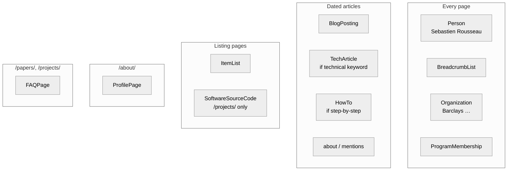
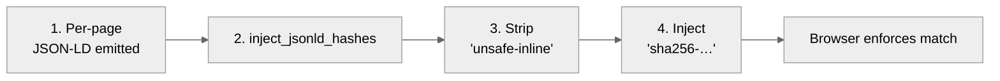

# Schema.org coverage

> Last Updated: June 4, 2026

Every page on the site emits structured data to help search engines, AI crawlers, and schema readers parse the content.
This document lists every type emitted, where it appears, and how the script keeps them secure under the site safety policies.

## Contents

This guide covers the type matrix, details for each schema block, script hashing rules, validation checks, and why we use rich types.

## Type matrix

The type matrix diagram shows how the build tool distributes different metadata blocks across the pages.

We emit specific schemas depending on whether a page is an article, a project list, or a profile.

| Type | Pages emitted | Source |
|---|---|---|
| `Person` | 1850 | `build_agent_api.py` and JSON-LD |
| `BlogPosting` | 1232 | Article header details |
| `TechArticle` | 613 | `schemas.py` postbuild function |
| `SoftwareSourceCode` | 26 | `schemas.py` postbuild function |
| `HowTo` | 16 | `seo.py` postbuild function |
| `ItemList` | 3 | `postbuild.py` postbuild function |
| `BreadcrumbList` | 1850 | Generator build output |
| `FAQPage` | 2 | Generator build output |
| `ProfilePage` | 1 | Profile header details |
| `Organization` | 1850 | Works for graph list |
| `ProgramMembership` | 1850 | Member of graph list |

The build counts scale automatically as you add translations for the other locales.

## Per-type details

Each metadata type carries specific fields that describe the author, article context, coding projects, or steps.

### `Person`

Standard profile tags describe the site owner and works history.
The person details include names, links, job titles, companies, and social profiles.
We emit a stable identifier that search engines collapse into a single entity across pages.

### `BlogPosting`

Standard article tags describe the headlines, dates, author references, language keys, and word counts.
The postbuild tool adds Wikidata links for entities that the article covers or mentions in the text.
It also extracts external links from the body to populate the citation fields automatically.

### `TechArticle`

We emit technical article schemas when the keywords name a language or code domain.
The build tool checks keywords against a list of known tech terms like Rust and WebAssembly.
This richer type makes coding posts stand out in search results.

### `SoftwareSourceCode`

We emit software source code schemas for project pages to describe open source libraries.
The tool extracts project names, repo links, languages, and descriptions from the project cards.
It sets the author metadata automatically using the global Person schema reference.

### `HowTo`

Step-by-step articles emit guide schemas with step details, tool sets, and supply lists.
We specify these setups in the postbuild script per page slug.
This keeps schemas stable even if the layout styles change.

### `ItemList`

We wrap listing pages in structured lists to help search indexers parse the card grids.
The listing schemas specify positions, names, and link URLs for each item.
Each list item must carry a name to pass the schema checks.

### `BreadcrumbList`

Every page carries breadcrumb links that show the site structure.
The build tool translates these links automatically into the page locale.

## CSP hash discipline

All inline schema scripts are allowed strictly by base64 hashes that are checked by the browser.

We compute the hashes last so that no later page edit blocks the scripts.
The test script extracts and checks these hashes on all generated pages.

## Validation

We run automated scripts in the build pipeline to check that all schemas carry their mandatory fields.

The checking tool scans the pages to confirm that titles, dates, author links, and tag grids exist.
It also blocks local host links and development stubs from reaching the production feeds.

## Why TechArticle and SoftwareSourceCode were added

We added richer schema types to improve search visibility and help artificial intelligence agents cite our content.

First, search engines prefer content that carries rich structured data.
Second, these types qualify the pages for enhanced snippets in search results.
Adding these blocks helps tools verify that our pages contain original technical details.
