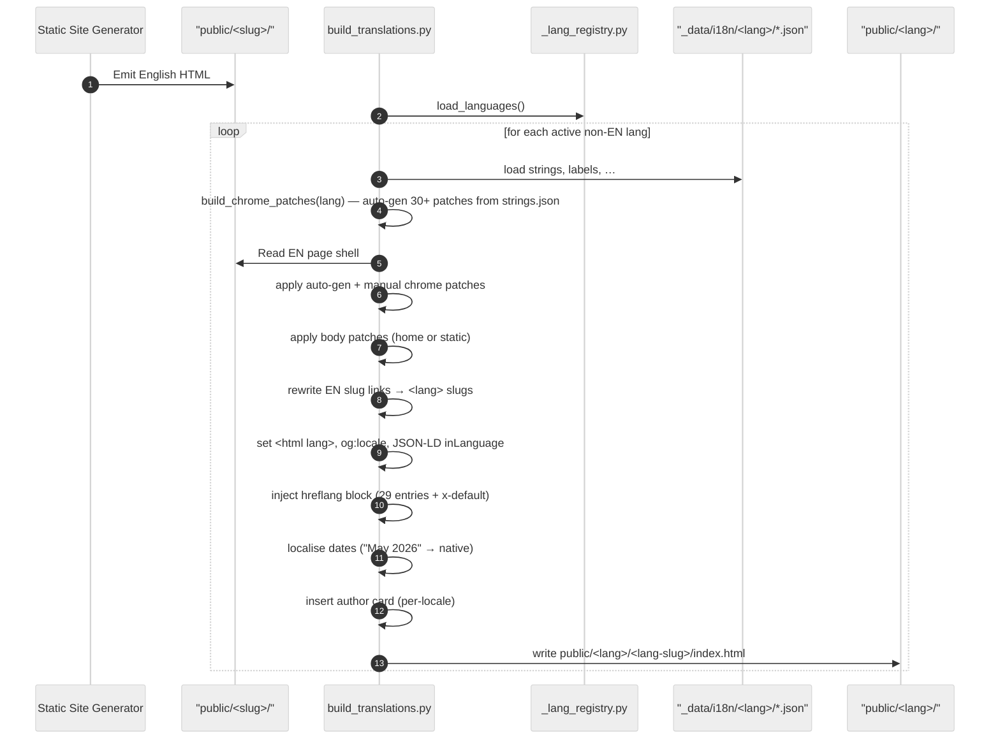
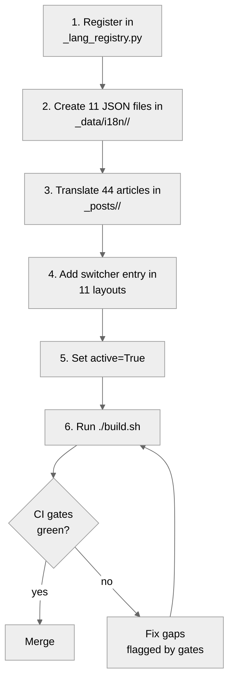

# Internationalisation

> Last Updated: June 4, 2026

The Sebastien Rousseau web platform uses the Static Site Generator static site generator to deploy a fully translated site across twenty-eight languages.
This guide explains how the system manages files, verifies parity, and updates content translations.

## Contents

This guide covers the design rationale, the language switcher matrix, files mapping, translation flow, URL slug rules, RTL layouts, alternate link maps, and build gates.

## Design rationale

We build our translation setup around three core design choices to keep pages identical and easy to maintain.

First, English is the single source of truth, and we build all other translations from English sources.
Second, the French canonical fork model copies the English page layout directly to ensure design parity.
Third, local strings live in flat files that are easy for non-developers to edit.

This design reduces site generation times by reusing the same HTML layout files.

## The 29-language matrix

The language registry file acts as the single source of truth for all active locales in the Static Site Generator static site generator.

Each locale entry specifies the BCP-47 attributes, display names, and flag switcher settings.

| Field | Purpose |
|---|---|
| `code` | URL segment |
| `bcp47` | Language attribute value |
| `locale` | Locale value for social tags |
| `flag_label` | Two-letter Pill label |
| `display_name` | Native name in switcher |
| `flag_emoji` | Country flag prefix |
| `active` | Renders the language if set to true |
| `rtl` | Renders with right-to-left layout if true |

All twenty-nine languages are active on the live web site. Six further
locales (`fa`, `mr`, `ta`, `te`, `ms`, `el`) are registered as
`active=False` — their glossaries and lang-switcher tiles ship, but they
are held out of hreflang/sitemap until their article backfill lands
(issue #360).

## Per-language JSON glossaries

Every language folder holds eleven JSON files that define the translation strings and page setups.

These files specify the button labels, search text, page metadata, and localized article slugs.

| File | Shape | What it drives |
|---|---|---|
| `strings.json` | Flat map | Generates switcher and footer patches |
| `labels.json` | Flat map | Defines table of contents and review labels |
| `takeaway_labels.json` | Flat map | Sets takeaways block labels |
| `chrome_patches.json` | Patch list | Defines custom chrome search rules |
| `home_patches.json` | Patch list | Updates home page blocks |
| `static_patches.json` | Patch list | Sets static page text updates |
| `static_bodies.json` | Body map | Houses contact and thanks page content |
| `static_pages.json` | Info map | Sets page metadata for static files |
| `slugs.json` | Slug map | Maps English to localized page slugs |
| `author.json` | Graph data | Sets bio and links for the author card |
| `topics.json` | Topic map | Sets topic names and descriptions |

The build tool verifies that these files have all required fields before generating the pages.

## Translation flow

The translation tool reads the English pages and generates the non-English pages using automated steps.

The script copies the English page content and swaps the menu strings and footer links automatically.

## Slug discipline

All translated slugs must use ASCII-only characters to keep page links clean and standard.

We use clear, native words in the links to make them easy to read for visitors.

- English: `/about/`
- French: `/fr/a-propos/`
- German: `/de/ueber-mich/`
- Japanese: `/ja/profile/`

A mapping file links each English article to its localized path during compilation.

## RTL handling

RTL languages like Arabic and Hebrew use special CSS settings to align text and design blocks safely.

The build tool sets the direction attribute on the page tags to ensure correct rendering.
Additionally, the test gate blocks physical styles to keep all layouts safe.

## Hreflang reciprocity

Every translated page carries header links that point to its alternate versions in all other languages.

These links are reciprocal, which means each alternate page points back to the original source.
Our automated check validates all pairs to verify the index is complete.

## Per-language CI gates

The integration build runs seven automated gates to confirm that all languages match the English reference page count.

These gates verify the language files, author details, and structural elements of the site.

| Gate | What it asserts | Source |
|---|---|---|
| `test_i18n_parity` | All locales render the same page count | `tests/validation/test_i18n_parity.py` |.
| `test_i18n_strings` | Check if chrome keys match reference | `tests/validation/test_i18n_strings.py` |.
| `test_i18n_labels` | Check if layout keys match reference | `tests/validation/test_i18n_labels.py` |.
| `test_i18n_takeaway_labels` | Check if key takeaway keys match reference | `tests/validation/test_i18n_takeaway_labels.py` |.
| `test_i18n_render_data` | Verify that patch counts match target | `tests/validation/test_i18n_render_data.py` |.
| `test_i18n_author` | Verify that author cards match reference | `tests/validation/test_i18n_author.py` |.
| `test_lang_no_leakage` | Block English words in other layouts | `tests/validation/test_lang_no_leakage.py` |.
| `test_hreflang_reciprocity` | Check that alternate links match pairs | `tests/validation/test_hreflang_reciprocity.py` |.
| `test_jsonld_localized` | Verify that schemas match page locales | `tests/validation/test_jsonld_localized.py` |.
| `test_rtl_safe` | Block physical layout rules in RTL pages | `tests/validation/test_rtl_safe.py` |.

Any gate failure stops the build and requires manual repair to pass.

## Adding a new language

Adding a new language is a simple six-step process that registers the locale and imports the translation files.

- Step 1: Register the locale in the language registry file.
- Step 2: Create the eleven JSON files in the language directory.
- Step 3: Copy and translate the source articles in the posts folder.
- Step 4: Add the language switcher link to the layout templates.
- Step 5: Activate the language in the registry settings.
- Step 6: Run the build script to check if the gates stay green.

## Adding a new article (28 translations)

You publish a new article by writing the English file first and then translating it for the other locales.

The build tool generates translations for the other twenty-seven language folders automatically.

- Step 1: Create the English source file in the drafts folder.
- Step 2: Run the promotion command to move the file and create the language stubs.
- Step 3: Translate each stub file using the standard rules.
- Step 4: Run the build script to check the pages before pushing.
